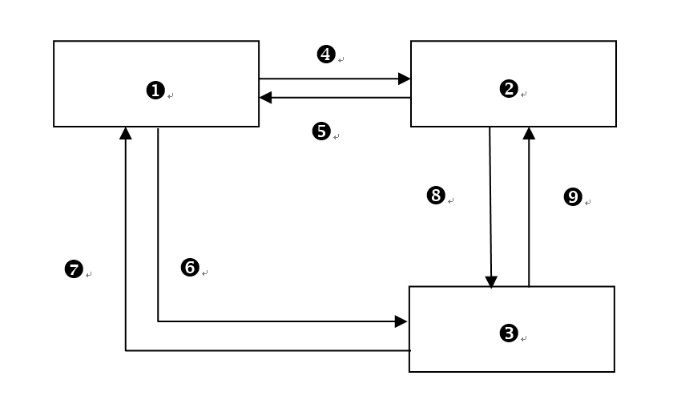

# 一、雲端概念

1. 列出雲端運算的五大基本特徵。

   1. 可以想著有什麼方便性，並在後面添加`服務`
      1. `隨需`自助服務
      2. `網路`服務
      3. `測量`服務
      4. 資源`共享`
      5. 快速`彈性`

2) 列出[雲端運算的三個服務模式](https://medium.com/@stfk1105/iaas-paas-saas-%E4%B8%89%E5%85%84%E5%BC%9F-c745dfa0cfd4)(含英文縮寫)。

   1. `SAAS` `軟體`即服務
   2. `PAAS` `平台`即服務
   3. `IAAS` `架構`即服務

3) 列出雲端運算的四個佈署模型。

   1. `公有`雲
   2. `社群`雲
   3. `私有`雲
   4. `混合`雲

4) 若以下圖表示雲端運算的概念，請解釋之。

   1. 用戶可以用`各種連網設備`連接`雲端服務`
   2. 雲端中`有各種軟硬體資源`以`服務`形式存在
   3. 可以用`網路`連上雲端

  

5. 舉例說明基礎建設雲(`IaaS`)所提供的服務。

   1. `記憶體`
   2. `儲存空間`([硬碟](https://medium.com/@racktar7743/%E4%BB%8B%E7%B4%B9%E9%9B%BB%E8%85%A6%E4%B8%89%E9%83%A8%E4%BB%B6-cpu-%E8%A8%98%E6%86%B6%E9%AB%94%E4%BB%A5%E5%8F%8A%E7%A1%AC%E7%A2%9F%E6%98%AF%E5%A6%82%E4%BD%95%E7%9A%84%E9%81%8B%E4%BD%9C-79031855761a))
   3. `CPU`(存取記憶體中的東西進行運算)
   4. `網路設施`(流量)
   5. `資料中心設置`
   6. `伺服器`

6. 解釋平台雲(`PaaS`)所提供的服務。

   1. 提供`含硬體設備`的`開發平台`，讓企業人員在平台上開發，`無須軟體的下載及安裝`

7. 舉出五種應用雲(`SaaS`)所提供的服務。

   1. 列出 google 服務，並用`網路`做開頭

      1. 網路`文字處裡`(word)
      2. 網路`試算表`(excel)
      3. 網路`簡報`(ppt)
      4. 網路`排程管理`(行事曆)
      5. 網路`郵件服務`(gmail)

   2. [SaaS](https://kknews.cc/news/aar5xnn.html) 具體工具: `ERP`(企業資源計劃)、`CRM`(客戶關係管理)、`OA`(辦公自動化)、`EHR`(人力資源管理)、`SCM`(供應鏈管理)

8. 公有雲(Public cloud)與私有雲(Private Cloud)有何不同。

   1. `公有雲`: 大家都能用(`一般大眾`)
   2. `私有雲`: 限制特定組織人員可用(`公司內部`)

9. 比較建構公有雲(Public cloud)或私有雲(Private Cloud)時應考慮之事項。

   1. `公有雲`: 成本低、安全低
   2. `私有雲`: 成本高、安全高

10. 對一般大眾而言，使用雲端運算有什麼好處?

    1. `方便` (使用方便性)
    2. `隨地可用` (立即可上線)
    3. `操作簡單` (操作更輕鬆)
    4. `程式開發社群`

11. 對企業用戶而言，使用雲端運算有什麼好處?

    1. `省成本`
    2. `更新、升級更快`

# 二、雲端技術

1. 雲端運算中虛擬化的特性為何?

   1. 想想 OOP 是為了什麼?

      1. 封裝資料讓不必要的東西不讓人看見
      2. 並把各種資源打包成一體
      3. 在想撰寫某些新功能時可以覆寫方法

   2. 雲端的運算對照

      1. `虛擬`各種軟硬體資源
      2. `隱藏`不必要的細節
      3. `實現`在真實環境中的部分或全部功能

2. 雲端運算中虛擬化種類有哪些?

   1. `軟`體
   2. `硬`體
   3. `記憶`體
   4. `儲存`體
   5. `資料`
   6. `桌面`
   7. `網路`...

3. 請以圖形方式表現硬體虛擬化之概念。

<table style="text-align: center;">
  <tr>
    <td>
      <table>
        <tr><td colspan="2">VM</td></tr>
        <tr>
          <td>Application</td>
          <td>Application</td>
        </tr>
        <tr><td colspan="2">Guest OS</td></tr>
      </table>
    </td>
    <td>
      <table>
        <tr><td colspan="2">VM</td></tr>
        <tr>
          <td>Application</td>
          <td>Application</td>
        </tr>
        <tr><td colspan="2">Guest OS</td></tr>
      </table>
    </td>
  </tr>
  <tr>
    <td colspan="2">Virtualization Layer</td>
  </tr>
  <tr>
    <td colspan="2">Host Operation System</td>
  </tr>
  <tr>
    <td colspan="2">Hardware</td>
  </tr>
</table>

4. 比較伺服器(server)虛擬化與桌面(desktop)虛擬化之不同處?

   1. 伺服器(server)虛擬: 將`一台實體伺服器` `切開` `變成很多小的`伺服器並管理的技術

      1. 將大切小並分割共享(可參考 `VMWare` ，把主機中切割一小部分空間用來安裝新的作業系統)

   2. 桌面(desktop)虛擬: 可以共用伺服器虛擬出的環境(`虛擬電腦`)

5. 寫出區域網路虛擬化及廣域網路虛擬化之代表性技術。

   1. `區網`: `VLAN`
   2. `廣域網路`: `VPN`

6. 說明 GFS 的特性。

   1. `可伸縮`的`分散式檔案管理系統`
   2. 如果將資料儲存在一堆便宜電腦中，`GFS可以容錯`
   3. `高效處裡`客戶資料`存取請求`

7. 完成下列 GFS 的架構圖。

   1. GFS `client`
   2. GFS `master`
   3. GFS `chunkserver`
   4. (`filename`, chunk `index`)
   5. (chunk `handles`, chunk `locations`)
   6. (chunk `handle`, `byte` range)
   7. chunk `data`
   8. `instructions` to `chunkserver`
   9. `chunkserver` `state`

  

  

8. 解釋 GFS 如何做到容錯。

   1. `chunkserver` 失效時：每個 `chunk` 有三個以上複製，一個失效時，其餘仍能正常工作。
   2. `master` 失效時：可依據 `checkpoints` 及 `operation log` 修復。
   3. 簡單來說就是會有多個 server 專門用於備份資料，出問題時替換 server，並且在無法主電腦(master)沒用時依據 log 將資料還原

9. 解釋下圖 [Bigtable](https://mlwmlw.org/2011/01/cassandra-the-definitive-guide/) 中的 row, column, column family, timestamp, content

   1. `row`: `com.cnn.www`
   2. `column`: `html`,`cnn`,`cnn.com`
   3. `column family`: `cnn`,`cnn.com`
   4. `timestamp`: `t3`,`t6`,`t9`,`t8`
   5. `content`: `html...`

  

---

  

1.  MapReduce 是什麼? 用途為何?

    1. 學術性說法

       1. MapReduce 是一個強大的 programming model，使用者能夠藉此處理大量資料的運算並自動平行分配運算，達到了加速的效果。

    2. 自我學習

       1. `MapReduce` 是種很強大的`設計模型`，用這種方式可以`處裡大量資料`並`自動平行分配運算`，達到加速效果

2.  解釋下圖中圈起來的部份 MapReduce 的機制在做什麼?

    1. 學術性說法

       1. 被分派的 Map 任務的 worker，首先從相對應的分割(spilt)讀取資料，並從中分析出一組對應的 key/value，然後在傳送給使用者定義的 Map 函數處理。Map 函數產生的 intermediate key/value 會先暫存在記憶體中。
       2. 負責 Reduce 任務的 worker 會使用 RPC 來讀取在當地磁碟中的暫存資料，而當讀取完所有的 intermediate key/value 後，worker 會對它做排序來把有相同 intermediate key 的 value 集合起來。

    2. 自我學習

       1. Map(give work) → `worker` → spilt(get `key` or `value`) → function Map(key, value) → local desks(save in memory)
       2. Reduce → `worker`(used `RPC` to read local data and sort key's value)

  

