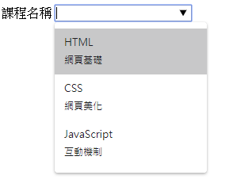
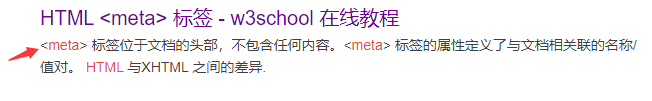

<h1 id="top">目錄</h1>

- [1. HTML5](#s1)
- [2. input 新增](#s2)
- [3. datalist 標籤](#s3)
- [4. HTML5 新增的標籤](#s4)
- [5. nav 標籤](#s5)
- [6. eta 標籤](#s6)

---

# <a id="s1" class="md-title" href="#top">1. HTML5</a>

- 新的屬性: placeholder,...
- 新的標籤: section,audio,canvas,... (強烈有結構性，語意化)

# <a id="s2" class="md-title" href="#top">2. input 新增</a>

# <a id="s3" class="md-title" href="#top">3. datalist 標籤</a>

- 讓[文字輸入盒](https://developer.mozilla.org/zh-CN/docs/Web/HTML/Element/datalist)使用預先設置好的標籤
- 使用 input 配合 datalist
- 與 select 差別為，選項內沒有的值可以在 input 中自行填寫

```html
<label>
  課程名稱 <input type="text" name="courseName" list="courseList" />
</label>
<datalist id="courseList">
  <option value="HTML">網頁基礎</option>
  <option value="CSS">網頁美化</option>
  <option value="JavaScript">互動機制</option>
</datalist>
```

  <div style="text-align:center">
    
  </div>

# <a id="s4" class="md-title" href="#top">4. HTML5 新增的標籤</a>

- 相當於比 div 更語意化的標籤

  - article
  - section
  - header
  - footer
  - nav
  - meter
  - progress
  - ...

# <a id="s5" class="md-title" href="#top">5. nav 標籤</a>

- 設定導覽列

```html
<nav>
  <a href="/">HTML</a>
  <a href="/">CSS</a>
  <a href="/">JAVASCRIPT</a>
</nav>
```

# <a id="s6" class="md-title" href="#top">6. eta 標籤</a>

- 提供訊息給瀏覽器、搜尋引擎等。一率放在 header 中

```html
<!-- 設定網頁編碼 -->
<meta charset="UTF-8" />
```

```html
<!-- 設定網頁關鍵字(SEO 主要搜尋地方) -->
<meta name="keywords" content="HTML,CSS,XML,XHTML,Javascript" />
```

```html
<!-- 設定網頁相關描述(主要適用於網頁上的簡短描述，若要優化 SEO 也要對此區塊作處理) -->
<meta name="description" content="深入淺出網頁設計" />
```

  <div style="text-align:center">
    
  </div>
