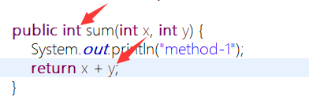

<h1 id="top">目錄</h1>

- [1. 方法的定義與呼叫](#s1)

---

# <a id="s1" class="md-title" href="#top">1. 方法的定義與呼叫</a>

- 定義

  - 可重複使用的程式碼片段
  - 增加程式碼的閱讀性(因為方法可命名)

- 範例

  - `public static void main(String[] args){...}` <br><br>

<table>
<thead>
<tr>
<th>修飾存取方式</th>
<th>回傳值型別</th>
<th>方法名稱</th>
<th>傳入參數</th>
<th>{...}</th>
</tr>
</thead>
<tbody>
<tr>
<td><code>&lt;modifier&gt;*</code></td>
<td><code>&lt;return_type&gt;</code></td>
<td><code>&lt;name&gt;</code></td>
<td><code>&lt;parameter&gt;*</code></td>
<td><code>{...}</code></td>
</tr>
<tr>
<td><code>public</code> <code>static</code></td>
<td><code>void</code></td>
<td><code>main</code></td>
<td><code>String[] args</code></td>
<td><code>{...}</code></td>
</tr>
</tbody>
</table>

- 注意

  - **回傳值**需與**回傳值型別**類型相同

  <div style="text-align:center">
    
  </div>

  - `void` 沒有回傳結果，若**要回傳結果**則不可定 void

    - `public static void main(String[] main){` `return;` `}` 因為沒有回傳值，所以這樣使用也是合法的

- 方法的呼叫

  - 呼叫不同類別中的方法(參數需照順序提供對應的資料)

```java
package ch06;

public class TestCalculator {
  public static void main(String[] args) {
    // 1. 建立 Calculator 型態的物件形體
    Calculator myCalculator = new Calculator();
    // 2. 呼叫 Calculator 的方法 sum ， 有順序的提供對應的參數值
    int sum1 = myCalculator.sum(1,2);
    // 4. 列印值
    System.out.println(sum1);
  }
}
```

---

```java
public class Calculator {

  public int sum(int x, int y) {
    System.out.println("method-1");
    // 3. 回傳相加後的值
    return x + y;
  }
}
```

- 呼叫相同類別中的方法

```java
package ch06;

public class TestCalculator {
  public static void main(String[] args) {
    // 直接使用方法(如果後面還有要用到這方法執行完的結果，可以用個變數保存)
    int sum1 = sum(1,2);
    System.out.println(sum1);
  }

  static int sum(int x, int y) {
    System.out.println("method-1");
    return x + y;
  }
}
```

---

参考链接:

- [Java 入門指南](http://kaiching.org/pydoing/java-guide/unit-08-class.html)
