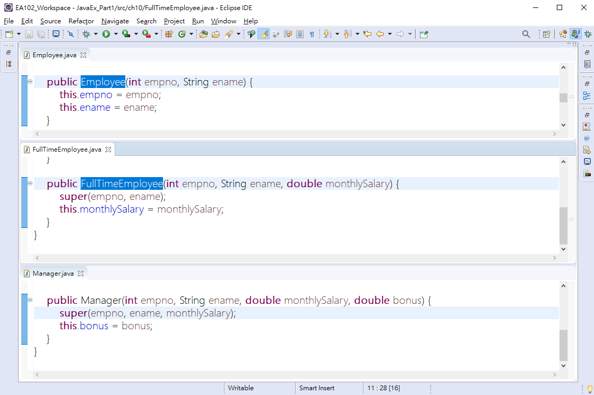
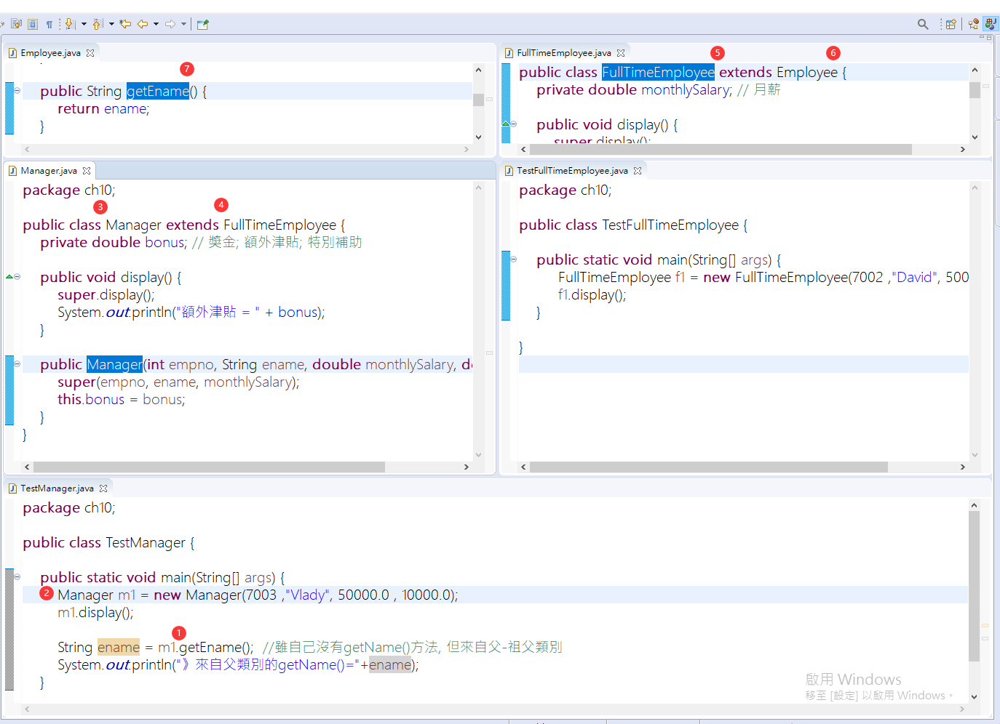
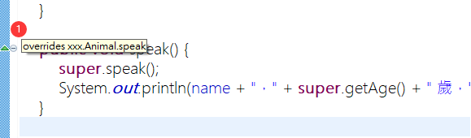

<h1 id="top">目錄</h1>

- [1. 繼承基本概念](#s1)
- [2. 繼承優點與好處](#s2)
- [3. 繼承與法與注意事項](#s3)
- [4. 覆寫(Overriding)目的與規定](#s4)
- [5. final 修飾子](#s5)
- [6. 呼叫父類別的方法](#s6)
- [7. 呼叫父類別的建構子](#s7)
- [8. 複雜的繼承關係](#s8)
- [9. 課堂練習](#s9)
- [10. 標註(Annotation)的作用](#s10)

---

# <a id="s1" class="md-title" href="#top">1. 繼承基本概念</a>

- [子類別](#)(`subclass`)[延伸](#)(`extence`)<span id="superclass">[父類別](#)(`superclass`)</span>

  - 使用繼承的話[子類別](#)(`subclass`)就可以直接**擁有**[父類別](#)(`superclass`)的東西，且不用在子類別再寫一次

  - 子類別**可以擴充**自己的東西

  - **類別**的延伸與擴展(包含成員變數與方法)

- 父類別(superclass)

  - 具有共同成員的類別

  - 一般化(generalization)

- 子類別(subclass)

  - 繼承父類別的類別

  - 特別化(specialization)

<div style="overflow: auto; margin: 15px;">
  <div>
    <div
      style="
        background: rgba(66, 185, 130, 0.1);
        width: 210px;
        border-radius: 50%;
        text-align: center;
        padding: 30px;
      "
    >
      父類別
      <div
        style="
          padding: 35px 10px;
          margin: 15px;
          background: rgba(66, 185, 130, 0.1);
          border-radius: 50%;
        "
      >
        子類別
      </div>
    </div>
  </div>
</div>

<br>

# <a id="s2" class="md-title" href="#top">2. 繼承優點與好處</a>

- 主要目的就是提高程式的重複使用性

- 子類別將會繼承到父類別中[所有可以存取的成員，包括變數與方法](#superclass)

  - (雖然可以存取，但還是會受到存取修飾關鍵字的影響)

  - 共同資料只要描述一次(會隱含在子類別裡面)

  - 處裡共同資料的成員方法也只要描述一次

# <a id="s3" class="md-title" href="#top">3. 繼承與法與注意事項</a>

- 繼承(inhert)的關鍵字 `extends` ， 使用方法 `class SubClassName extends SuperClassName{...}`

  - 只能繼承**方法**跟**成員**

- 當 B 繼承 A，以 [B is a A](#)(**is a** 可以理解為 **是一種**) 表示

  - FullTimeEmployee **is a** Employee

    - 自動門 is a 門

  - FullTimeEmployee **has a** MonthlySalary

    - 自動門 has a 尺寸

    - 自動門 has a 自動化開關

- 注意

  - Java 不支援多重繼承，一個子類別只能 `extends` 一個父類別

    - OOP 來說是可以多重繼承的(ex.C++)

  - 建構子(Constructor)**無法被繼承**

    - [無法被繼承是因為他是私有物??](#)

      - 建構子的特性: 需跟 class 名稱相同，但繼承到新的 class 就肯定跟當下的 class 名稱不同了，要用也沒辦法使用

  - java.lang.**Object 類別**為所有類別的共同父類別(所有類別的根)

    - 源頭找上去就能找到 Object `public class LetMeAskYou extends Object {...}` ，所有 class 都有隱藏的父類別 Object

<div style="overflow: auto; margin: 15px;">
<div style="max-width: 652px; min-width: 652px;">
<div style="
display: flex;
">
<div style="
background: rgba(66, 185, 130, 0.1);
width: 320px;
border-radius: 50%;
text-align: center;
padding: 30px;
">
Pen
<div style="
padding: 35px 10px;
margin: 15px;
background: rgba(66, 185, 130, 0.1);
border-radius: 50%;
">
Pencil
<div style="
padding: 35px 10px;
background: rgba(66, 185, 130, 0.1);
border-radius: 50%;
width: 100px;
margin: 15px auto;
">
AutoPencil
</div>
</div>
</div>
<ul>
<li>
<p>AutoPencil is a Pencil</p>
</li>
<li>
<p>AutoPencil is a Pen</p>
</li>
<li>
<p><a href="#">Everything is a Object</a></p>
</li></ul></div>
</div>
</div>

<br>

# <a id="s4" class="md-title" href="#top">4. 覆寫(Overriding)目的與規定</a>

- 目的

  - 子類別繼承父類別後，不滿意父類別定義的方法時子類別可以在繼承後重新改寫，即為 Overriding

- 規定(只是對方法**內容**改變，所以方法宣告的結構不可以亂動)

  - **方法名稱**、**參數數量**、**參數型別**、**回傳型別**要一樣

  - 子類別覆寫方法時存取修飾子的等級**不能小於**原方法

    - [存取修飾子](https://leisure0621.github.io/tibame/3.JAVA程式設計/9.使用封裝與建構子/9-4.static修飾子.html) : `public` > `protected` > `default` > `private`

# <a id="s5" class="md-title" href="#top">5. final 修飾子</a>

- 一個類別宣告為 `final`([常數](https://leisure0621.github.io/tibame/3.JAVA/01.JAVA%E5%9F%BA%E7%A4%8E%E5%AD%B8%E7%BF%92/03.%E5%AE%9A%E6%95%B8%E3%80%81%E8%AE%8A%E6%95%B8%E3%80%81%E5%B8%B8%E6%95%B8%E8%88%87%E9%81%8B%E7%AE%97%E5%AD%90/3-03.JAVA%E5%B8%B8%E6%95%B8%E8%88%87%E5%91%BD%E5%90%8D%E6%96%B9%E5%BC%8F.html) 時**不能被繼承**(絕子絕孫)

  - `public final class String {...}`

  - `public final class Math {...}`

  - `public class A extends Math {...}` 會提示錯誤，因為 String 為 final

  - `public final Methods(...){...}` method 也可變成 final

  - `final Pen myPen = new Pen();` **物件參考變數**宣告為 final，表示這個變數在初始值化後不得在指向另一個物件

  - 固定不變的是址的值，而該物件的屬性是否能修改要看宣告屬性時是否有加上 final

  - `public static final double price = 10.0;` 固定不能變動的值，繼承後也不能改變

    - 任何人都能用，不能直接修改，固定的，double 型態的，金額

```java
final Pen myPen = new Pen();
Pen yourPen = new Pen();
myPen = yourPen; // 會產生錯誤，因為 myPen 被宣告為 final
```

# <a id="s6" class="md-title" href="#top">6. 呼叫父類別的方法</a>

- 呼叫父類別的建構子

  - 子類別透過建構子，用 `supper(...)` 將**共同的建構子參數**傳給父類別(指共同的資料應使用父類別的建構子)

  - 物件產生時，建構子呼叫的順序為先父類別在子類別，所以

    - 建構子中若有出現**super(...)**，一定要放在**第一個**敘述位置

    - 建構子中若未出現**super(...)**，JAVA 預設會有一個**隱形的 super()**

      - 相當於沒有建立建構子，則類別中預設會有一個隱形的建構子

      - **呼叫父類別不帶參數的建構子**，預設自動放 `super()` 在第一個敘述的位置

        - 所有 class 都有隱藏的父類別 Object

      - `this()` 與 `super()` 在建構子的設計上都得放在第一個敘述位置，才能符合建構子執行順序規則，所以兩個只能擇一使用

        - 建構子的特性，一次性，所以一個方法內不能重複用 `this()` 與 `super()`<br><br>

- `super.MethodName();` 子類別通過 `super.` 可以呼叫**上一層類別**的方法，**無法越級呼叫**(就是只能呼叫**上一個**)

<div style="text-align:center">
  
</div>

```java
super(1,2)
```

<div style="text-align:center">
  
</div>

- 呼叫同個類別的建構子

```java
this(1,2)
```

# <a id="s7" class="md-title" href="#top">7. 呼叫父類別的建構子</a>

<div style="text-align:center">
  
</div>

# <a id="s8" class="md-title" href="#top">8. 複雜的繼承關係</a>

- 通過繼承方式來產生兩個 animal

- 方法 1

```java
package xxx;

public class Elephant extends Animal {
  String name;

  public Elephant(){

  }

  public Elephant(String name, int age, float weight) {
    super(age, weight);
    this.name = name;
  }

  public void speak() {
    super.speak();
    System.out.println(name);
  }

  public static void main(String[] args) {
    Elephant Animal = new Elephant("Animal", 3, 8);
    Elephant Elephone = new Elephant("Elephone", 8, 1200);
    Animal.speak();
    Elephone.speak();

  }
}
```

```java
package xxx;

public class Animal {
  private int age;
  private float weight;

  public Animal(){

  }

  public Animal(int age, float weight) {
    this.age = age;
    this.weight = weight;
  }

  public void speak() {
    System.out.println(age + "歲");
    System.out.println(weight + "公斤");
  }

  public void setAge(int age) {
    this.age = age;
  }

  public float getWeight(float weight) {
    return weight;
  }

  public void setWeight(float weight) {
    this.weight = weight;
  }
}
```

---

```cs
3歲
8.0公斤
Animal

8歲
1200.0公斤
Elephone
```

- 方法 2

```java
package xxx;

public class Animal {
  private int age;
  private float weight;

  public Animal(){

  }

  public Animal(int age, float weight) {
    this.age = age;
    this.weight = weight;
  }

  public void speak() {
    System.out.println("Age is = " + age);
    System.out.println("Weight is = " + weight);
  }

  public int getAge() {
    return age;
  }

  public void setAge(int age) {
    this.age = age;
  }

  public float getWeight() {
    return weight;
  }

  public void setWeight(float weight) {
    this.weight = weight;
  }
}
```

```java
package xxx;

public class Elephant extends Animal {
  private String name;
  public Elephant(){

  }

  public Elephant(int age, float weight, String name) {
    super(age, weight);
    this.name = name;
  }

  public void speak() {
    System.out.println(name + "，" + super.getAge() + " 歲，" + super.getWeight() + " 公斤");
  }

  public static void main(String[] args) {
    Elephant Animal = new Elephant(3, 8, "Animal");
    Elephant Elephone = new Elephant(8, 1200, "Elephone");
    Animal.speak();
    Elephone.speak();

  }
}
```

# <a id="s9" class="md-title" href="#top">9. 課堂練習</a>

- `public 建構子(){}` 因為程式撰寫會再結合框架，也為了讓後續繼承時要用，所以會保留一個空的建構子(預設建構子)

- 做到此步驟時 Elephant 會有警示

```java
public class Elephant extends Animal {

}
```

- 原因是因為繼承時會有隱形的 super() 父類別功能

```java
public class Elephant extends Animal {
    public Elephant(){
      super(); // 使用父類別的建構子
    }
}
```

- 但又因為 Animal 類別中符合不需傳入參數的建構子，所以找不到而出錯

```java
public class Animal {
  private int age;
  private float weight;

  // 父類別建構子，沒有空的建構子
  public Animal(int age, float weight) {
    this.age = age;
    this.weight = weight;
  }

  public void speak() {
    System.out.println("Age is = " + age);
    System.out.println("Weight is = " + weight);
  }

  public int getAge() {
    return age;
  }

  public void setAge(int age) {
    this.age = age;
  }

  public float getWeight() {
    return weight;
  }

  public void setWeight(float weight) {
    this.weight = weight;
  }
}
```

- 為了符合目前有的父級建構子的資料，就要入參，讓 super 可有值
  (到此步驟就將出現的錯誤修改完成了)

```java
public class Elephant extends Animal {
    public Elephant(int age, float weight){
      super(int age, float weight);
    }
}
```

# <a id="s10" class="md-title" href="#top">10. 標註(Annotation)的作用</a>

- 可以協助提醒是否格式錯誤

```java
@Override // JDK5時加入的功能(Annotation 標註)
public void speak() {
  // TODO Auto-generated method stub
  super.speak();
}
```

- 有這種綠色鍵頭表示格式正確

<div style="text-align:center">
  
</div>
