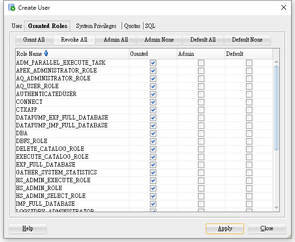
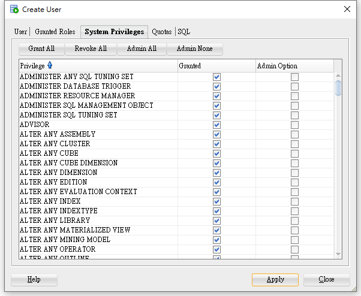
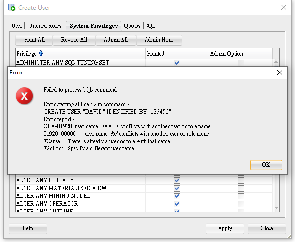

<h1 id="top">目錄</h1>

<ul>
<li><a href='#s1'>1. JDBC 簡介</a></li>
<li><a href='#s2'>2. JDBC API</a></li>
<li><a href='#s3'>3. JDBC Driver 目的</a></li>
<li><a href='#s4'>4. JDBC Driver 載入</a></li>
<li><a href='#s5'>5. Connection 介面</a></li>
<li><a href='#s6'>6. Statement 介面</a></li>
<li><a href='#s7'>7. ResultSet 介面</a></li>
<li><a href='#s8'>8. 開始寫程式</a></li>
<li><a href='#s8_1'>8_1. 開啟資料庫權限</a></li>
<li><a href='#s8_2'>8_2. 項目引入 JAR</a></li>
<li><a href='#s8_3'>8_3. 內容撰寫</a></li></ul><hr>

# <a id='s1' class='md-title' href='#top'>1. JDBC 簡介</a>

- `關聯式資料庫`(Relational DataBase Management System)

  - 以表格方式儲存與呈現資料,再用數學集合論為基礎,將表格與表格之間建立關聯以處理複雜的資料關係
  - 如 Oracle Database, MySQL, 微軟 SQL Server, IBM 的 DB2 等

- `非關聯式資料庫`(又稱 NoSQL)

  - 分散式進行資料儲存,可區分三大類:文檔儲存、圖形關係儲存與鍵值儲存(key – value)
  - 如 Google 的 BigTable, MongoDB, Cassandra 等

- 資料庫本身是一個獨立運行的應用程式,所以我們設計的應用程式得利用網路通訊協定對資料庫進行指令交換,以便進行資料的 `CRUD` (Create Update delete Review，增刪改查)

- 但實作上我們會使用一組專門與資料庫進行通訊協定的類別庫來簡化與資料庫溝通的程式撰寫

<div style="display: flex; width: 900px; overflow: auto;">
<table style="width: 150px;">
  <tbody><tr>
    <td>
    應用程式
    </td>
  </tr>
  <tr>
    <td>
    類別庫
    </td>
  </tr>
</tbody></table>
<div style="
    text-align: center;
    padding: 8px 15px;
">← 通訊協定 →</div>
<table style="width: 150px;">
  <tbody><tr>
    <td>
    資料庫
    </td>
  </tr>
</tbody></table>
</div>

- 問題

  1. 不同廠商資料庫的通訊協定都不一樣,需使用不同類別庫撰寫程式
  2. 遇到更換資料庫,程式碼也幾乎跟著要重寫
  3. 應用程式被類別庫綁死,跨平台議題考量(?)

- 解決

  - 使用 JDBC 解決

- Java 提供一組資料庫存取 API,名為`JDBC`(**J**ava **D**ata**B**ase **C**onnectivity)

- JDBC 是用於`執行 SQL`(`搭配關聯式資料庫`)的解決方案,Java 應用程式`開發人`員`使用 JDBC`的標準介面,而`資料庫廠商`則對介面進行`實作`。因此應用程式開發人員就不需接觸到底層資料庫的驅動程式

- JDBC API 使得應用系統開發者能使用相同的介面名稱與方法來存取資料庫的資料,讓程式設計師能專心於應用系統的開發,`無需顧慮到不同廠商所提供的不同資料庫系統`

- JDBC API 已包含在 JDK 裡

  - <sup><bikao>★ 會考</bikao></sup> `java.sql`: JDBC 的核心 API,用來`存取資料庫資料,基本`功能
  - <sup><bikao>★ 會考</bikao></sup> `javax.sql`: JDBC Extension API,支援`進階資料庫存取`功能

- JDBC 標準 API 分為兩個部份

  1. JDBC 應用程式開發者介面 (Application Developer Interface)
  2. JDBC 驅動程式開發者介面 (Driver Developer Interface)

- 本課程使用 JDBC 應用程式介面與關聯式資料庫進行說明與範例測試

  - 註: 驅動程式為資料庫廠商實作,一般開發者無須瞭解

# <a id='s2' class='md-title' href='#top'>2. JDBC API</a>

- Interface

  - Statement `相關對應到 SQL 指令的執行`
    - PreparedStatement
  - ResultSet `對應到資料庫查詢結果`
  - Driver
  - Connection

- Class

  - DriverManager

- Exception

  - SQLException `一定要處裡的例外`

# <a id='s3' class='md-title' href='#top'>3. JDBC Driver 目的</a>

- 分層目的就是降低對資料庫的相依性

<div style="display: flex; width: 900px; overflow: auto;">
<table style="width: 300px;">
  <tbody><tr>
    <td>
    應用程式
    </td>
  </tr>
  <tr>
    <td>
    JDBC API
    </td>
  </tr>
  <tr>
    <td>
    MySQL JDBC Driver
    </td>
  </tr>
</tbody></table>
<div style="
    text-align: center;
    padding: 8px 15px;
">← MySQL 通訊協定 →</div>
<table style="width: 150px;">
  <tbody><tr>
    <td>
    MySQL 資料庫
    </td>
  </tr>
</tbody></table>
</div>

<div style="display: flex; width: 900px;">
<table style="width: 300px;">
  <tbody><tr>
    <td>
    應用程式
    </td>
  </tr>
  <tr>
    <td>
    JDBC API
    </td>
  </tr>
  <tr>
    <td>
    Oracle JDBC Driver
    </td>
  </tr>
</tbody></table>
<div style="
    text-align: center;
    padding: 8px 15px;
">← Oracle 通訊協定 →</div>
<table style="width: 150px;">
  <tbody><tr>
    <td>
    Oracle 資料庫
    </td>
  </tr>
</tbody></table>
</div>

- 依廠商實作 JDBC 方式,可以分成以下四種類型:

  - Type 1: JDBC-ODBC Bridge Driver

    為 JDK 安裝即附,將 JDBC 的運作轉成 ODBC 的機制來連接資料庫,存取速度與功能均有受限,彈性不足,建議在無其它 driver 可以使用時才用 Type1 的 driver (註: `JDK 8 已將 ODBC 相關類別庫移除`)

  - Type 2: `Native` API Driver

    此類型 driver 會以原生(Native)方式呼叫資料庫提供的原生程式庫(通常是 `C/C++` 實作),因為採用原生方式,故存取速度為四種類型最快但沒有達到跨平台的目標,需要在各平台先行安裝資料庫所屬的原生程式庫

  - Type 3: `JDBC-Net` Driver

    此類型 driver 會將 JDBC 呼叫轉換為特定的網路協定(Protocol),由中介伺服器或元件跟資料庫進行操作,使用此類型 driver 好處是軟體架構可獲得彈性,但速度會較慢

  - Type 4: Native Protocol Driver

    此類型 driver 通常由資料庫廠商直接提供,會將 JDBC 呼叫轉換為與資料庫特定的網路協定,driver 可以完全用 Java 技術實現,因此達到跨平台功能,效能也有不錯表現,為`業界最常見的driver類型`

# <a id='s4' class='md-title' href='#top'>4. JDBC Driver 載入</a>

- 載入 JDBC Driver 有三種方式:

  - Class Loader 方式

  - register 方式

  - System Property 方式

- 採用 Class Loader 方式產生 Driver 實體,並註冊到 DriverManager 的驅動程式註冊表單中

  - `參數就是提供 class 的完整名稱(含套件名稱)`

  - Class.forName("com.mysql.jdbc.Driver"); <sup><bikao>★ 常用</bikao></sup>

  - Class.forName("oracle.jdbc.driver.OracleDriver");

  - Class.forName("com.microsoft.sqlserver.jdbc.SQLServerDriver");

  - Class.forName("com.ibm.db2.jdbc.app.DB2Driver");

- 採用 register 方式產生 Driver 實體,並將自己註冊到 Driver Manager 驅動程式註冊表單中

  - DriverManager.registerDriver(new com.mysql.jdbc.Driver());
  - DriverManager.registerDriver(new oracle.jdbc.driver.OracleDriver());

- 採用 System Property 方式
  - System.setProperty("jdbc.drivers", "com.mysql.jdbc.Driver");
  - 可以包含數個 drivers,彼此之間以冒號(:)隔開

# <a id='s5' class='md-title' href='#top'>5. Connection 介面</a>

- Connection 代表資料庫的一個連線通路,傳遞一系列的 SQL 指令給資料庫,並管理這些指令的認可與中止

- Connection con = DriverManager.getConnection(String url, String userID, String password);

  - 以資料庫 URL 做為引數產生 Connection 物件來連接資料庫

  - DriverManager 在驅動程式註冊表單搜尋 driver,一旦 driver 認得此 url,便會依據 url 的資訊連接資料庫

- `Connection 非常珍貴,使用完畢後務必完成歸還的動作`!

- 資料庫 URL 為一字串,用以說明連接某一特定資料庫所需要的資訊,包含資料庫位址、埠號、名稱等

  - 埠號: Port Number 埠號 ，有 65536 個(0~65535)，只要有網路通訊就會用到埠號

    - 0-1024 間的埠號世界默認不使用

- 資料庫 URL 格式: `jdbc:<Subprotocol>:<Subname>` <sup>「jdbc」: 引用 jdbc 必出現<sup>

  - "jdbc:mysql://" + serverName + ":3306/" + DBName

    - jdbc:mysql://localhost:3306/HR

  - "jdbc:oracle:thin:@" + serverName + ":1521" + SID

    - jdbc:oracle:thin:@localhost:1521:xe

      - SID: 依照資料庫連線設定修改

  - "jdbc:sqlserver://" + serverName + ":1433:databaseName=" + DBName
    - jdbc:sqlserver://localhost:1433:databaseName=HR

- `close()`: 歸還資源

  - Connection 是極為重要的資源,`建議寫在finally{}裡`

  - 自 JDK 7 開始,若將有實作 AutoCloseable 介面的物件置於 try{}裡,try{}
    結束時,Java 會自動將該物件 close

    - JDK 7 裡,Connection 介面 extends AutoCloseable 介面

```java
finally {
  if (con != null) {
    try {
      con.close();
    } catch (SQLException e) {...}
  }
}
```

- 由於仍有可能使用 JDK 7 以前的版本,故還是寫在 finally{}較保險

# <a id='s6' class='md-title' href='#top'>6. Statement 介面</a>

- Statement createStatement(): `建立可陳述 SQL 指令的 statement 物件`

- PreparedStatement prepareStatement(String sql): `資料庫可預先編譯 SQL 指令`,執行效能較快,常用於需變數傳遞且重覆執行的 SQL

- CallableStatement prepareCall(String sql): `使用預存程序(stored procedure)`,預存程序已事先內建在資料庫中,通常比預先編譯的效能佳

- 藉由 Statement 相關物件,才能使用 SQL 指令與資料庫交談

- 用來陳述 SQL 指令,`執行靜態`的 SQL 指令

- 執行 SQL 指令的主要兩個方法

  - ResultSet executeQuery(String sql): `查詢資料庫,傳回資料列`

    - 用於 SQL 的 SELECT 指令

  - int executeUpdate(String sql): `更新資料庫,傳回成功更新的筆數`

    - 用於 SQL 的 INSERT、UPDATE 與 DELETE 指令

- close(): 歸還資源

# <a id='s7' class='md-title' href='#top'>7. ResultSet 介面</a>

- 查詢資料庫後傳回的資料列

- 移動資料列`游標`的相關方法

  - next() 下一列
    - next()傳回 boolean 值
  - previous() 上一列
  - first() 第一列
  - last() 最後一列
  - beforeFirst() 第一列之前
  - afterLast() 最後列之後

* 測試目前資料列指標位置的方法

  - isFirst()、isLast()、isBeforeFirst()、isAfterLast()

* 註:部份移動游標方法為 JDBC 2.0 時新增,需在建立 `Statement` 時設定!

---

- 游標起始位置(第一列資料上面)

<table>
<thead>
<tr>
<th style="text-align:left">→ 有值，next() = true</th>
<th style="text-align:center">deptno</th>
<th style="text-align:center">dname</th>
<th style="text-align:center">loc</th>
</tr>
</thead>
<tbody>
<tr>
<td style="text-align:left">→ 有值，next() = true</td>
<td style="text-align:center">10</td>
<td style="text-align:center">財務部</td>
<td style="text-align:center">台北</td>
</tr>
<tr>
<td style="text-align:left">→ 有值，next() = true</td>
<td style="text-align:center">20</td>
<td style="text-align:center">研發部</td>
<td style="text-align:center">新竹</td>
</tr>
<tr>
<td style="text-align:left">→ 沒值，next() = false</td>
<td style="text-align:center">30</td>
<td style="text-align:center">業務部</td>
<td style="text-align:center">紐約</td>
</tr>
</tbody>
</table>

- 因為此位置沒有資料列，next() 會回傳 false

---

- 取出查詢結果資料欄的方法

  - 有 type getType(int columnIndex)或 type getType(String columnName)

    - `index從1開始`,一般來說使用 index 較有效率 (`必須注意查詢結果的欄位順序`)

  - getBoolean()、getByte()、getShort()、getInt()、getLong()、getFloat()、getDouble()、getString()、getDate()、getTime()、getTimestamp()、getBinaryStream()...

    - 配合欄位資料類型，呼叫對應的 getxxx() 方法

- 其它方法

  - int `getRow()`:取得目前的列編號,若傳回 1,表示游標`不在任一列上`,可能在`第一列前或最後一列後`
    - 取得的整數就是代表查詢的第幾筆資料

# <a id='s8' class='md-title' href='#top'>8. 開始寫程式</a>

#### <a id='s8_1' class='md-title' href='#top'>8_1. 開啟資料庫權限</a>

- 創造 User 並設定連線

  - 帳號: DAVID
  - 密碼: 123456

- `Granted Roles` > `Grant All`

<div style="text-align:center">
  
</div>

- `System Privileges` > `Grant All`

<div style="text-align:center">
  
</div>

- `跳出錯誤` > `OK` > `Close`

<div style="text-align:center">
  
</div>

- Close 後即建立成功，錯誤題式的意思是表示內含系統權限

#### <a id='s8_2' class='md-title' href='#top'>8_2. 項目引入 JAR</a>

```cs
操作參考: "02.JAVA 開發環境建立/2-3.Eclipse 各種操作/16. Eclipse 引入類別函式庫(第三方或自己的)"
```

```cs
引入檔案: "ojdbc6.jar"
```

#### <a id='s8_3' class='md-title' href='#top'>8_3. 內容撰寫</a>

```java
package jdbctest;

import java.sql.Connection;
import java.sql.DriverManager;
import java.sql.ResultSet;
import java.sql.SQLException;
import java.sql.Statement;

public class HelloJDBC {
  private static final String DRIVER = "oracle.jdbc.driver.OracleDriver";
  private static final String URL = "jdbc:oracle:thin:@localhost:1521:xe";
  private static final String USER = "DAVID";
  private static final String PASSWORD = "123456";
  private static final String INSERT_STMT = "INSERT INTO DEPARTMENT (DEPTNO, DNAME, LOC) VALUES (50, '衛服部', '桃園中壢')";
  private static final String GET_ALL = "SELECT * FROM DEPARTMENT";

  public static void main(String[] args) {
    // 為了搭配資源關閉，故需自行設定 try-catch
    Connection con = null;
    Statement stmt = null;
    ResultSet rs = null;
    try {
      // step 1: 載入驅動
      Class.forName(DRIVER);
      System.out.println("載入成功");

      // step 2: 建立連線
      con = DriverManager.getConnection(URL, USER, PASSWORD);
      System.out.println("連線成功");

      // step 3: 執行SQL指令
      stmt = con.createStatement();

      // 資料更新
      int count = stmt.executeUpdate(INSERT_STMT);
      System.out.println("更新" + count + "筆資料");

      // 資料查詢
      rs = stmt.executeQuery(GET_ALL);

      // 查詢方法1
      while (rs.next()) { // 讀下一列(有值: true，沒值:false)
        int deptno = rs.getInt("DEPTNO"); // getInt(欄位名); 欄位名大小寫不影響
        String dname = rs.getString("DNAME"); // getString(欄位名)
        String loc = rs.getString("LOC");

        System.out.println("DEPTNO = " + deptno);
        System.out.println("DNAME = " + dname);
        System.out.println("LOC = " + loc);
        System.out.println("------------------");
      }
      // 查詢方法2
      while (rs.next()) { // 讀下一列(有值: true，沒值:false)
        int deptno = rs.getInt(1); // getInt(欄位名); 欄位名大小寫不影響
        String dname = rs.getString(2); // getString(欄位名)
        String loc = rs.getString(3);

        System.out.println("DEPTNO = " + deptno);
        System.out.println("DNAME = " + dname);
        System.out.println("LOC = " + loc);
        System.out.println("------------------");
      }
    } catch (ClassNotFoundException e) {
      e.printStackTrace();
    } catch (SQLException e) {
      e.printStackTrace();
    } finally {
      // 越晚建立的越早關閉
      if (rs != null) {
        try {
          rs.close();
        } catch (SQLException e) {
          e.printStackTrace();
        }
      }
      if (stmt != null) {
        try {
          stmt.close();
        } catch (SQLException e) {
          e.printStackTrace();
        }
      }
      // 連線不為空 關閉連線
      if (con != null) {
        try {
          con.close();
        } catch (SQLException e) {
          e.printStackTrace();
        }
      }
    }
  }
}
```
