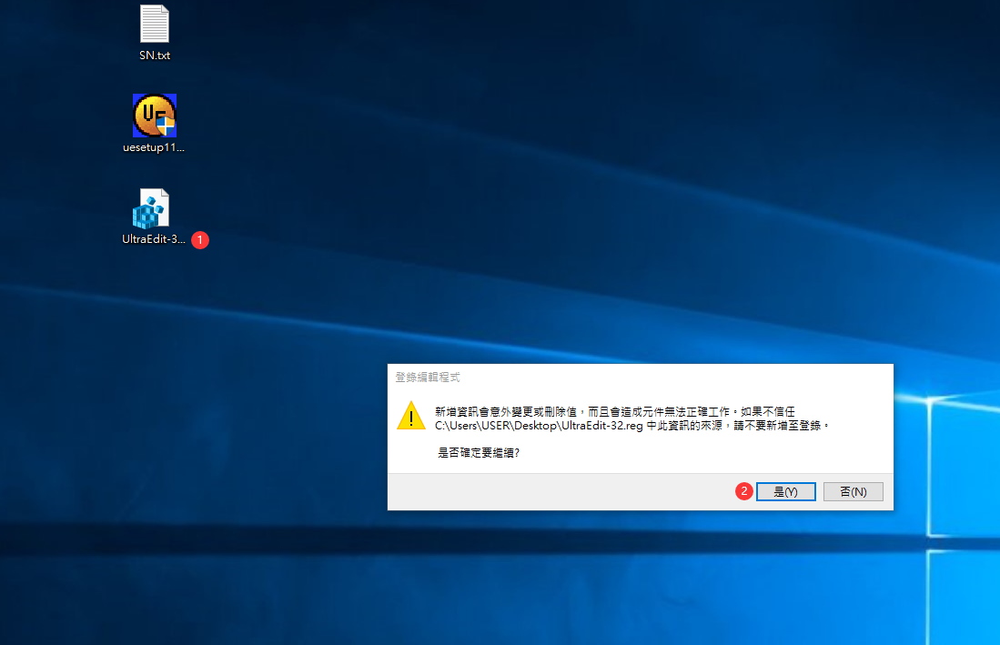
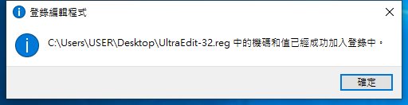
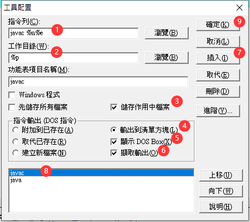
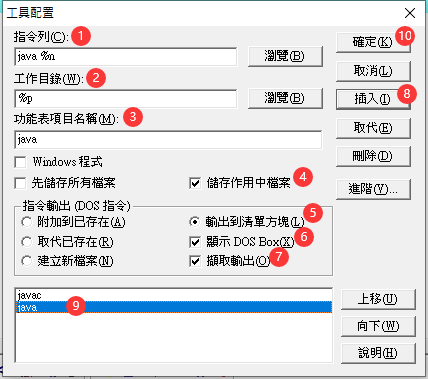
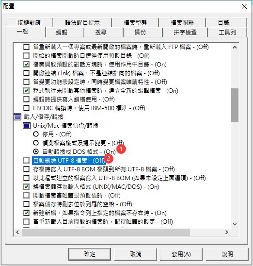
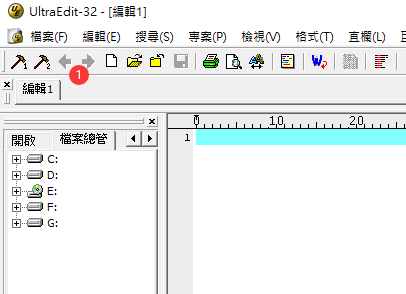

1. 執行 UltraEdit-32.reg

  

1. UltraEdit-32.reg 執行成功

  

2. 安裝 uesetup11_4.exe

   - Name : `www.crackzplanet.com`
   - Serial: `Z4J50-G0L1D-X805M-V901U`

  

3. 配置 javac: `進階` > `工具配置`

   - 指令列: `javac %n%e`
   - 工作目錄: `%p`
   - 功能表項目名稱: `javac`

  

4. 配置 java: `進階` > `工具配置`

   - 指令列: `java %n`
   - 工作目錄: `%p`
   - 功能表項目名稱: `java`

  

5. 配置基礎設定: `進階` > `配置`

  

6. 配置快捷: `右鍵箭頭位置` > `自訂工具列...` > `添加【使用者工具 1】` > `添加【使用者工具 2】` > `確定`

   - 後續寫完程式可點擊 `工具1` 編譯，點擊 `工具2` 執行

  

