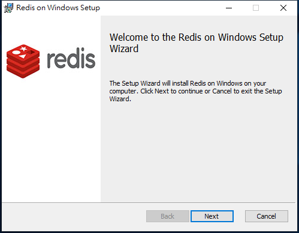
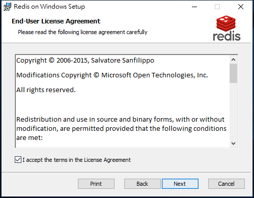
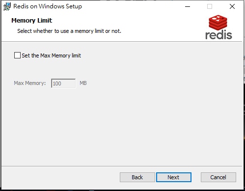
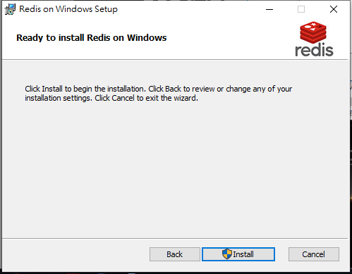
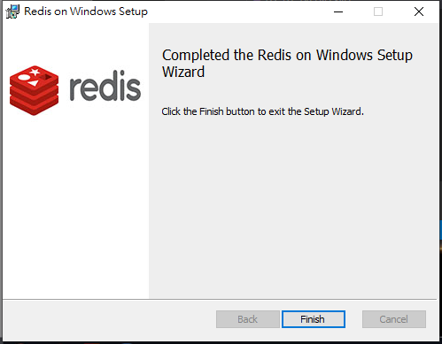
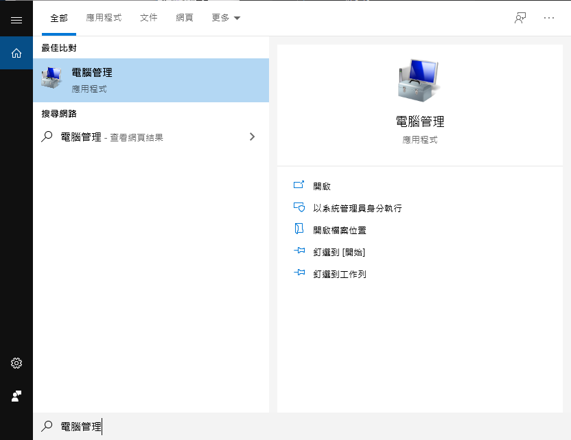
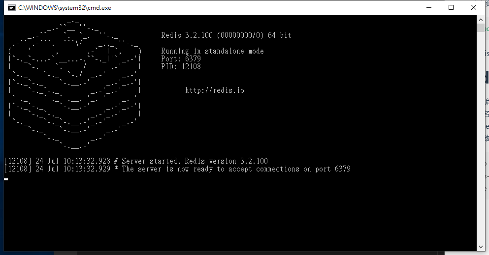
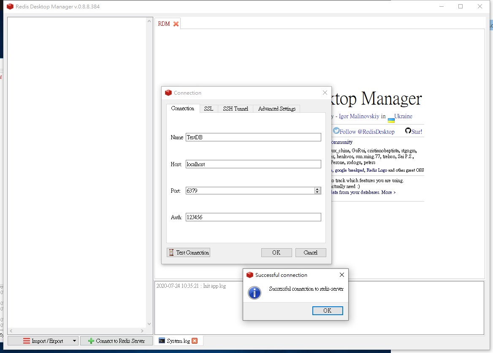
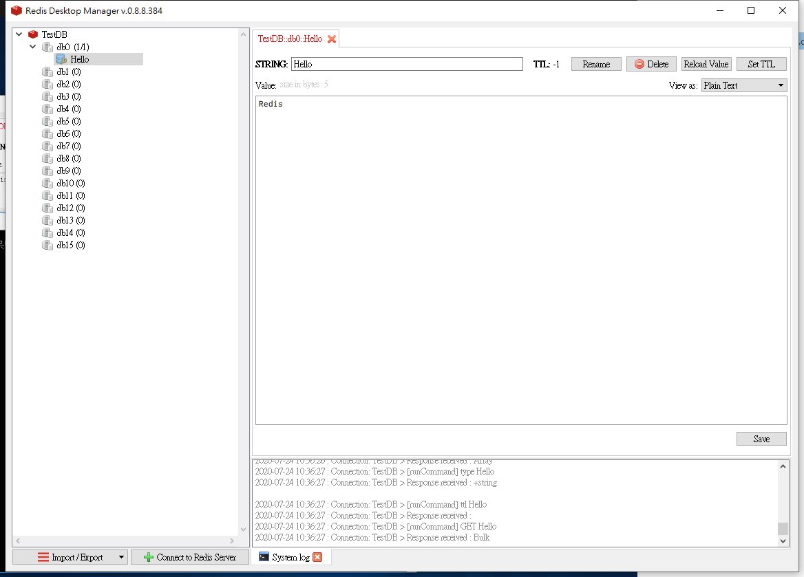

<h1 id="top">目錄</h1>

- [1. Redis 安裝](#s1)
- [2. 設定手動啟用 Redis](#s2)
- [3. Redis 啟動](#s3)
- [4. Redis 視窗化安裝執行](#s4)

---

# <a id='s1' class='md-title' href='#top'>1. Redis 安裝</a>

- 建立資料夾

```cs
"C:\Redis"
```

- 點擊 [Redis-x64-3.2.100.msi](./doc/Redis-x64-3.2.100.msi) 並安裝至自訂目錄

<p></p>

- Next

<p></p>

- 勾選，自動設定環境變數

<p></p>

- 勾選，允許通過防火牆

<p></p>

- Next

<p></p>

- Install

<p></p>

- Finish，Redis 安裝完成

<p></p>

# <a id='s2' class='md-title' href='#top'>2. 設定手動啟用 Redis</a>

- 電腦管理

<p></p>

- 找到並停用

<p></p>

- 設定手動

<p></p>

- 欲修改位置(改密碼)

<p></p>

- localhost

<p></p>

- 設定密碼

<p></p>

# <a id='s3' class='md-title' href='#top'>3. Redis 啟動</a>

- 創建啟動檔，並撰寫 bat
  - 名稱自訂為 redis_startup.bat
  - redis-server C:\Redis\redis.windows.conf --appendonly yes 也可直接在 cmd 執行
  - `--appendonly yes` 即 `AOF 持久化開啟`
  - 啟動後窗口不可關閉

```cs
@echo off
redis-server C:\Redis\redis.windows.conf --appendonly yes
pause
```

- 測試連線

<p></p>

- **命令提示字元介面** 新增資料

<p></p>

# <a id='s4' class='md-title' href='#top'>4. Redis 視窗化安裝執行</a>

- 雙擊 [redis-desktop-manager-0.8.8.384.exe](./doc/redis-desktop-manager-0.8.8.384.exe) 並安裝

- <u>Connect Redis Server</u> 創建連線

<p></p>

- 連線成功畫面，可查看新增的資料

<p></p>
