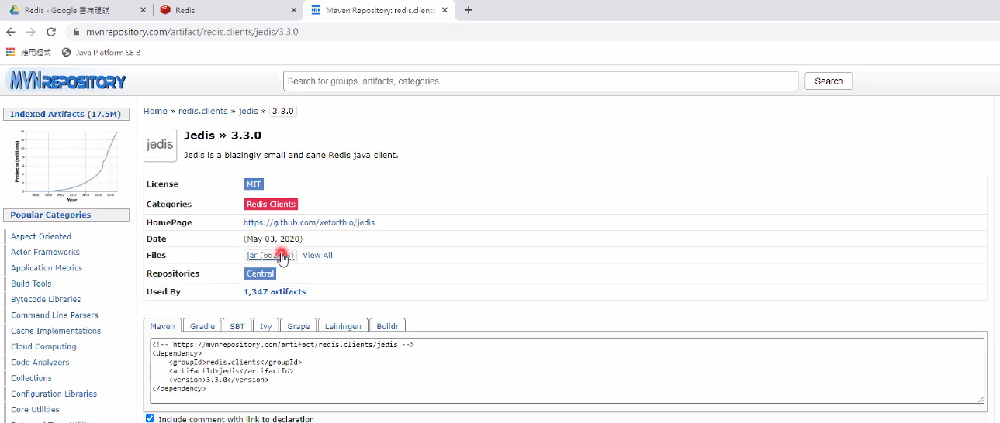
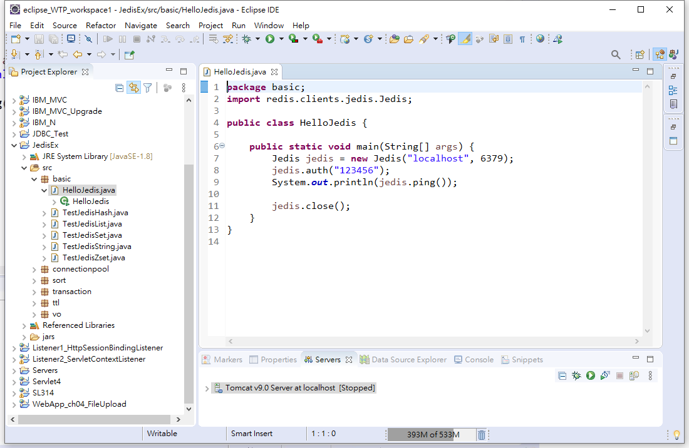

<h1 id="top">目錄</h1>

- [1. Redis Java API – Jedis](#s1)
- [2. Eclipse 引入範例附件](#s2)
- [3. Redis 連線測試](#s3)
- [4. Redis 命名規則](#s4)
- [5. Redis 基本指令與型態](#s5)
- [6. Jedis 範例](#s6)
- [7. Jedis 模糊查詢](#s7)
- [8. String 型態](#s8)
- [9. List 型態](#s9)
- [10. List 範例](#s10)
- [11. jason 範例](#s11)
- [12. Hash 型態](#s12)
- [13. Hash 範例](#s13)
- [14. Set 型態](#s14)
- [15. Set 範例](#s15)
- [16. 集合比較](#s16)
- [17. Zset 型態](#s17)
- [18. Zset 範例](#s18)
- [19. Redis 進階 – 交易](#s19)
- [20. Redis 交易時間範例](#s20)
- [21. Redis 進階 – 存活時間](#s21)
- [22. Redis 存活時間範例](#s22)
- [23. Redis 存活時間 - 會員驗證範例](#s23)
- [24. Redis 進階 – 排序](#s24)
- [25. Redis 進階 – 排序(BY)](#s25)
- [26. Redis 進階 – 排序(GET)](#s26)
- [27. Redis 進階 – 排序相關參數](#s27)
- [28. Redis 進階 – 排序總結](#s28)
- [29. Redis 進階 – 持久化](#s29)
- [30. 部份 redis.conf 設定](#s30)

---

# <a id='s1' class='md-title' href='#top'>1. Redis Java API – Jedis</a>

- Jedis 是 Redis 官網上主要推薦的其中一種 Java 的用戶端套件，而且是
  開源專案，目前最新版本釋出為 2.9 版，可以在 Github 上找到完整的
  source code 之外，也可以從 maven 上直接下載已打包好的 jar 檔使用

- Jedis 設計上，API 裡的方法與 Redis 命令名稱均相同，方便我們在學習
  或是使用上的對應，可結合 Redis 命令列一同測試方便觀察執行結果

- `Jedis 也提供了連線池機制(JedisPool)`，在 Web 多人環境裡，可以對
  Redis 的連線做到有效率的執行與資源重覆的利用性
  (註) 要使用 Jedis 連線池還需要依賴 commons-pool2 套件才可使用

- **Jedis 相關資源**:
  https://redis.io/clients#java (Redis 官網有關 Java 相關套件介紹)
  https://github.com/xetorthio/jedis (Jedis Github 頁面)
  https://mvnrepository.com/artifact/redis.clients/jedis/2.9.0 (maven)

  搭配附件提供的 JedisEx 範例與投影片 Redis 指令整理進行操作與測試

<p></p>

# <a id='s2' class='md-title' href='#top'>2. Eclipse 引入範例附件</a>

- Existing Projectsinto Workspace

<p></p>

- Select archive file

<p></p>

- 開啟範例

<p></p>

# <a id='s3' class='md-title' href='#top'>3. Redis 連線測試</a>

```cs
"/JedisEx/src/basic/HelloJedis.java"
```

```java
package basic;
import redis.clients.jedis.Jedis;

public class HelloJedis {

  public static void main(String[] args) {
    // 連線與埠號
    Jedis jedis = new Jedis("localhost", 6379);
    // 連線密碼
    jedis.auth("123456");
    System.out.println(jedis.ping());

    jedis.close();
  }
}
```

# <a id='s4' class='md-title' href='#top'>4. Redis 命名規則</a>

- Redis 對於 key 的命名並沒有強制的規範或要求，但比較好的實作命名
  是用<u> "物件型態:物件 ID:物件屬性" </u>來做為 key 的命名，若是兩個單字以
  上則用<u> "." </u>做為分隔

  - 如 user:1:friends 做為 key 來儲存 ID 為 1 的使用者的好友列表
  - 又如 post:42:page.view 來儲存 ID 為 42 的文章的瀏覽次數

- Key 的名稱不能包含空格等特殊字元 (為了方便在文字介面進行操作)，
  而 key 的名稱也不需要再用雙引號包覆起來，但無論如何，可讀性的命
  名是最重要的!

# <a id='s5' class='md-title' href='#top'>5. Redis 基本指令與型態</a>

- Redis 提供了一百多個指令，但常用的只有十幾個，而且都很容易記憶，
  雖然跟 SQL 指令一樣沒有區分大小寫，但比起 SQL 指令卻要簡單得多，
  可以參考官網文件: https://redis.io/commands

- `Redis 使用 "指令" 來區分存入的資料類型`

- **五種型態資料結構與操作**:

  - Redis 的 List 偏向 LinkedList 的設計結構，Zset 偏向 Tree set

- **可儲存三種類型的值**:

  - 文字 (含 JSON， BASE64 與二進位資料)
    - 注意: `org.json 套件不支援 java.sql.Date`
    - 解決方式: `從資料庫 getDate 取出後，轉成字串`(呼叫 toString()即可)
  - 整數
  - 浮點數

- **字串操作基本指令**:
<table>			
<tr>	<td>GET </td>	<td>GET key: <br>讀取該key對應的value</td>	</tr>
<tr>	<td>SET </td>	<td>SET key newValue:<br>新增/改變此key對應的value</td>	</tr>
<tr>	<td>DEL</td>	<td>DEL key: <br>刪除此key與對應的value，對所有資料結構都適用</td>	</tr>
</table>

# <a id='s6' class='md-title' href='#top'>6. Jedis 範例</a>

```cs
"/JedisEx/src/basic/TestJedisString.java"
```

```java
package basic;
import java.util.ArrayList;
import java.util.List;

import org.json.JSONArray;
import org.json.JSONObject;

import redis.clients.jedis.BitOP;
import redis.clients.jedis.Jedis;
import vo.Pen;

public class TestJedisString {

  public static void main(String[] args) {
    Jedis jedis = new Jedis("localhost", 6379);
    jedis.auth("123456");

    // 一般字串資料
    jedis.set("myKey", "Hello, Redis~");
    System.out.println("myKey is: " + jedis.get("myKey"));

    jedis.append("myKey", "安安你好");
    System.out.println("Append result: " + jedis.get("myKey"));
    System.out.println("myKey's length: " + jedis.strlen("myKey"));
    System.out.println("Get range: " + jedis.getrange("myKey", 7, 11));
    System.out.println("Get range(2): " + jedis.getrange("myKey", -18, -14));


    // JSON格式
    Pen myPen = new Pen(1, "SKB", 10);
    Pen yourPen = new Pen(2, "Pentel", 50);
    List<Pen> penList = new ArrayList<>();
    penList.add(myPen);
    penList.add(yourPen);

    String jObjStr = new JSONObject(myPen).toString();
    String jArrayStr = new JSONArray(penList).toString();
    StringBuilder sb = new StringBuilder("pen:").append(myPen.getId());
    jedis.set(sb.toString(), jObjStr);
    jedis.set("pens", jArrayStr);
    System.out.println(jedis.get(sb.toString()));
    System.out.println(jedis.get("pens"));

    // 多筆key處理
    jedis.mset("key1", "value1", "key2", "value2", "key3", "value3");
    List<String> data = jedis.mget("key1", "key2", "key3");
    for (String str : data)
      System.out.println(str);

    // 整數: 可應用在投票系統，沒參數也會在資料庫中自動增加
    for (int i = 1; i <= 100; i++) {
      jedis.incr("num");
    }
    jedis.decr("num");// num-- 的意思
    System.out.println(jedis.get("num")); // 取出的資料都為 String
    System.out.println(jedis.decrBy("num", 12));
    System.out.println(jedis.incr("data"));   // 需要為數字格式，否則會錯誤

    // 位元
    //       b           a            r
    //   01100010     01100001     01110010
    //
    //                 OR運算
    //
        //       a           a            r
    //   01100001     01100001     01110010
    //   ↓↓↓↓↓↓↓↓↓↓↓↓↓↓↓↓↓↓↓↓↓↓↓↓↓↓↓↓↓↓↓↓↓↓
    //
    //       c           a            r
    //   01100011     01100001     01110010


    jedis.set("foo", "bar");
    System.out.println(jedis.getbit("foo", 6));
    jedis.setbit("foo", 6, false); // false: 0
    jedis.setbit("foo", 7, true); // true: 1
    System.out.println(jedis.get("foo"));

    jedis.set("foo1", "bar");
    jedis.set("foo2", "aar");
    jedis.bitop(BitOP.OR, "result", "foo1", "foo2"); // bitop 位元運算，bit 的 OR 運算，1 0 或 0 1 才是 1 否則都 0
    System.out.println(jedis.get("result"));


    System.out.println("獲得所有 key: \t"+jedis.keys("*"));
    System.out.println("獲得所有 key*: \t"+jedis.keys("key*"));
    System.out.println("獲得所有 key[^12]: \t"+jedis.keys("key[^12]"));
    System.out.println("獲得所有 *key*: \t"+jedis.keys("*key*"));


    jedis.close();
  }
}
```

# <a id='s7' class='md-title' href='#top'>7. Jedis 模糊查詢</a>

```java
System.out.println("獲得所有 key: \t"+jedis.keys("*"));
System.out.println("獲得所有 key*: \t"+jedis.keys("key*"));
System.out.println("獲得所有 key[^12]: \t"+jedis.keys("key[^12]"));
System.out.println("獲得所有 *key*: \t"+jedis.keys("*key*"));
```

```cs
獲得所有 key: 		[key1, key2, data, key3, foo, num, pen:1, myKey, pens, result, Hello, foo1, foo2]
獲得所有 key*: 		[key1, key2, key3]
獲得所有 key[^12]: 	[key3]
獲得所有 *key*: 		[key1, key2, key3]
```

# <a id='s8' class='md-title' href='#top'>8. String 型態</a>

- **讀寫部份字串操作指令**:

<table>			
<tr>	<td>APPEND</td>	<td>APPEND key value: <br>若key已存在且對應的值是個字串，則將value附加到原本value<br>的尾端，若是key不存在，功能等同於SET key value</td>	</tr>
<tr>	<td>GETRANGE</td>	<td>GETRANGE key start end: <br>傳回key對應value的子字串，截取範圍包含start與end，若提供<br>為負數則-1代表最後一個 <code>byte</code> ，-2為倒數第二個 <code>byte</code> 依此類推</td>	</tr>
<tr>	<td>SETRANGE</td>	<td> SETRANGE key offset value:<br>用value取代指定的key所對應的字串，從offset開始，若key不存<br>在則當成空白字串處理</td>	</tr>
<tr>	<td>STRLEN</td>	<td>STRLEN key:<code>( 回傳該字串的byte數量，不是字元數量 )</code> <br>回傳對應value的長度，若key不存在則回傳0</td>	</tr>
<tr>	<td>MGET/MSET</td>	<td>MGET key [key...]: 一次取得多個key對應的value<br>MSET key value [key value...]: 一次設定多個key-value</td>	</tr>
</table>

- **整數與浮點數操作指令**:

<table>			
<tr>	<td>INCRBY</td>	<td>INCRBY key amount: 將key對應的value增加amount</td>	</tr>
<tr>	<td>DECRBY</td>	<td>DECRBY key amount: 將key對應的value減少amount</td>	</tr>
<tr>	<td>INCRBYFLOAT</td>	<td>INCRBYFLOAT key amount: 將key對應的value增加amount，<br>amount可以為浮點數</td>	</tr>
</table>

- **二進位操作指令**:

<table>			
<tr>	<td>GETBIT</td>	<td>GETBIT key offset: 取得對應value的offset位置的位元資料</td>	</tr>
<tr>	<td>SETBIT</td>	<td>SETBIT key offset value: 設定對應value的offset位置換成value</td>	</tr>
<tr>	<td>BITCOUNT</td>	<td>BITCOUNT key [start] [end]: 取得對應value位元資料為1的數量<br>可加start / end做範圍的計次</td>	</tr>
<tr>	<td>BITOP</td>	<td>BITOP operation destkey key [key...]: 對一個或多個以上的存著<br>二進位位元的資料進行AND / OR / XOR / NOT運算，並將結果<br>存到destkey裡</td>	</tr>
</table>

# <a id='s9' class='md-title' href='#top'>9. List 型態</a>

- List 如同 LinkedList，或是`可視為佇列或堆疊進行操作`，因為可以進行
  List 的左右兩端的加入與移除，或是取得某一部份內容，但 `搭配索引值 存取的效能表現就較不理想`

- **List 基本操作指令**:

<table>			
<tr>	<td>RPUSH</td>	<td>RPUSH key value [value...]:<br>從右邊插入一個或多個value</td>	</tr>
<tr>	<td>LPUSH</td>	<td>LPUSH key value [value...]:<br>從左邊插入一個多或個value</td>	</tr>
<tr>	<td>LRANGE</td>	<td>LRANGE key start stop:<br>取得對應的start ~ stop範圍的value</td>	</tr>
<tr>	<td>LINDEX</td>	<td>LINDEX key index:<br>取得索引值對應的value,從0開始,也可給負數<br>(即從最右邊開始向左)</td>	</tr>
<tr>	<td>LPOP</td>	<td>LPOP key:<br>從最左邊取出一個value (含移除該value)</td>	</tr>
<tr>	<td>RPOP</td>	<td>RPOP key:<br>從最右邊取出一個value (含移除該value)</td>	</tr>
<tr>	<td>LLEN</td>	<td>LLEN key:<br>回傳該List的元素個數,key不存在回傳0</td>	</tr>
</table>

- **List 進階操作指令**:

<table>			
<tr>	<td>LREM</td>	<td>LREM key count value:<br>count > 0時,會從左邊刪除前count值為value的元素<br>count < 0時,會從右邊刪除前count值為value的元素<br>count = 0時,會刪除所有值為value的元素</td>	</tr>
<tr>	<td>LTRIM</td>	<td>LTRIM key start end:<br>刪除key對應從start到stop範圍外的所有元素</td>	</tr>
<tr>	<td>LINSERT</td>	<td>LINSERT key BEFORE | AFTER pivot value:<br>從左至右尋找到pivot後再根據BEFORE或AFTER,將value插入於pivot的前面或後面</td>	</tr>
<tr>	<td>LSET</td>	<td>LSET key index value:<br>將key對應的元素,從指定的index替換成value</td>	</tr>
<tr>	<td>RPOPLPUSH</td>	<td>RPOPLPUSH source destination:<br>先做RPOP再執行LPUSH (原子性)<br>從指定的source右邊取出value後,再加到destination的左邊</td>	</tr>
</table>

# <a id='s10' class='md-title' href='#top'>10. List 範例</a>

```cs
"/JedisEx/src/basic/TestJedisList.java"
```

```java
package basic;
import java.util.List;

import redis.clients.jedis.BinaryClient.LIST_POSITION;
import redis.clients.jedis.Jedis;

public class TestJedisList {

  public static void main(String[] args) {
    Jedis jedis = new Jedis("localhost", 6379);
    jedis.auth("123456");

    if (jedis.exists("customers"))
      jedis.del("customers");

    jedis.lpush("customers", "David", "James", "Vincent", "Ben", "Ron", "George", "Howard");
    // List內容："Howard", "George", "Ron", "Ben", "Vincent", "James", "David"
    System.out.println(jedis.lpop("customers"));
    // List內容："George", "Ron", "Ben", "Vincent", "James", "David"
    jedis.rpush("customers", "Gakki", "Messi", "CR7");
    // List內容："George", "Ron", "Ben", "Vincent", "James", "David", "Gakki", "Messi", "CR7"

    System.out.println("============================");

    // 可指定小範圍
    // List<String> range1 = jedis.lrange("customers", 3, 6);
    List<String> range1 = jedis.lrange("customers", 0, -1); // 從左邊第一個元素取到最右邊的第一個元素(-1為索引值)
    for (String customer : range1)
      System.out.println(customer);

    System.out.println("共有" + jedis.llen("customers") + "位客戶");

    System.out.println("============================");

    jedis.ltrim("customers", 3, 6);
    List<String> range2 = jedis.lrange("customers", 0, jedis.llen("customers"));
    for (String customer : range2)
      System.out.println(customer);

    System.out.println("============================");

    jedis.linsert("customers", LIST_POSITION.BEFORE, "David", "Jedis");
    List<String> range3 = jedis.lrange("customers", 0, jedis.llen("customers"));
    for (String customer : range3)
      System.out.println(customer);


    jedis.close();

  }
}
```

# <a id='s11' class='md-title' href='#top'>11. jason 範例</a>

- json.org 最早 json 格式是在 javascript 上出現的
- json 也是種對物件進行序列化的格式
- 用 json ，需要另外放入 json.jar

```cs
"/JavaEx_Additional/src/json/JSONEx.java"
```

```java
package json;

import java.text.ParseException;
import java.text.SimpleDateFormat;
import java.util.ArrayList;
import java.util.Date;
import java.util.List;
import java.util.Locale;

import org.json.JSONArray;
import org.json.JSONException;
import org.json.JSONObject;

public class JSONEx {

  public static void main(String[] args) throws JSONException, ParseException {
    String jsonStr = "";

    // Data for testing
    Book book1 = new Book("Java", 500, "John");
    Book book2 = new Book("Android", 600, "Allen");
    List<Book> bookList = new ArrayList<Book>();
    bookList.add(book1);
    bookList.add(book2);
    OrderMaster order = new OrderMaster("111", "david", new Date(), bookList);

    // Object to JSON
    jsonStr = new JSONObject(book1).toString();
    System.out.println("Object to JSON: " + jsonStr);
    // JSON to Object
    JSONObject jsonObj = new JSONObject(jsonStr);
    String name = jsonObj.getString("name");
    double price = jsonObj.getDouble("price");
    String author = jsonObj.getString("author");
    Book myBook = new Book(name, price, author);
    myBook.show();
    System.out.println();

    // List to JSON
    jsonStr = new JSONArray(bookList).toString();
    System.out.println("List to JSON: " + jsonStr);
    // JSON to List
    List<Book> books = new ArrayList<Book>();
    JSONArray jsonArray = new JSONArray(jsonStr);
    for (int i = 0; i < jsonArray.length(); i++) {
      JSONObject json_book = jsonArray.getJSONObject(i);
      String book_name = json_book.getString("name");
      double book_price = json_book.getDouble("price");
      String book_author = json_book.getString("author");
      Book book = new Book(book_name, book_price, book_author);
      books.add(book);
    }
    for (Book book : books) {
      book.show();
    }
    System.out.println();

    // Object (with List) to JSON
    jsonStr = new JSONObject(order).toString();
    System.out.println("Object (with List) to JSON: " + jsonStr);
    // JSON to Object (with List)
    JSONObject orderObj = new JSONObject(jsonStr);
    String orderId = orderObj.getString("orderId");
    String customer = orderObj.getString("customer");
    // Locale.ENGLISH could be needed if current locale != ENGLISH
    // pattern letters refers to SimpleDateFormat in Javadoc
    SimpleDateFormat simpleDateFormat = new SimpleDateFormat("EEE MMM d HH:mm:ss zzz yyyy", Locale.ENGLISH);
    Date date = simpleDateFormat.parse(orderObj.getString("date"));
    JSONArray jsonArray_books = orderObj.getJSONArray("bookList");
    List<Book> myBookList = new ArrayList<Book>();
    for (int i = 0; i < jsonArray_books.length(); i++) {
      JSONObject json_book = jsonArray_books.getJSONObject(i);
      String bookName = json_book.getString("name");
      double bookPrice = json_book.getDouble("price");
      String bookAuthor = json_book.getString("author");
      Book book = new Book(bookName, bookPrice, bookAuthor);
      myBookList.add((book));
    }
    OrderMaster myOrder = new OrderMaster(orderId, customer, date, myBookList);
    myOrder.show();
  }
}
```

# <a id='s12' class='md-title' href='#top'>12. Hash 型態</a>

- `Hash 型態也是一種 key-value 結構`，儲存欄位與對應的值，但值只能
  是字串資料，不支援其它型態，因此不能做巢狀結構 (`Redis 所有資料 型態都不支援巢狀資料結構`)。
- Hash 型態很適合用來儲存物件，利用物件所屬類別與 ID 做為 key，而
  實體變數名稱做為欄位，而欄位值存著實體變數的值，例如:

<p></p>

- **Hash 基本操作指令**:

<table>			
<tr>	<td>HSET</td>	<td>HSET key field value:<br>加入或更新一個雜湊型態資料</td>	</tr>
<tr>	<td>HGET</td>	<td>HGET key field:<br>取得一個對應的欄位值</td>	</tr>
<tr>	<td>HMSET</td>	<td>HMSET key field value [field value...]:<br>一次設定或加入多個雜湊型態資料</td>	</tr>
<tr>	<td>HMGET</td>	<td>HMGET key field [field...]:<br>一次取得多個欄位值</td>	</tr>
<tr>	<td>HGETALL</td>	<td>HGETALL key:一次取得所有的欄位與欄位值</td>	</tr>
<tr>	<td>HEXISTS</td>	<td>HEXISTS key field:<br>判斷一個欄位是否存在，回傳1代表存在，0為相反</td>	</tr>
<tr>	<td>HSETNX</td>	<td>HSETNX key field value:<br>NX(if not exist)，與HSET相似，但若欄位已存在，此指令不做任何動作</td>	</tr>
<tr>	<td>HINCRBY</td>	<td>HINCRBY key field increment:<br>如欄位值為整數，可以用來做為增加動作</td>	</tr>
<tr>	<td>HDEL</td>	<td>HDEL key field [field...]:<br>可以刪除一個或多個欄位，回傳被刪除的數量</td>	</tr>
<tr>	<td>HLEN</td>	<td>HLEN key:<br>取得欄位數量</td>	</tr>
</table>

# <a id='s13' class='md-title' href='#top'>13. Hash 範例</a>

```cs
"/JedisEx/src/basic/TestJedisHash.java"
```

```java
package basic;
import java.util.HashMap;
import java.util.List;
import java.util.Map;

import redis.clients.jedis.Jedis;

public class TestJedisHash {

  public static void main(String[] args) {
    Jedis jedis = new Jedis("localhost", 6379);
    jedis.auth("123456");

    // 清空 key 值
    jedis.flushDB();

    jedis.hset("pen:1", "brand", "SKB");
    jedis.hset("pen:1", "price", "10");
    System.out.println("Pen 1's brand is: " + jedis.hget("pen:1", "brand"));
    System.out.println("Pen 1's price is: " + jedis.hget("pen:1", "price"));

    HashMap<String, String> data = new HashMap<>();
    data.put("brand", "Pentel");
    data.put("price", "50");
    // 無須對應ORM設計，可自由為key增減自己需要的欄位與欄位值
    data.put("color", "blue");

    jedis.hmset("pen:2", data);
    List<String> penData = jedis.hmget("pen:2", "brand", "price", "color");
    System.out.println("HMGET: ");
    for (String str : penData)
      System.out.println(str);

    Map<String, String> hAll = jedis.hgetAll("pen:2");
    for (String str : hAll.keySet())
      System.out.println(str + " = " + hAll.get(str));

    // 註：Hash沒有提供hincr(遞增)指令，只有hincrby指令可用

    jedis.close();
  }

}
```

# <a id='s14' class='md-title' href='#top'>14. Set 型態</a>

- `Set 型態其特性為無序性與唯一性`，因此很適合向 Set 做加入或刪除，
  並判斷元素是否存在，而 key 之間還能進行`聯集、交集與差集`等運算
  (如文章分類標籤)

- **Set 基本操作指令**:

<table>			
<tr>	<td>SADD</td>	<td>SADD key member [member...]:<br>加入一個或多個元素,回傳加入的元素數量 (重複不加入)</td>	</tr>
<tr>	<td>SREM</td>	<td>SREM key member [member...]:<br>移除一個或多個元素,回傳刪除成功的元素數量</td>	</tr>
<tr>	<td>SMEMBERS</td>	<td>SMEMBERS key:<br>回傳set裡的所有元素</td>	</tr>
<tr>	<td>SISMEMBER</td>	<td>SISMEMBER key member:<br>檢查key對應的元素裡有沒有member,回傳1為存在,反之為0</td>	</tr>
<tr>	<td>SCARD</td>	<td>SCARD key:<br>回傳此set有幾個元素</td>	</tr>
<tr>	<td>SRANDMEMBER</td>	<td>SRANDMEMBER key [count]:<br>count > 0 則隨機取得count個不重覆元素<br>count < 0 則隨機取得count個元素,有可能重覆</td>	</tr>
<tr>	<td>SPOP</td>	<td>SPOP key:<br>隨機取得一個元素 (含移除該元素)</td>	</tr>
</table>

- **Set 多個集合操作指令**: 差集

<table>			
<tr>	<td>SDIFF</td>	<td>SDIFF key [key...]:<br>進行差集運算,即為集合A – 集合B的結果,代表所有屬於A<br>且不屬於B的元素<br>如 A {1, 2, 3} – B {2, 3, 4} = {1}<br>或 A {2, 3, 4} – B {1, 2, 3} = {4}</td>	</tr>
</table>

<p></p>

- **Set 多個集合操作指令**: 交集

<table>			
<tr>	<td>SINTER</td>	<td>SINTER key [key...]:<br>進行交集運算,即為集合A與集合B的交集結果,代表所有屬<br>於A <strong style="color:red;">且</strong> 屬於B的元素<br>如 A {1, 2, 3} ∩ B {2, 3, 4} = {2, 3}<br></td>	</tr>
</table>

<p></p>

- **Set 多個集合操作指令**: 連集

<table>			
<tr>	<td>SUNION</td>	<td>SUNION key [key...]:<br>進行聯集運算,即為集合A與集合B的聯集結果,代表所有屬<br>於A或屬於B的元素<br>如 A {1, 2, 3} ∪ B {2, 3, 4} = {1, 2, 3, 4}</td>	</tr>
</table>

<p></p>

# <a id='s15' class='md-title' href='#top'>15. Set 範例</a>

```cs
"/JedisEx/src/basic/TestJedisSet.java"
```

```java
package basic;

import java.util.Set;
import redis.clients.jedis.Jedis;

public class TestJedisSet {

  public static void main(String[] args) {
    Jedis jedis = new Jedis("localhost", 6379);
    jedis.auth("123456");

    jedis.sadd("post:1:tags", "Java");
    jedis.sadd("post:2:tags", "Java", "Servlet");
    jedis.sadd("post:3:tags", "Java", "Servlet", "JSP");
    jedis.sadd("tag:Java:posts", "2", "1", "3");
    jedis.sadd("tag:Servlet:posts", "3", "2");
    jedis.sadd("tag:JSP:posts", "3");

    for (String str : jedis.smembers("post:3:tags")) {
      System.out.println(str);
    }

    System.out.println(jedis.sismember("post:2:tags", "JSP"));

    System.out.println("============差集運算=============");
                          //jedis.sdiff("post:1:tags", "post:2:tags");  ??
    Set<String> diffResult = jedis.sdiff("post:2:tags", "post:1:tags");
    System.out.println(diffResult);

    System.out.println("============交集運算=============");

    Set<String> interResult = jedis.sinter("tag:Java:posts", "tag:Servlet:posts", "tag:JSP:posts");
    System.out.println(interResult);

    System.out.println("============聯集運算=============");

    Set<String> unionResult = jedis.sunion("post:1:tags", "post:2:tags", "post:3:tags");
    System.out.println(unionResult);

    System.out.println("============其它指令測試=============");

    jedis.sadd("candidate", "David", "Lai", "Aliee", "Hugh", "Ping Ru", "Chung-Yu");
    System.out.println(jedis.srandmember("candidate"));
                          // 回傳List<String>
    System.out.println(jedis.srandmember("candidate", 3));

    jedis.close();
  }
}
```

# <a id='s16' class='md-title' href='#top'>16. 集合比較</a>

- 情境:
  想要列出某個標籤底下的所有文章，或是同時屬於某幾個標籤的文章，
  在傳統關聯式資料庫，因為標籤與文章為多對多關係，所以會採以下設計
- 發想情境:
  - 購物車
  - 會員登入
  - 討論區文章

<p></p>

- 要找到同時屬於 Java， Servlet 與 JSP 這 3 個標籤的文章，SQL 指令可能
  如以下做法:

```sql
SELECT p.post_title
FROM posts_tags pt,

posts p,
tags t

WHERE pt.tag_id = t.tag_id
AND (t.tag_name IN ('Java', 'Servlet', 'JSP'))
AND p.post_id = pt.post_id
GROUP BY p.post_id HAVING COUNT (p.post_id) = 3;
```

- 改成 Redis 設計，每個標籤用一個 tag:標籤名稱:posts 的 set 型態儲存有該標籤的文章 ID

- 想找到標記為 Servlet 標籤的文章時
  **SMEMBERS tag:Servlet:posts**

- 想同時找到屬於 Java, Servlet, JSP 這三個標籤的文章時
  **SINTER tag:Java:posts tag:Servlet:posts tag:JSP:posts**

- 即`可省去`在 SQL 指令下達`複雜的跨表格查詢`動作與效率的提昇

# <a id='s17' class='md-title' href='#top'>17. Zset 型態</a>

- Zset(Sorted Set)與 Set 不同之處就在於是`有序`性的。每個元素都會連
  結一個分數，讓我們可以輕鬆完成最高(或最低)的前 N 個元素
- Zset 與 List 也有些相似，兩者皆為有序性，也都能取得某一個範圍的元
  素，但使用的情境卻是不同的:
  (1) List 是 Linked 結構，所以對兩端資料存取效率極高，但對中間元素
  處理較慢，適合用在新的資料或最舊的資料(兩端)存取
  (2) Zset 非 Linked 結構，即使是取中間元素資料速度也很快
  (3) List 要調整某個元素位置效能表現不佳，但 Zset 表現極佳(透過調整
  元素連結的分數即可)
  (4) Zset 比起 List 更耗費記憶體的使用

- 分數資料可以使用整數之外也可以使用浮點數

- **Zset 基本操作指令**:

<table>			
<tr>	<td>ZADD</td>	<td>ZADD key score member [score member...]:<br>加入一個元素與連結的分數,如元素已存在取新分數取代舊的<br>回傳加入的元素數量</td>	</tr>
<tr>	<td>ZSCORE</td>	<td>ZSCORE key member:<br>取得一個元素的分數</td>	</tr>
<tr>	<td>ZRANGE</td>	<td>ZRANGE key start stop [WITHSCORES]:<br>回傳從start到stop之間(索引值)的元素,按照分數由小到大的順序<br></td>	</tr>
<tr>	<td>ZREVRANGE</td>	<td>ZREVRANGE key start stop [WITHSCORES]:<br>與ZRANGE功能相反(大→小)</td>	</tr>
<tr>	<td>ZRANGEBYSCORE</td>	<td>ZRANGEBYSCORE key min max [WITHSCORES] [LIMIT offset count]:<br>按元素分數由小到大順序回傳分數介於min到max之間(包含)<br>若不想包含min或max,可以用 "(" 表示<br>例如: ZRANGEBYSCORE scoreboard 80 (100 (100就不包含在內)<br>還可以使用+inf 或 –inf 表示正無窮或負無窮<br></td>	</tr>
<tr>	<td>ZINCRBY</td>	<td>ZINCRBY key increment member:<br>增加一個元素的分數,回傳更改後的分數,也可以提供負數代表減分</td>	</tr>
<tr>	<td>ZCARD</td>	<td>ZCARD key:<br>取得元素數量</td>	</tr>
<tr>	<td>ZCOUNT</td>	<td>ZCOUNT key min max:<br>取得分數範圍內的元素數量</td>	</tr>
</table>

- **Zset 進階操作指令**:

<table>			
<tr>	<td>ZREM</td>	<td>ZREM key member [member...]:<br>刪除一個或多個元素,回傳刪除的元素數量</td>	</tr>
<tr>	<td>ZREMRANGEBYRANK</td>	<td>ZREMRANGEBYRANK key start stop:<br>按照分數由小到大的順序,刪除start到stop範圍的元素,回傳刪除的元素數量</td>	</tr>
<tr>	<td>ZREMRANGEBYSCORE</td>	<td>ZREMRANGEBYSCORE key min max:<br>與上個指令相似,根據分數範圍進行刪除</td>	</tr>
<tr>	<td>ZRANK</td>	<td>ZRANK key member:<br>按照分數小到大取得指定元素的排名</td>	</tr>
<tr>	<td>ZREVRANK</td>	<td>ZREVRANK key member:<br>與上個指令相似,按照分數由大到小</td>	</tr>
<tr>	<td>ZINTERSTORE</td>	<td>ZINTERSTORE destination numkeys key [key...] [WEIGHTS weight [weight...] ][AGGREGATE SUM | MIN | MAX:<br>對多個Zset做交集運算,並把結果存在destination,回傳結果數量<br>SUM:預設值,destination裡元素分數是每個參與計算的元素分數的總合<br>MIN:destination裡元素分數是每個參與計算的元素分數的最小值<br>MAX:destination裡元素分數是每個參與計算的元素分數的最大值<br>WEIGHTS:權重,可以在計算時,元素分數乘上該Zset的權重</td>	</tr>
<tr>	<td>ZUNIONSTORE</td>	<td>同上,做聯集運算</td>	</tr>
</table>

# <a id='s18' class='md-title' href='#top'>18. Zset 範例</a>

```java
package basic;

import java.util.HashMap;
import java.util.Map;

import redis.clients.jedis.Jedis;
import redis.clients.jedis.ZParams;
import redis.clients.jedis.ZParams.Aggregate;

public class TestJedisZset {

  public static void main(String[] args) {
    Jedis jedis = new Jedis("localhost", 6379);
    jedis.auth("123456");

    Map<String, Double> scores1 = new HashMap<>();
    scores1.put("David", new Double(100));
    scores1.put("James", new Double(85));
    scores1.put("Ron", new Double(67));
    scores1.put("Vincent", new Double(72));
    scores1.put("George", new Double(87));
    scores1.put("Howard", new Double(75));
    scores1.put("Peter", new Double(80));

    Map<String, Double> scores2 = new HashMap<>();
    scores2.put("David", new Double(90));
    scores2.put("James", new Double(77));
    scores2.put("Ron", new Double(78));
    scores2.put("Vincent", new Double(68));
    scores2.put("George", new Double(95));
    scores2.put("Howard", new Double(81));
    scores2.put("Peter", new Double(72));

    jedis.zadd("scores1", scores1);
    jedis.zadd("scores2", scores2);

    jedis.zadd("scores1", 92, "Vincent");
    System.out.println(jedis.zscore("scores1", "Vincent"));
    // 由小到大 (會讀不到最後一位人)
    System.out.println(jedis.zrange("scores1", 1, -1));
    // '('代表不包含，也可以用+inf或-inf來代表正無窮或負無窮 (是 Redis 的特殊語法)
    System.out.println(jedis.zrangeByScore("scores1", "80", "(100"));
    // 小於等於100分的前3人
    System.out.println(jedis.zrevrangeByScore("scores1", "100", "0", 0, 3));

    System.out.println(jedis.zincrby("scores1", 8, "Peter"));
    // zrank 索引值，java 的 tree set 則沒索引值
    System.out.println(jedis.zrank("scores1", "David"));
    System.out.println(jedis.zrevrank("scores1", "David"));

    System.out.println("============Zset運算=============");

    ZParams zp = new ZParams();
    // Aggregate.MAX | Aggregate.MIN
    jedis.zinterstore("scoresinter", zp.aggregate(Aggregate.SUM), "scores1", "scores2");
    System.out.println(jedis.zrevrange("scoresinter", 0, -1));

    jedis.close();
  }
}
```

# <a id='s19' class='md-title' href='#top'>19. Redis 進階 – 交易</a>

- Redis 與其它資料庫一樣，也有提供交易機制，但以下還是列出 Redis
  對於交易執行的相關特性說明:

  (1) **交易裡的所有指令都是循序執行**，而交易執行期間，Redis 就不會
  再接受其它用戶端的請求提供任何服務，以確保原子性執行

  (2) 與關聯式資料庫不同，若是其中**有指令執行失敗，Redis 會繼續執
  行後續的指令 (沒有 rollback 機制)**

  (3) 交易開啟之前，若通訊發生故障，則所有交易指令都不會執行;但
  若是已經執行 EXEC 指令之後發生通訊故障，則指令都會被 Redis
  執行

  - **交易執行就算失敗也會保留操作，不 rollback**
  - **例**:
    需求作溫溼度分析，取一整天的溫濕度感應，
    一分鐘一次一兩筆有問題也沒關係
  - **CAP 理論**
    - 東西好吃、便宜、又不用排隊
    - 很難同時滿足，所以要則須而論

- **交易操作相關指令**:

<table>			
<tr>	<td>MULTI</td>	<td>用來標記一個交易的開始，在MULTI指令之後的指令都會是被加入到指令佇列裡，直到執行了EXEC指令才會被循序執行</td>	</tr>
<tr>	<td>EXEC</td>	<td>執行一個交易裡所有的指令佇列，並將目前狀態恢復為正常狀態 (非交易狀態)。如果交易裡有執行了WATCH指令，那就只有在WATCH的key沒有被修改的前提下，EXEC指令才以能執行指令佇列裡的所有操作，否則EXEC會放棄目前佇列裡的所有指令</td>	</tr>
<tr>	<td>DISCARD</td>	<td>取消交易指令佇列裡的所有項目，並將狀態恢復正常，如果裡面有WATCH指令，則DISCARD會改為UNWATCH操作</td>	</tr>
<tr>	<td>WATCH</td>	<td>WATCH key [key...]:<br>可以監控WATCH的key，如果在EXEC執行之前，WATCH的keys發生修改的話，則EXEC會放棄執行佇列裡的所有指令</td>	</tr>
<tr>	<td>UNWATCH</td>	<td>取消WATCH監控的keys，但若執行了EXEC或DISCARD指令的話，則無需再使用UNWATCH，因為在此之後，所有被監控的keys都會被自動取消WATCH</td>	</tr>
</table>

# <a id='s20' class='md-title' href='#top'>20. Redis 交易時間範例</a>

```cs
"/JedisEx/src/transaction/TestJedisTransaction.java"
```

```java
package transaction;

import java.util.List;
import redis.clients.jedis.Jedis;
import redis.clients.jedis.Transaction;

public class TestJedisTransaction {

  public static void main(String[] args) {
    Jedis jedis = new Jedis("localhost", 6379);
    jedis.auth("123456");

    Transaction tr = jedis.multi();
    tr.set("key", "1");
    // 表示執行就算錯誤也會將所有內容執行完畢，且不可 rollback
    // JedisDataException!!!
    tr.sadd("key", "2");
    tr.set("key", "3");
    List<Object> results = tr.exec();

    System.out.println(results);

    System.out.println(jedis.get("key"));

    jedis.close();
  }
}
```

# <a id='s21' class='md-title' href='#top'>21. Redis 進階 – 存活時間</a>

- 在開發功能時，可能會遇到一些有時效性的資料處理，例如限時優惠、
  快取機制，或是驗證信件點擊處理等，過了一定時間就要做資料刪除
  的動作，而 Redis 就提供了這樣的功能，可以對 key 設定存活時間，
  只要指定的時間到期，由 Redis 自動刪除

  - 可應用在短網址

- **存活時間相關指令**: `(預設存進 redis 的資料是無時效性的，所以需自行設定存活時間)`

<table>			
<tr>	<td>EXPIRE</td>	<td>EXPIRE key seconds:<br>指定該key的存活時間，單位為秒數</td>	</tr>
<tr>	<td>TTL</td>	<td>TTL key:<br>取得該key剩餘的存活時間，回傳剩餘的秒數</td>	</tr>
<tr>	<td>PTTL</td>	<td>PTTL key:<br>與上述指令不同處在於回傳的是剩餘毫秒數</td>	</tr>
<tr>	<td>PERSIST</td>	<td>PERSIST key:<br>取消EXPIRE，將該key恢復成永久存活</td>	</tr>
<tr>	<td>EXPIREAT</td>	<td>EXPIREAT key seconds:<br>跟EXPIRE不同在於，seconds是指系統時間(1970-01-01 00:00:00)起始的秒數，<br>目的是做更精準的存活控制</td>	</tr>
<tr>	<td>PEXPIREAT</td>	<td>PEXPIREAT key milliseconds:<br>跟上者唯一不同的是單位為毫秒</td>	</tr>
</table>

# <a id='s22' class='md-title' href='#top'>22. Redis 存活時間範例</a>

```cs
"/JedisEx/src/ttl/TestJedisTTL.java"
```

```java
package ttl;
import redis.clients.jedis.Jedis;

public class TestJedisTTL {

  public static void main(String[] args) {
    Jedis jedis = new Jedis("localhost", 6379);
    jedis.auth("123456");

    jedis.set("test", "Hello");
    jedis.expire("test", 10);
    try {
      Thread.sleep(3000);
      System.out.println("First ttl: " + jedis.ttl("test"));
      Thread.sleep(3000);
      System.out.println("Second ttl: " + jedis.ttl("test"));
      // 過期之前設定 persist ，就會改回永久存活
      // 若在過期期間 修改了資料則過期設定也會被取消，即 set
      jedis.persist("test"); // 或 jedis.set("test", "World");
      Thread.sleep(4000);


      System.out.println(jedis.ttl("test"));


      System.out.println(jedis.get("test"));

    } catch (Exception e) {
    }
    jedis.close();
  }
}
```

# <a id='s23' class='md-title' href='#top'>23. Redis 存活時間 - 會員驗證範例</a>

```cs
"/JedisEx/src/ttl/TestJedisTTL2.java"
```

```java
package ttl;

import java.util.Scanner;

import redis.clients.jedis.Jedis;

public class TestJedisTTL2 {

  public static void main(String[] args) {
    Jedis jedis = new Jedis("localhost", 6379);
    jedis.auth("123456");

    String code = returnAuthCode();
    System.out.println("Auth code is: " + code);

    jedis.set("Member:M0001", code);
    jedis.expire("Member:M0001", 10);

    Scanner sc = new Scanner(System.in);
    System.out.println("請輸入驗證碼：");
    String str = sc.next();

    // 假設會員點擊驗證信
    String tempAuth = jedis.get("Member:M0001");
    if (tempAuth == null) {
      System.out.println("連結信已逾時，請重新申請");
    } else if (str.equals(tempAuth)){
      System.out.println("驗證成功!");
    } else {
      System.out.println("驗證有誤，請重新申請");
    }

    sc.close();
    jedis.close();
  }

  private static String returnAuthCode() {
    StringBuilder sb = new StringBuilder();
    for (int i = 1; i <= 8; i++) {
      int condition = (int) (Math.random() * 3) + 1;
      switch (condition) {
      case 1:
        char c1 = (char)((int)(Math.random() * 26) + 65);
        sb.append(c1);
        break;
      case 2:
        char c2 = (char)((int)(Math.random() * 26) + 97);
        sb.append(c2);
        break;
      case 3:
        sb.append((int)(Math.random() * 10));
      }
    }
    return sb.toString();
  }
}
```

## <a id='s24' class='md-title' href='#top'>24. Redis 進階 – 排序</a>

- Redis 的 SORT 指令可以對 List、Set 與 Zset 進行排序動作,配合相關
  參數,可以達到非常強大的功能實現,甚至是完成類似關聯式資料庫
  的 JOIN 查詢工作

- SORT 指令:

```cs
SORT key [BY pattern][limit offset count] [GET pattern [GET pattern ...]][asc | desc] [ALPHA][store destination]
```

# <a id='s25' class='md-title' href='#top'>25. Redis 進階 – 排序(BY)</a>

- 因為大多情況下，儲存的元素值是該物件的 ID，但有時候 ID 的排序意
  義不大，而是`希望藉由 ID 對應到的物件裡的某個屬性進行排序動作`，
  這樣的情境下，就可以使用 BY 參數的設定

- 使用了 BY 參數，則 SORT 就不再依據元素本身的值進行排序，而是對
  我們在 BY 參數設定的參考 key 對應的元素值做排序

- BY 參考 key 可以是 String 或 Hash 型態
- 語法:
  如 SORT tag:java:posts BY post:\* -> time (Hash 型態) (key -> 欄位名稱)
  如 SORT mydata BY itemscore:\* (String 型態)

# <a id='s26' class='md-title' href='#top'>26. Redis 進階 – 排序(GET)</a>

- GET 參數可以讓我們在 SORT 完後，取得 GET 參數指定的 key-value，
  而語法規則也跟 BY 參數一樣，也是支援 Hash 型態與 String 型態

- 一個 SORT 指令最多只能有一個 BY 參數，但 GET 參數可以下達多個以
  便我們取得想要的鍵值

- 如:

```cs
SORT tag:java:posts BY post:* -> time GET post:* -> title
SORT tag:java:posts BY post:* -> time GET post:* -> title
GET post:* -> time GET #
```

- 註: GET #會回傳元素本身的值

# <a id='s27' class='md-title' href='#top'>27. Redis 進階 – 排序相關參數</a>

- ASC / DESC 參數即為能對排序結果做升冪或降冪

- ALPHA 參數可以實現字母排序排列非數字的元素資料

- LIMIT offset count 參數可以限制排序後回傳指定範圍的結果，表示跳
  過前 offset 個元素並取得之後的 count 個元素

- STORE destination 參數用在儲存排序結果，因為一般 SORT 完後就是
  直接回傳結果，若是想要將該結果保存在某 key 裡，就可以搭配這個參
  數，再結合 EXPIRE 指令，就能做出快取機制

# <a id='s28' class='md-title' href='#top'>28. Redis 進階 – 排序總結</a>

- 是個功能強大的指令，但也是最為複雜的指令之一

- 若是使用不正確，容易造成資料庫效能低落的狀態;
  因此，在進行 SORT 指令時，注意以下三個原則:

  (1) 盡可能減少要排序 key 裡元素的數量

  (2) 使用 LIMIT 參數只取得需要的資料

  (3) 若是要排序的資料量較大，盡可能搭配 STORE 參數將結果快取起
  來，避免過多次的重覆執行 SORT 動作

# <a id='s29' class='md-title' href='#top'>29. Redis 進階 – 持久化</a>

- **Redis 提供了兩種持久化機制:RDB 與 AOF。讓我們可以對在記憶體裡面的資料透過兩種不同機制(或是混搭)，可以進行硬碟保存的永續操作**

- RDB 是透過快照機制完成，當符合設定檔裡的條件，即把所有在記憶
  體裡的資料進行快照並儲存在硬碟裡，而 AOF 則是滿足條件即把資料
  透過 append 的方式，附加在硬碟檔案裡面

- 官方的設定檔 redis.conf 裡就預置了三個 RDB 啟動快照的條件:
  (1) save 900 1 (2) save 300 10 (3) save 60 10000
- AOF 設定條件 (2)為預設設定:
  (1) appendfsync always (2) appendfsync everysec (3) appendfsync no

- **RDB 機制的優劣勢**
- 優點:
  - 使用 RDB 對整個 Redis 資料庫來說就是一個檔案,因此在進行資料
    恢復時,可以做到較輕鬆的處理
  - RDB 採用子程序處理快照動作,這對 Redis 服務來說執行效率較佳
- 缺點:
  - 若是在 RDB 持久化未進行的期間發生當機等中斷服務狀態時,資料
    都將會遺失
  - 若是一次要快照的資料較大時,會影響到 Redis 程序的運作
- **AOF 機制的優劣勢**
- 優點:
  - 帶來`更高的資料持久性`與`安全性`，因為是採取同步機制進行儲存
  - 因為採用 append 機制，所以寫入中發生當機現象，也不會破壞原有
    的內容，也有 redis-check-aof 工具可以協助解決資料一致性問題
  - AOF 包含一個完整記錄檔記錄了所有的修改操作，也可以透過 AOF
    完成資料重建的動作
- 缺點:
  - 對相同的資料量來說，AOF 的檔案會比 RDB `檔案`來得`大`
  - 因為採用同步方式，所以 AOF 在執行的效能上`慢`於 RDB 機制

# <a id='s30' class='md-title' href='#top'>30. 部份 redis.conf 設定</a>

<table>				
<tr>	<td>daemonize</td>	<td>yes</td>	<td>以背景方式執行</td>	</tr>
<tr>	<td>port</td>	<td>埠號</td>	<td>設定Redis使用的埠號</td>	</tr>
<tr>	<td>dbfilename</td>	<td>dump.rdb</td>	<td>設定持久化檔案名稱</td>	</tr>
<tr>	<td>dir</td>	<td>/var/redis/埠號</td>	<td>設定持久化檔案儲放位置</td>	</tr>
<tr>	<td>databases</td>	<td>16</td>	<td>Redis可用的資料庫數量 (可透過SELECT index切換 0~15)</td>	</tr>
<tr>	<td>requirepass</td>	<td>無</td>	<td>開啟此設定就需要使用登入密碼</td>	</tr>
<tr>	<td>maxmemory</td>	<td>無</td>	<td>設定Redis可使用的最大記憶體量單位為位元組(byte)</td>	</tr>
<tr>	<td>maxmemory-policy</td>	<td>volatile-lru<br>(least recently used)<br>(最近最少使用)</td>	<td>當超過maxmemory,設定刪除key的方案:<br>volatile-lru - 使用LRU演算刪除一個有設定存活時間的key<br>allkeys-lru – 使用LRU演算刪除一個key<br>volatile-random – 隨機刪除一個有設定存活時間的key<br>allkeys-random – 隨機刪除一個key<br>volatile-ttl – 刪除存活時間最近的key<br>noeviction – 不刪除key,只回傳錯誤</td>	</tr>
<tr>	<td>maxmemory-samples</td>	<td>3</td>	<td>若上個設定為allkeys-lru,則隨機取3個刪除裡面最久未被用的key</td>	</tr>
</table>

---

參考鏈接:

- [Redis 数据库 keys 命令的模糊查询](https://blog.csdn.net/qq_15071263/article/details/83576713)
- [Redis Flushdb 命令](https://www.runoob.com/redis/server-flushdb.html)
