<h1 id="top">目錄</h1>

- [1. 基礎篇](#s1)
- [2. CGI 共同閘道介面](#s2)
- [3. CGI 其他解決方案](#s3)

---

# <a id='s1' class='md-title' href='#top'>1. 基礎篇</a>

- 常用方法
  - service()
  - doGet()
  - doPost()

# <a id='s2' class='md-title' href='#top'>2. CGI 共同閘道介面</a>

- CGI (Common Gateway Interface)

  - 第一種`動態內容`技術
  - 每個請求都產生一個新的`行程(process)`

- 每一次的請求都是一個新行程，即使用 Fast CGI 也仍會消耗許多效能

# <a id='s3' class='md-title' href='#top'>3. CGI 其他解決方案</a>

- **ASP**(Active Server Pages)

  - `不具移植性`
  - 只能搭配特定 Web Server<a href="#fn2" id="fnref2">[1]</a> ，如 **Windows**+**IIS**+**ASP**
  - 使用 Windows 物件模型 COM 元件

- **PHP**(Personal Home Page)

  - 簡單易學，符合中小企業需求

- **Jsp**(JavaServer Pages)/**Java Severlet**

  - `具移植性`
  - **Write once, Run Anywhere**
  - 使用 JavaBean<a href="#fn1" id="fnref1">[2]</a> 元件

---

參考鏈接:

- [UML (1) Class Diagram 與常見的箭頭們](http://ashkandi.herokuapp.com/blog/2015/09/14/uml-notes-01/)
- [Day15 [淺談 Web 應用程式]](https://ithelp.ithome.com.tw/articles/10186014)
- [Web 應用框架](https://zh.wikipedia.org/wiki/Web%E5%BA%94%E7%94%A8%E6%A1%86%E6%9E%B6)

---

<section class="footnotes">
<ol class="footnotes-list">
<li id="fn2" class="footnote-item">
Web 應用是一組網頁的集合 <a href="#fnref2" class="footnote-backref">↩︎</a>

<li id="fn1" class="footnote-item">
具獨立性(可獨立於應用程式外)，並整合了企業邏輯(ex. 資料庫的存取、安全、事務完整性...等) <a href="#fnref1" class="footnote-backref">↩︎</a>

</li>
</li>
</ol>
</section>
