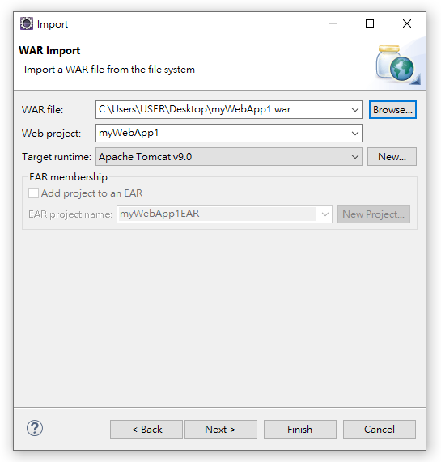

# 什麼是 WAR?

- **網站備存檔 .war (Web Application Archive)**
  - 若要將系統佈署到其它地方，我們必須要將它集中到一個稱為 Web Archive (.war) 的檔案中
- **何謂網站備存檔 .war ?**
  - 直到目前為止我們都在描述 Web App 的結構，若要將系統佈署到其他地方，我們**必須**要將它集中到一個稱為 Web Archive (.war) 的檔案中
  - 此檔案跟 .jar 沒什麼不同，只是延伸附檔名為 .war，其內部結構同樣從 Web App 的跟目錄開始。可使用 jdk 的 **<span style="color: red;">jar.exe</span>** 命令建立此 .war 檔

# 使用 UltraEdit-32 建立 war 檔

- **清除不必要檔案**
  - 刪除 `*.bak` 與 `*.bak.*`
- **創建打包工具**
  - <u>進階</u> > <u>DOS 指令</u> > <u>勾選 "顯示 DOS 視窗"</u>
    - 指令: `jar`
    - 工作目錄: `%p`
  - <u>進階</u> > <u>DOS 指令</u>
    - **工作目錄下生成 war**
    - 指令: `jar cvf IBM.war *`
    - 工作目錄: `C:\EA102_WebApp\apache-tomcat-9.0.35\webapps\IBM_9`

# 使用 CMD 環境建立 war

- **建立 war 檔**
  - 將於所在目錄中得到 IBM.war 檔
  - 將 IBM.war 置入 <u>{serve_root}/webapps</u> 目錄下
  - 於 server (如 Tomcat) 重新啟動後，IBM.war 將自動被解壓成入下 <u>{serve_root}/webapps/IBM</u>

```cs
X:IBM> jar cvf IBM.war *
```

- **命令參數說明**
  - **<span style="color: red;">jar 參數選項</span>** 簡述
    - **<span style="color: red;">c</span>** : 建立新的壓縮歸檔
    - **<span style="color: red;">v</span>** : 在標準輸出中產生詳細輸出
    - **<span style="color: red;">f</span>** : 指定歸檔檔案名稱 (IBM.war)
    - **<span style="color: red;">\*</span>** : 壓縮所在目錄內的所有檔案

<table>
<tr>	<td>-c</td>	<td>建立新的歸檔</td>	</tr>
<tr>	<td>-t</td>	<td>列出歸檔的目錄</td>	</tr>
<tr>	<td>-x</td>	<td>從歸檔中擷取指定(或所有)檔案</td>	</tr>
<tr>	<td>-u</td>	<td>更新現有歸檔</td>	</tr>
<tr>	<td>-v</td>	<td>在標準輸出中產生詳細輸出</td>	</tr>
<tr>	<td>-f</td>	<td>指定歸檔檔案名稱</td>	</tr>
<tr>	<td>-m</td>	<td>包含指定資訊清單中的資訊清單資訊</td>	</tr>
<tr>	<td>-n</td>	<td>在建立新規檔之後執行 Pack200 正規化</td>	</tr>
<tr>	<td>-e</td>	<td>位已隨附於可執行 jar 檔案中的獨立應用程式指定應用程式進入點</td>	</tr>
<tr>	<td>0</td>	<td>僅留存; 不使用ZIP壓縮方式</td>	</tr>
<tr>	<td>-P</td>	<td>保留檔案名稱前面的 '/'(絕對路徑) 和 ".." (上層目錄) 元件</td>	</tr>
<tr>	<td>-M</td>	<td>不為項目建立資訊清單檔案</td>	</tr>
</table>

# 用 Eclipse 匯出 war 檔

- 匯出 war 檔

<p></p>

- 匯出時勾選 <u>Export source files</u> ，才會將 <u>\*.java</u> 打包在裏頭

<p></p>

# 用 Eclipse 匯入 war 檔

- **匯入 war 操作**
  - <u>打開 Eclipse</u> > <u>File</u> > <u>Import</u> > <u>Web</u> > <u>WAR file</u> > <u>Next</u> > <u>WAR file</u> > <u>Browse...</u> > <u>選擇 [範例程式](./doc/myWebApp1.war)</u> > <u>Finish</u>

<p></p>

- **匯入成功畫面**

<p></p>

- **運行狀態**(startup.bat) 中 **專案名.war 刪除** 時，專案名(資料夾) 就會被**同步刪除**，需要在**非運行狀態**(shutdown.bat)才可直接刪

# 使用瀏覽器瀏覽 web 畫面

- <u>window</u> > <u>Web Browswer</u> > <u>Internet Explore</u>

---

參考鏈接:

- [java ： java -jar,java -cp,jar cvf 命令详解](https://blog.csdn.net/z425955498/article/details/78872288)
