<h1 id="top">目錄</h1>

- [1. # Java Servlet / JSP 解決方案](#s1)

---

# <a id='s1' class='md-title' href='#top'>1. # Java Servlet / JSP 解決方案</a>

- 為了解決執行效能問題，Java 也提出了相關的解決方法
- `多執行續環境`<a href="#fn1" id="fnref1">[1]</a>
  - 拜訪伺服器時，伺服器會將請求轉化成 thread 執行，來拜訪該 Servlet
  - 也因為是使用 thread 進來如此可以發現伺服器只有`一個行程`在執行，進而提升效能

- **想完全了解 JSP，必先學會 Servlet**
  - 在 JSP 第一次被呼叫時，伺服器會自動將 JSP 網頁轉換成 Servlet，這是執行過程的必要步驟
  - 因為 JSP 在 S 際執行時還是一支 Servlet 程式，並且底層觀念都來自 Servlet，**所以想完全了解 JSP，必先學會 Servlet**
  - 取兩者的長處(**MVC Model**)
  - 可以使用單獨 Servlet 或 JSP—項技術來解決動態網頁呈現的需求，但最好是取兩者的長處，如使用 NIVC Model 來開發動態專案，以利專案的擴展與更新，維護容易
- `JSP` 比較屬於`網頁設計人員`導向，而 `Servlet` 則是`程式設計人員`導向

---

參考鏈接:

- [何謂容器](https://openhome.cc/Gossip/ServletJSP/Container.html)
- [理解 Servlet 和 Servlet 容器、Web 服务器等概念](https://blog.csdn.net/lz233333/article/details/68065749)
- [【Tomcat】JVM，Tomcat，Servlet，Tomcat 中的应用。彻底弄懂这些概念之间的联系](https://www.cnblogs.com/wangzhongqiu/p/6500751.html)

---

<section class="footnotes">
<ol class="footnotes-list">
<li id="fn1" class="footnote-item">
Servlet 引擎，是 Web 服务器或应用程序服务器的一部分 <a href="#fnref1" class="footnote-backref">↩︎</a>

</li>
</ol>
</section>
