<h1 id="top">目錄</h1>

- [1. Java Servlet 的優勢](#s1)
- [2. 15 個取得瀏覽器請求時的動態路徑](#s2)
- [3. object instance 測試](#s3)

---

# <a id='s1' class='md-title' href='#top'>1. Java Servlet 的優勢</a>

- `效率與耐用性`
  - 不同於 CGI **只要 Servlet 被載入一次，其 object instance 即保存於伺服器的記憶體中**，可隨時再以執行緒處理方式接受下一個請求
  - 由於是以物件形式存在，故能自動維護自己的狀態，並持續保有外部資源(如保有資料庫連線，不必每次重新連線浪費資源）
  - **物件在記憶體中可以維持原狀態是 servlet 的第一個優勢**
- `整合性`
  - 與伺服器間的高度整合性，如利用伺服器來轉譯檔案路徑...等 CGI 無法達成的任務
- `安全性`
  - 除承襲 Java 原有的 strong type safety 外；伺服器甚至可用 Java 的 security manager 或 access controller 來保護自己，以免受 servlet 的傷害

# <a id='s2' class='md-title' href='#top'>2. 15 個取得瀏覽器請求時的動態路徑</a>

<p></p>

10. **req.getProtocol()** = **HTTP/1.1**

- GET
  11. **req.getMethod()** = **GET**
  12. **req.getHeader("Content-Type")** = **null**
  13. **req.getContentType()** = **null**
  14. **req.getContentLength** = **-1**
- POST
  11. **req.getMethod()** = **POST**
  12. **req.getHeader("Content-Type")** = **application/x-www-form-urlencoded** (或 **multipart/form-data**，檔案上傳)
  13. **req.getContentType()** = **application/x-www-form-urlencoded**
  14. **req.getContentLength** = **142**

15. **StringBuffer req.getRequestURL()** = http://localhost:8080/myWebApp/PathServlet/1.txt
16. **String context.getRealPath(String virtualpath)**
    - 轉換指定的 virtualpath 為真時的檔案系統路徑(**該檔案位於本地機器內**)
    - 如: `context.getRealPath("xx.gif")` = http://localhost:8080/myWebApp/PathServlet/xx.gif
17. **java.net.URL context.getResource(String uripath)**
    - 傳回指定的 uripath(uripath 需以`/`開頭)的 URL 物件(可位於`本地機器`、`遠端`或`包在.war內`)
    - 如: `context.getResource("/path1/1.html")`
    - 取得 URL 物件後，可在呼叫 openStream()方法，以取得 java.io.InputStream 在行下一步處理
18. **java.io.InputStream context.getResourceAstream(String uripath)**
    - 如同前者的 `context.getResource("/path1/1.html").openStream()`

# <a id='s3' class='md-title' href='#top'>3. object instance 測試</a>

- 因為 **Servlet 每載入一次，其 object instance 即保存於伺服器的記憶體中**，所以 `count` 數值會疊加
- out.println() 出的結果如果需要是網頁結構，則就要 `<html></html>` 的起始跟結束標籤

```java
//package servlet_examples;

import java.io.*;
import javax.servlet.*;
import javax.servlet.http.*;

public class HelloWorld extends HttpServlet {

  int count = 0;

  public void doGet(HttpServletRequest req, HttpServletResponse res)
                               throws ServletException, IOException {
    doPost(req, res);

  }

  public void doPost(HttpServletRequest req, HttpServletResponse res)
                                throws ServletException, IOException {

    res.setContentType("text/html; charset=Big5");
    PrintWriter out = res.getWriter();

    out.println("<HTML>");
    out.println("<HEAD><TITLE>Hello World</TITLE></HEAD>");
    out.println("<BODY>");
    out.println("<BIG>Hello World , 世界你好2 !</BIG>"+(++count));
    out.println("</BODY></HTML>");
  }
}
```
