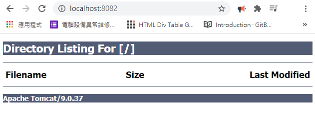

<h1 id="top">目錄</h1>

<ul>
<li><a href='#s1'>1. Eclipse 之 Tomcat Embedded</a></li></ul>

---

# <a id='s1' class='md-title' href='#top'>1. Eclipse 之 Tomcat Embedded</a>

- **下載並設置資料庫驅動程式**
  - 要將 Tommcat 嵌入 Eclipse 之前，應先將 **資料庫驅動程式** **.jar** 檔，置入 Tomcat 的 **Classpath** 為佳
  - 以 **MySQL 5.6.x** + Tomcat 8.x 為例
    - <u>下載 Mysql 資料庫驅動程式</u>: [官網各版本列表](https://downloads.mysql.com/archives/c-j/) 將 **mysql-connector-java-5.x.xx-bin.jar** 檔下載
    - <u>放入伺服器</u>: 將 **mysql-connector-java-5.x.xx-bin.jar** 放入 **X:\apache-tomcat-8.x\lib** 中
    - 其他版本的 server 會有不同目錄位置
  - 若使用 **Oracle 6** + Tomcat 9.x 為例
    - <u>下載 oracle 資料庫驅動程式</u>: 下載 oracle 的 jar
    - <u>放入伺服器</u>: 將 [ojdbc6.jar](./doc/jar/ojdbc6.jar) 放入 **apache-tomcat.x.xx.xx\lib** 中
- **設定 Eclipse 的 Tomcat 服務器**
  - <u>Window</u> > <u>Preferences</u> > <u>Server</u> > <u>Runtime Environments</u> > <u>Add...</u> > <u>Apache</u> >
    <u>Apache Tomcat v9</u> (依據當前選定的 Tomcat 版本選擇，若是 Tomcat 8 則選 8) >
    <u>Create a new local server</u> > <u>Next</u> > <u>Installed JREs...</u> (選擇 java_home 所設定之 jdk) >
    <u>Browse...</u> (選擇 Timcat 安裝路徑) > <u>確定</u> > <u>Finish</u>
  - **服務器設定好後 Tomcat 會將 Serve 資料匯入，所以後續有要在 eclipse 設定新的 user 之類，tomcat 中也要手動設定**

- **測試 Eclipse 設定是否完成**
  - <u>Eclipse</u> > <u>Restart the server</u>
  - 依設定的 port 執行: http://localhost:8082/

