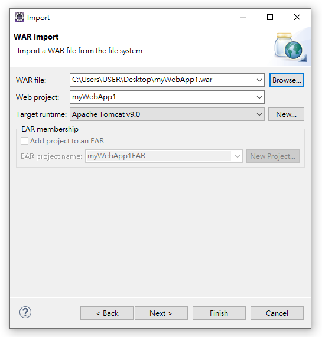

<h1 id="top">目錄</h1>

<ul>
<li><a href='#s1'>1. 用 Eclipse 匯出 war 檔</a></li>
<li><a href='#s2'>2. 用 Eclipse 匯入 war 檔</a></li>
<li><a href='#s3'>3. 設定 Eclipse 使 web 畫面用瀏覽器瀏覽</a></li>
<li><a href='#s4'>4. 設定 Eclipse 為 UTF-8</a></li>
<li><a href='#s5'>5. 設定 Eclipse 的文字大小</a></li>
<li><a href='#s6'>6. 設定 Eclipse 以文字方式閱覽 xml 資料</a></li></ul>

---

# <a id='s1' class='md-title' href='#top'>1. 用 Eclipse 匯出 war 檔</a>

- 匯出 war 檔

- 匯出時勾選 <u>Export source files</u> ，才會將 <u>\*.java</u> 打包在裏頭

# <a id='s2' class='md-title' href='#top'>2. 用 Eclipse 匯入 war 檔</a>

- **匯入 war 操作**
  - <u>打開 Eclipse</u> > <u>File</u> > <u>Import</u> > <u>Web</u> > <u>WAR file</u> > <u>Next</u> > <u>WAR file</u> > <u>Browse...</u> > <u>選擇 [範例程式](./doc/war/myWebApp1.war)</u> > <u>Finish</u>

- **匯入成功畫面**

- **運行狀態**(startup.bat) 中 **專案名.war 刪除** 時，專案名(資料夾) 就會被**同步刪除**，需要在**非運行狀態**(shutdown.bat)才可直接刪

# <a id='s3' class='md-title' href='#top'>3. 設定 Eclipse 使 web 畫面用瀏覽器瀏覽</a>

- <u>window</u> > <u>Web Browswer</u> > <u>Internet Explore</u>

# <a id='s4' class='md-title' href='#top'>4. 設定 Eclipse 為 UTF-8</a>

- <u>window</u> > <u>Preferences</u> > <u>General</u> > <u>Workspace</u> > <u>Text file encoding</u> > <u>Other</u> > <u>UTF-8</u> > <u>Apply</u> > <u>OK</u>

# <a id='s5' class='md-title' href='#top'>5. 設定 Eclipse 的文字大小</a>

- <u>window</u> > <u>Preferences</u> > <u>General</u> > <u>Appearance</u> > <u>Colors and Fonts</u> > <u>Basic</u> > <u>Text Font</u> > <u>Edit...</u> > <u>選擇所需字型與大小</u> > <u>確定</u> > <u>Apply</u> > <u>OK</u>

# <a id='s6' class='md-title' href='#top'>6. 設定 Eclipse 以文字方式閱覽 xml 資料</a>

