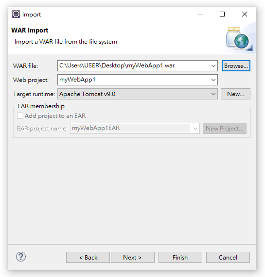

<h1 id="top">目錄</h1>

- [1. 用 Eclipse 匯出 war 檔](#s1)
- [2. 用 Eclipse 匯入 war 檔](#s2)
- [3. 設定 Eclipse 使 web 畫面用瀏覽器瀏覽](#s3)
- [4. 設定 Eclipse 為 UTF-8](#s4)
- [5. 設定 Eclipse 的文字大小](#s5)
- [6. 設定 Eclipse 以文字方式閱覽 xml 資料](#s6)
- [7. Server Tomcat v8.5 Server at localhost failed to start](#s7)
- [8. 新建動態 web 專案](#s8)
- [9. 新建 servlet 程式](#s9)

---

# <a id='s1' class='md-title' href='#top'>1. 用 Eclipse 匯出 war 檔</a>

- 匯出 war 檔

- 匯出時勾選 <u>Export source files</u> ，才會將 <u>\*.java</u> 打包在裏頭

# <a id='s2' class='md-title' href='#top'>2. 用 Eclipse 匯入 war 檔</a>

- **匯入 war 操作**
  - <u>打開 Eclipse</u> > <u>File</u> > <u>Import</u> > <u>Web</u> > <u>WAR file</u> > <u>Next</u> > <u>WAR file</u> > <u>Browse...</u> > <u>選擇 [範例程式](./doc/war/myWebApp1.war?target=_blank)</u> > <u>Finish</u>

- **匯入成功畫面**

- **運行狀態**(startup.bat) 中 **專案名.war 刪除** 時，專案名(資料夾) 就會被**同步刪除**，需要在**非運行狀態**(shutdown.bat)才可直接刪

# <a id='s3' class='md-title' href='#top'>3. 設定 Eclipse 使 web 畫面用瀏覽器瀏覽</a>

- <u>window</u> > <u>Web Browswer</u> > <u>Internet Explore</u>

# <a id='s4' class='md-title' href='#top'>4. 設定 Eclipse 為 UTF-8</a>

- <u>window</u> > <u>Preferences</u> > <u>General</u> > <u>Workspace</u> > <u>Text file encoding</u> > <u>Other</u> > <u>UTF-8</u> > <u>Apply</u> > <u>OK</u>

# <a id='s5' class='md-title' href='#top'>5. 設定 Eclipse 的文字大小</a>

- <u>window</u> > <u>Preferences</u> > <u>General</u> > <u>Appearance</u> > <u>Colors and Fonts</u> > <u>Basic</u> > <u>Text Font</u> > <u>Edit...</u> > <u>選擇所需字型與大小</u> > <u>確定</u> > <u>Apply</u> > <u>OK</u>

# <a id='s6' class='md-title' href='#top'>6. 設定 Eclipse 以文字方式閱覽 xml 資料</a>

# <a id='s7' class='md-title' href='#top'>7. Server Tomcat v8.5 Server at localhost failed to start</a>

- 此問題可能因為 context.xml 檔案設定錯誤產生，需簡查連線池設訂

# <a id='s8' class='md-title' href='#top'>8. 新建動態 web 專案</a>

- <u>File</u> > <u>New</u> > <u>Dynamic Web Project</u> > 輸入 <u> Project name</u> > <u>Target runtime</u>選擇伺服器 > <u>Dynamic web model version</u> 選擇 servlet 版本(預設就好) > <u>Next</u> > <u>Next</u> > 勾選 <u>Generate web.xml deployment descriptor</u> (新建部屬檔) > <u>Finish</u>

# <a id='s9' class='md-title' href='#top'>9. 新建 servlet 程式</a>

- <u>打開專案</u> > <u>Java Resources</u> > <u>src</u> 右鍵 > <u>New</u> > <u>Servlet</u> > <u>Java package: {你的 package 名稱}</u> > <u>Class name: {你的 class 名稱}</u> > <u>Next</u> > <u>URL mappings</u> (Eclipse 自動產生明確對應) > <u>Next</u> > **勾選** <u>Inherited abstract methods</u> 、<u>doGet()</u> ，**取消勾選** <u>Constructors from superclass</u> 、<u>doPost()</u> > <u>Finish</u>

---

參考鏈接:

- [Eclipse 出现 Tomcat 无法启动：Server Tomcat v8.5 Server at localhost failed to start 问题](https://blog.csdn.net/m0_37482190/article/details/86610039)
