<h1 id="top">目錄</h1>

- [1. Java Servlet 的優勢](#s1)
- [2. 15 個取得瀏覽器請求時的動態路徑](#s2)
- [3. 3 個瀏覽器額外請求](#s3)
- [4. 物件實體 (object instance)](#s4)

---

# <a id='s1' class='md-title' href='#top'>1. Java Servlet 的優勢</a>

- `效率與耐用性`
  - 不同於 CGI **只要 Servlet 被載入一次，其 object instance 即保存於伺服器的記憶體中**，可隨時再以執行緒處理方式接受下一個請求
  - 由於是以物件形式存在，故能自動維護自己的狀態，並持續保有外部資源(如保有資料庫連線，不必每次重新連線浪費資源）
  - **物件在記憶體中可以維持原狀態是 servlet 的第一個優勢**
- `整合性`
  - 與伺服器間的高度整合性，如利用伺服器來轉譯檔案路徑...等 CGI 無法達成的任務
- `安全性`
  - 除承襲 Java 原有的 strong type safety 外；伺服器甚至可用 Java 的 security manager 或 access controller 來保護自己，以免受 servlet 的傷害

# <a id='s2' class='md-title' href='#top'>2. 15 個取得瀏覽器請求時的動態路徑</a>

(13) `req.getContentType()`

- get
  - null
- post
  - 預設資料: application/x-www-form-urlencoded
  - 資料上傳: multipart/form-data

# <a id='s3' class='md-title' href='#top'>3. 3 個瀏覽器額外請求</a>

(16) `String context.getRealPath(String virtualpath)`

- 轉換指定的 virtualpath 為真實的檔案系統路徑(**該檔案位於本地機器內**)
- 如: **context.getRealPath("xx.gif")** = http://localhost:8080/myWebApp/PathServlet/xx.gif
- 用途: **檔案上傳**
- 幫客戶創建資料夾在專案路徑底下，接著可用 `getServletContext().getRealPath('/images')` 抓取路徑。抓取路徑: `C:\EA102_WebApp\apache-tomcat-9.0.35\webapps\IBM_9\`

(17) `java.net.URL context.getResource(String uripath)`

- 傳回指定的 uripath(uripath 需以`/`開頭)的 URL 物件 (可位於`本地機器`、`遠端`或`包在.war內`)
- 如: **context.getResource("/path1/1.html")**
- 取得 URL 物件後，可在呼叫 openStream()方法，以取得 java.io.InputStream 在行下一步處理 (`用的機會比較小`)

(18) `java.io.InputStream context.getResourceAstream(String uripath)`

- 如同前者的 **context.getResource("/path1/1.html").openStream()**

# <a id='s4' class='md-title' href='#top'>4. 物件實體 (object instance)</a>

- 因為 **Servlet 每載入一次，其 object instance 即保存於伺服器的記憶體中**，所以 `count` 數值會疊加
- out.println() 出的結果如果需要是網頁結構，則就要 `<html></html>` 的起始跟結束標籤
- 每實體化一次就會增加 count 的計數
- **範例檔**: [servlet_examples.java](./doc/servlet_examples.java?target=_blank)
