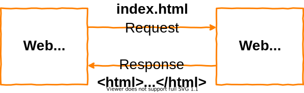
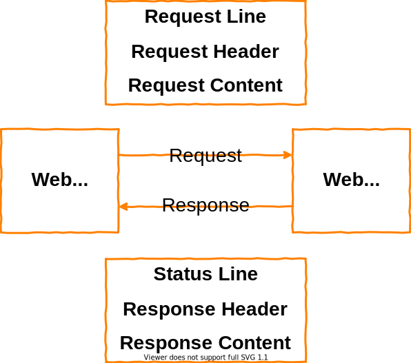

<h1 id="top">目錄</h1>

<ul>
<li><a href='#s1'>1. HTTP 基礎</a></li>
<li><a href='#s2'>2. Get 與 Post 的 request 結構</a></li>
<li><a href='#s3'>3. Request Parameters (請求參數) 與請求方法 GET 與 POST</a></li>
<li><a href='#s4'>4. Response Parameters (回應參數) GET 與 POST</a></li>
<li><a href='#s5'>5. 請求方法 (Method)</a></li></ul><hr>

# <a id='s1' class='md-title' href='#top'>1. HTTP 基礎</a>

- 在撰寫、執行第一個 HTTP servlet 程式之前，<span style="color:red;font-weight:bold;">必需</span>先對 Web 底層的 HTTP 通訊協定有基本的認識
- 送出 HTTP 請求、回傳 HTTP 回應之基本操作模式如下:

<p></p>

- 即前端頁面傳遞資料至 **SimpleHttpServer.java** (Web Server)

```java
// 簡易 Web Server
public class SimpleHttpServer {
  public static void main(String[] args) throws IOException {
    ...
    bw.write("<html>\n" + "<head>\n" + "    <title>first page</title>\n"
            + "</head>\n" + "<body>\n" + "    <h1>Hello Web Server!</h1>\n"
            + "</body>\n" + "</html>\n");
    ...
  }
}
```

# <a id='s2' class='md-title' href='#top'>2. Get 與 Post 的 request 結構</a>

- **Request Message 結構**
  - **<u>Request Line (請求行)</u>**
    - 請求行與顯示資訊:
      - <u>Method</u>: GET
      - <u>Request-URI</u>: /index.html
      - <u>HTTP-Version</u>: HTTP/1.1
    - 請求的方法有:
      - **GET**, **POST**, HEAD, OPTIONS, TRACE, PUT, DELETE... 等
  - **<u>Request Header (請求標頭)</u>**
    - 告知 Server 與該請求有關的額外資訊，最後並以空白行代表結束 Header
    - <u> accept-language </u>
      - 顯示的是瀏覽器語言，跟國際化([I18N](./03.I18N基本觀念.md))有關
        - 送出該國家語言的 unicode
        - 自動獲取瀏覽器語言
        - 設定語言順序
        - 設定國際化語言的檔案:<u> \*.properties </u>(副檔名要正確)，寫入 unicode 文字即會自動轉換各國語言
    - <u> User-Agent </u>
      - 主要會應用在爬蟲相關的功能 (使騙過 server 讓程式以為是使用者操作，而非工具)
      - 一方面用於判斷使用者上限時是使用什麼伺服器
      - 一方面模擬使用者請求標頭，騙伺服器用的
    - <u> content-type </u>
      - multipart/form-data (傳送文件)
      - application/x-www-form-urlencoded
      - null (Get 請求的結果)
  - **<u>Request Content (請求內容)</u>**
    - POST 方法由此傳送請求參數(Request Parameters) 或 client 端上傳之資料
    - GET 方法此塊 **無** 資料
- **POST 與 GET 差別**
  - **<u>POST</u>** 在 Request Header 中**多了 Content-type 以及 Content-Length** (表示 Request Content 的長度)
  - **<u>GET</u>** 則不僅少了 Content-type 以及 Content-Length，**Request Content 的部分也為空**

```cs
------------ Get ------------
  Request Line:
    GET /index.html HTTP/1.1
  Request Header:
    Accept: image/gif,...
    Accept-Language:zh-TW, en-US;...
    Accept-Encoding: gzip,...
    User-Agent: Mozilla/5.0(compatible;MSIE 9.0;Windows NT 6.0; Trident/5.0)
    HOST: localhost:8080
    Connection: Keep-Alive
  Request Content:
    無
------------ Post ------------
  Request Line:
    POST /index.html HTTP/1.1
  Request Header:
    Accept: image/gif,...
    Accept-Language:zh-TW, en-US;...
    Accept-Encoding: gzip,...
    User-Agent: Mozilla/5.0(compatible;MSIE 9.0;Windows NT 6.0; Trident/5.0)
    HOST: localhost:8080
    Connection: Keep-Alive
    Content-type: application/x-www-form-urlencoded
    Content-Length: 25
  Request Content:
    name1=peter1&name2=peter2
```

<p></p>

# <a id='s3' class='md-title' href='#top'>3. Request Parameters (請求參數) 與請求方法 GET 與 POST</a>

- **參數的傳遞方式(GET)**
  - 附在 URL 後端( **?** 後面以 **&** 符號隔開 )傳遞出去，此方法稱為 Query String(查詢字串;請求參數)
  - **?** **&** **=** 都是瀏覽器自動加的
- **GET 使用時機**
  - **<u>於瀏覽器直接輸入 URL</u>** 時， `localhost/index.html?name1=peter&name2=peter2`
  - **<u>點選超連結(hyperlink)</u>** 時， `<a href=".../index.html?name1=peter&name2=peter2">` 或 `<a>`
  - **<u>HTML 表單(form)</u>** 時， `<form method="GET" ...>...</form>`
- **參數的傳遞方式(POST)**
  - 當成 Request Content(請求內容)的一部分傳遞出去
- **GET 使用時機**
  - **<u>HTML 表單(form)</u>** 時，`<form method="POST" ...>...</form>`
- **注意事項**
  - **<u>GET</u>** : 參數以 Query String 附在 URL 尾端，資料(參數內容)易暴露，且不可過多(即有[長度限制](./02.GET與POST長度限制.md))
    - IE 對 URL 長度限制是 2083 字符
    - Firefox 長度限制是 65536 字符
  - **<u>POST</u>** : 參數以 Request Contents 傳送，資料長度不限，資料可以 SSL 安全傳送(有通過 SSL 憑證的站台會以 https 做為網域開頭)
- **特殊方式**
  - Multipart Request(File Upload)

# <a id='s4' class='md-title' href='#top'>4. Response Parameters (回應參數) GET 與 POST</a>

- **回應的部分已不分 GET 與 POST 了**
  - text/html，描述 Response Content 結構
  - charset=UTF-8，描述編碼
- **Response Header 回應標頭**
  - <u>content-type</u>，文件內容型態與文字編碼(裝什麼文件就放什麼 content-type)
  - <u>content-length</u>，告知瀏覽器有幾位元組

```cs
------------ Get / Post ------------
Status Line:
  HTTP/1.1 200 OK
Response Header:
  Date: Tue, 21 Jun 201104:56:24 GMT
  Server: Apache-Coyote/1.1
  ...
  Content-Type: text/html; charset=UTF-8
  Content-Length: 7023
  Last-Modified: Thu, 02 Jun 2011 15:54:42 GMT
Response Content:
  <HTML>...</HTML>
```

- 在程式中<u>回應的部分</u>就是 <u>res.setContentType("text/html; charset=UTF-8")</u> 寫了這行就會在回應標頭中出現 **Content-Type**，瀏覽器也會根據這邊的指令做出適當的回應 (即做出適當的解碼)
- 此時若使用 IE 瀏覽器並查看目前往頁編碼的話，就會發現目前頁面編碼方式為 <u>UTF-8</u>

```java
package servlet_examples;

import java.io.*;
import javax.servlet.*;
import javax.servlet.http.*;

public class HelloWorld extends HttpServlet {
  private static final long serialVersionUID = 1L;

  public void doGet(HttpServletRequest req, HttpServletResponse res)
                           throws ServletException, IOException {

    // 指明回應標頭，根據此指令執行適當的回應進行解碼
    res.setContentType("text/html; charset=UTF-8");
    PrintWriter out = res.getWriter();

    out.println("<HTML>");
    out.println("<HEAD><TITLE>Hello World</TITLE></HEAD>");
    out.println("<BODY>");
    out.println("<BIG>Hello World , 世界你好 !</BIG>");
    out.println("</BODY></HTML>");
  }

}
```

- 若寫成 <u>res.setContentType("text/html;")</u> 則會造成亂碼，因沒**有給解碼方式**此時**瀏覽器就會自動選擇 ISO8859-1** (即西歐語系)
- 為了讓程式碼彈性更大，**建議改成 UTF-8** (但若使用上方便可以用 BIG5 編碼，此編碼使用任意編輯器查看時中文都會顯示正常，但 UTF-8 是目前業界泛用編碼)

# <a id='s5' class='md-title' href='#top'>5. 請求方法 (Method)</a>

- 請求時 <u>Request-Line</u> 等於 <u>Method + Rewuest-URI + HTTP-Version</u>

- 一般來說<u> get 和 head 一定要支援</u>，其他方法可自行選擇是否支援(optional)

  - **method="Head"** ， doHead() 僅傳送 header
  - **method="doOptions"**， doOptions() 即詢問伺服器支援的請求方法有哪幾個(應用機會 0)
  - **method="Put"** ， doPut()
  - **method="Delete"** ， doDelete()
  - **method="Delete"** ， doTrace() 除錯用

- The methods **GET** and **HEAD** MUST be supported by all general-purpose servers.All other methods are OPTIONAL

- **Methos 包含以下方法**
  - "OPTIONS" (section 9.2)
  - "**GET**" (section 9.3)
  - "HEAD" (section 9.4)
  - "**POST**" (section 9.5)
  - "PUT" (section 9.6)
  - "EELETE" (section 9.7)
  - "TRACE" (section 9.8)
  - "CONNECT" (section 9.9)
  - extendion-method
- extendion-method 等於 token

---

參考鏈接:

- [使用 Java 实现一个最简单的 Web Server](https://blog.csdn.net/martinwangjun/article/details/77659336)
- [http Request-Line](https://blog.csdn.net/virgilli/article/details/36871803)
- [Get/POST 方法提交的长度限制](https://developer.aliyun.com/article/101173)
- [什麼是 SSL、TLS 以及 HTTPS？](https://www.websecurity.digicert.com/zh/tw/security-topics/what-is-ssl-tls-https)

---

額外參考資料:

- 學習 tomcat 開發的人才要使用

```cs
"\SL314_Servlet4課程分享\SL314_第一次分享\04_官方文件 _ 規格書"
```
