<h1 id="top">目錄</h1>

<ul>
<li><a href='#s1'>1. Servlet API</a></li>
<li><a href='#s2'>2. 繼承關係圖(Inheritance Relationships, UML 表示)</a></li>
<li><a href='#s3'>3. Servley 基本介面、Servlet 狀態圖 (State Diagram)</a></li>
<li><a href='#s4'>4. Generic Servlet (通用型 servlet) 處理請求的過程</a></li>
<li><a href='#s5'>5. HTTP Servlet 處理請求的過程</a></li></ul>

# <a id='s1' class='md-title' href='#top'>1. Servlet API</a>

- **API 文件連結**
  - [Servlet API](http://tomcat.apache.org/tomcat-8.0-doc/servletapi/)
  - [JSP API](http://tomcat.apache.org/tomcat-8.0-doc/jspapi/)
- **API 類別函式庫(Java class libraries-jar 檔)**
  - servlet-api.jar 已置於: <u>apache-tomcat.x.xx.xx\lib\servlet-api.jar</u>
  - jsp-api.jar 已置於: <u>apache-tomcat.x.xx.xx\lib\jsp-api.jar</u>
  - 以上兩個 API 內建在 Tomcat 中

- **開發工具與 API 類別函式庫之相依設定**
  - <u>servlet-api.jar</u> 與 <u>jsp-api.jar</u> 有時會設進系統環境的 **classpath**中是為了讓一般的編輯器可編輯 Servlet 程式
  - classpath 表示自訂的 jar 目錄，即 **myLib**
- **classpath 設定方式**
  - JDK6(含)之後的設定都如下，可參考 [環境設定](./../03.環境準備/01.設定Tomcat.md) 的操作
  - <u>創建目錄 myLib</u> > <u>將 jar 複製入 myLib 中</u> > <u>修改 **系統環境變數** 值</u> > <u>C:\myLib\*;</u>
- **IDE 環境如 Eclipse，在嵌入 Tomcat 時已自動相依該類別函式庫，故不需在做以上的設定**

# <a id='s2' class='md-title' href='#top'>2. 繼承關係圖(Inheritance Relationships, UML 表示)</a>

- 因為 GenericServlet 中有個 service 方法並未實做，所以 GenericServlet 變成一個抽象的類別
- 不過 Servlet 介面也並不僅止於一個 service 方法

# <a id='s3' class='md-title' href='#top'>3. Servley 基本介面、Servlet 狀態圖 (State Diagram)</a>

- **基本觀念**
  - **Servlet container**: 替我們建立 servlet 實體(instance); 並且由其控制呼叫 servlet 的 init()、service()、destroy() 等方法，以管理 servlet 的生命週期
    - **init()**: **初始化方法**
    - **service()**: **用來轉向的**，最終不管是使用 get 還是 post 提交過來都會經過 service() 方法來處理，然後轉向到 doGet 或是 doPost 方法，所以最終撰寫 servlet 只需要重寫 doGet 或是 doPost 就可以了
    - **destroy()**: **卸載方法**
- **程式設計師**: 則藉由提供上述方法之實作，予以控制該 servlet 物件即與該物件相關之姿員(resource)

# <a id='s4' class='md-title' href='#top'>4. Generic Servlet (通用型 servlet) 處理請求的過程</a>

- Generic Servlet 對一個 request 的處理流程 (但重點是在它的子類別，HttpServlet)

# <a id='s5' class='md-title' href='#top'>5. HTTP Servlet 處理請求的過程</a>

- 正在處理 GET request 和 POST request 的 HTTP Servlet

---

參考鏈接:

- [servlet 中 service() doGet() doPost() 方法详解](http://www.51gjie.com/javaweb/852.html)
