<h1 id="top">目錄</h1>

- [1. Servlet 生命週期基本概念](#s1)

---

# <a id='s1' class='md-title' href='#top'>1. Servlet 生命週期基本概念</a>

- **基本觀念**
  - **Servlet container**: 替我們建立 servlet 實體(instance); 並且由其控制呼叫 servlet 的 init()、service()、destroy() 等方法，以管理 servlet 的生命週期
    - **init()**: **初始化方法**
    - **service()**: **用來轉向的**，最終不管是使用 get 還是 post 提交過來都會經過 service() 方法來處理，然後轉向到 doGet 或是 doPost 方法，所以最終撰寫 servlet 只需要重寫 doGet 或是 doPost 就可以了
    - **destroy()**: **卸載方法**， 伺服器 shutdown 後執行的方法
- **程式設計師**:
  - 則藉由提供上述方法之實作，予以控制該 servlet 物件即與該物件相關之資源(resource)
- **service 運行中執行次數**
  - **init()**: 1 次
  - **service()**: n 次
  - **destroy()**: 1 次

