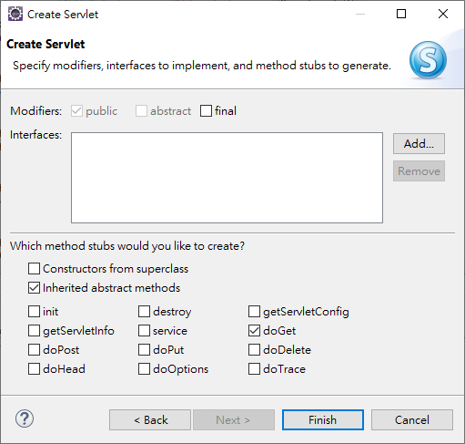

<h1 id="top">目錄</h1>

- [1. Servlet Container 一般執行步驟與相關技術](#s1)
- [2. 新建動態 web 專案](#s2)
- [3. 新建 servlet 程式](#s3)
- [4. \*.Java 上的明確對應方式](#s4)

---

# <a id='s1' class='md-title' href='#top'>1. Servlet Container 一般執行步驟與相關技術</a>

- ① 當 Servlet 第一次被客戶端請求時，container 會載入該 Servlet，**建立 Servlet 實體**

  - <u>例外情況</u>: <u>Servlet Reloading</u> 與 <u>load-on-startup</u>

- ② container 呼叫 Servlet 的 **init()** 方法，以進行 Servlet 的初始化工作
  - <u>衍生技術</u>: <u>String getInitParameter(String name) 方法</u>
    - 可以接收 web.xml 傳進來的數值或者文件的資料
- ③ container 呼叫 Servlet 的 **service()** 方法，處裡所有的請求
  - <u>衍生技術</u>: 個體持續性 <u>object instance persistence 觀念</u> 與 <u>執行續同步 synchronization</u>
- ④ container 關閉時，會先呼叫每一個 Servlet 的 **destroy()** 方法
  - <u>衍生技術</u>: <u>釋放之前在 init()內引用的資源</u> 或 <u>儲存一些永續性的資料</u>，供下次 init() 被啟動時可讀取之

# <a id='s2' class='md-title' href='#top'>2. 新建動態 web 專案</a>

- <u>File</u> > <u>New</u> > <u>Dynamic Web Project</u> > 輸入 <u> Project name</u> >
- <u>Target runtime</u>選擇伺服器 > <u>Dynamic web model version</u> 選擇 servlet 版本(預設就好) >
- <u>Next</u> > <u>Next</u> > 勾選 <u>Generate web.xml deployment descriptor</u> (新建部屬檔) > <u>Finish</u>

# <a id='s3' class='md-title' href='#top'>3. 新建 servlet 程式</a>

- <u>打開專案</u> > <u>Java Resources</u> > <u>src</u> 右鍵 > <u>New</u> > <u>Servlet</u>
- <u>Java package: {你的 package 名稱}</u> > <u>Class name: {你的 class 名稱}</u> > <u>Next</u> >
- <u>URL mappings</u> (Eclipse 自動產生明確對應) > <u>Next</u> >
- **勾選** <u>Inherited abstract methods</u> 、<u>doGet()</u> ，**取消勾選** <u>Constructors from superclass</u> 、<u>doPost()</u> ><u>Finish</u>

<p></p>

- **@WebServlet("** /ch03 **")** ，是<u> Servlet 3.x </u>的明確設定方法，使用此方法就<u> 不用 </u>在 **WEB-INF/web.xml** 中設定

```java
package myWebApp3;

import java.io.IOException;
import javax.servlet.ServletException;
import javax.servlet.annotation.WebServlet;
import javax.servlet.http.HttpServlet;
import javax.servlet.http.HttpServletRequest;
import javax.servlet.http.HttpServletResponse;

@WebServlet("/ch03")
public class ch03 extends HttpServlet {
  private static final long serialVersionUID = 1L;

  protected void doGet(HttpServletRequest request, HttpServletResponse response) throws ServletException, IOException {
    response.getWriter().append("Served at: ").append(request.getContextPath());
  }
}
```

# <a id='s4' class='md-title' href='#top'>4. \*.Java 上的明確對應方式</a>

- **@WebServlet(**"/ch03"**)** ，是 Servlet 3.x 的明確設定方法，使用此方法就不用在 WEB-INF/**web.xml** 中設定

```java
// 簡化成以下結構
package servlet_examples;

import java.io.*;
import javax.servlet.*;
import javax.servlet.http.*;

public class HelloWorld extends HttpServlet {
  private static final long serialVersionUID = 1L;

  public void doGet(HttpServletRequest req, HttpServletResponse res)
                          throws ServletException, IOException {

    res.setContentType("text/html; charset=UTF-8");
    PrintWriter out = res.getWriter();

    out.println("<HTML>");
    out.println("<HEAD><TITLE>Hello World</TITLE></HEAD>");
    out.println("<BODY>");
    out.println("<BIG>Hello World , 世界你好 !</BIG>");
    out.println("</BODY></HTML>");
  }
}
```

```cs
明確對應路徑: "http://localhost:8082/myWebApp1/ch03"
```
