<h1 id="top">目錄</h1>

- [1. Persistence vs. Synchronization](#s1)
- [2. synchronized 測試檔案準備](#s2)
- [3. synchronized 方法測試](#s3)

---

# <a id='s1' class='md-title' href='#top'>1. Persistence vs. Synchronization</a>

- **多執行緒環境**
  - 因為 Servlet 程式是處於多執行續環境，如下圖中 Servlet 1 同時接收兩個請求，也就是兩個 Multi-thread 進來執行這隻 servlet 程式，這時 servlet 中有個<u>實體變數</u>就會造成<u>資源衝突</u>的問題，此時就要處理這問題，否則會造成<u>資源共享</u>的出現

<p></p>

- **Synchronization (同步) 之處理**

  - 可能因 persistence 而衍生(須注意)的問題，如:
    - **<span style='color:blue;'>以上述而言</span>**: 可能發生前一個請求的執行緒還沒印出結果前，最後一個請求的執行緒已經先加 1
    - **<span style='color:blue;'>其它</span>**: 可能發生前一個請求 (Request) 執行緒的資料連線物件，在它尚未完成所有資料庫動做時，就被另一請求執行緒所 commit ， 則悲慘的結果即將發生!!
  - 5 種解決方案

    - **方法 1**:
      - **做法**:
        - <u>synchronized</u> public void doGet(...){...}
      - **優點**: 簡單
      - **缺點**: 一次只能處理一個請求，效率不好
    - **方法 2**:
      - **做法**:
        - <u>synchronized</u> (this){ count++; out.println(count); }
      - **說明**:
        - 於 doGet 內處理 Critical Section (危險區塊)
      - **優點**: 縮小鎖定範圍
    - **方法 3**:
      - **做法**:
        - int local_count;
          <u>synchronized</u> (this){ local_count = count++; }
      - **說明**:
        - 於 doGet 內處理 Critical Section
      - **優點**: 另外宣告一個區域變數，以縮小鎖定範圍
    - **方法 4**:
      - **做法**:
        - 如果不是很重要的結果，則雖知道但不處理
      - **說明**:
        - 因為只要做了鎖定就會影響效能，有時可選擇不處理此問題
    - **方法 5**:
      - **做法**:
        - 如果程式目的不需要持續性時(不適用本範例)，可將所有變數宣告為 <u>區域變數</u> local variable (因為 <u>區域變數的存活期無法持續到下一次 Request</u>)，將可避免執行緒間的彼此干擾

# <a id='s2' class='md-title' href='#top'>2. synchronized 測試檔案準備</a>

- 測試前準備，[可直接下載此檔案](./doc/java/HelloWorld_syn.java?target=_blank)

```java
package servlet_examples;

import java.io.*;
import javax.servlet.*;
import javax.servlet.annotation.WebServlet;
import javax.servlet.http.*;


@WebServlet("/HelloWorld2")
public class HelloWorld_syn extends HttpServlet {
  private static final long serialVersionUID = 1L;

  int count = 0;

  public void doGet(HttpServletRequest req, HttpServletResponse res)
                          throws ServletException, IOException {

    res.setContentType("text/plain; charset=UTF-8");
    PrintWriter out = res.getWriter();
    count++;

    try {
      // 設定此步驟是為了測試  count++ 時可能因降速導置兩個頁面同時都出現同個數字的情形，
      // 這表示數值可能出現明明是第二人按下按鈕，但是計數錯誤的情形，此種情形就需使用 synchronized 去處理
      Thread.sleep(3000);
    }
    catch (InterruptedException e) {
      e.printStackTrace();
    }

      out.println("Hello World World , 世界你好 !"+ (count));
  }
}
```

# <a id='s3' class='md-title' href='#top'>3. synchronized 方法測試</a>

```java
// 將 synchronized 添加在此，將可鎖定值到一方執行完畢才執行另個。
// 如此就不會造成一邊還沒做完動做，另方就先執行的情形
synchronized public void doGet(HttpServletRequest req, HttpServletResponse res)
                          throws ServletException, IOException {

  res.setContentType("text/plain; charset=UTF-8");
  PrintWriter out = res.getWriter();
  count++;

  try {
    Thread.sleep(3000);
  }
  catch (InterruptedException e) {
    e.printStackTrace();
  }

    out.println("Hello World World , 世界你好 !"+ (count));
}
```

---

參考鏈接:

- [多執行緒](https://zh.wikipedia.org/wiki/%E5%A4%9A%E7%BA%BF%E7%A8%8B)
