<h1 id="top">目錄</h1>

- [1. 取得路徑資訊 (path information) 及檔案服務](#s1)

---

# <a id='s1' class='md-title' href='#top'>1. 取得路徑資訊 (path information) 及檔案服務</a>

- **目的**: Servlet 必須有能力以各種方式，完整的取得各種不同的路徑資訊 (path information) ，以達成其任務、或增加程式之靈活度、彈性
- **取得路徑資訊的方法**:

- ⑯ **String context.getRealPath(String virtualpath)**
  - 轉換指定的 virtualpath 為真實的檔案系統路徑 (該檔案位於本地機器內)
  - 如: <u>context.getRealPath("xx.gif") = x:\apache-tomcat-x.x.x\webapps\myWebApp\xx.gif</u>
- ⑰ **java.net.URL context.getResource(String uripath)**
  - 傳回指定的 uripath (uripath 必須以 <u>/</u> 開頭) 的 URL 物件 (可位於本地機器 ; 或遠端系統 ; 或包在 .war 內的檔案)
  - 如: <u>context.getResource("/path1/1.html");</u>
  - 取得 URL 物件後，可再呼叫 openStream() 方法，以取得 java.io.InputStream 再進行下一步處理
- ⑱ **java.io.InputStream context.getResourceAsStream(String uripath)**
  - 如同前者的: <u>context.getResource("/path1/1.html").openStream();</u>
- ⑲ **String context.getMimeType(String file)**
  - 傳回 file 的言深黨明索隊硬的 MIME 型態 (MIME type)，如此 Servlet 才有辦法知道 (要送出資料給 client 端時) 該檔案是屬於哪一種檔案型態
  - 最 **<u>常見</u>** 的 MIME type 如下:
    - context.getMimeType("xxx.**html**") = **text/html**
    - context.getMimeType("xxx.**txt**") = **text/plain**
    - context.getMimeType("xxx.**gif**") = **image/gif**
    - context.getMimeType("xxx.**jpg**") = **image/jpeg**
  - 其它的 MIME type 如下:
    - context.getMimeType("xxx.**doc**") = **application/msword**
    - context.getMimeType("xxx.**ppt**") = **application/vnd.ms-powerpoint**
    - context.getMimeType("xxx.**mp3**") = **audio/mpeg**
    - context.getMimeType("xxx.**avi**") = **video/x-msvideo**
    - context.getMimeType("xxx.**pdf**") = **application/pdf**
  - 伺服器的 web.xml 內通常都會有一組「**<u> 延伸檔名 - MIME type </u>**」的對照表，我們也可以在自己 Web App 的部屬描述檔 web.xml 內去擴充或修改它們

> 範例: PathServlet.java、ViewFile.java、Hello.java

---

額外學習:

- 常用圖片格式區別
  - **JPG**: 不失真的程度壓縮圖檔大小
  - **JPEG**: 印刷效果比 JPG 好
  - **PNG**: 可透明、檔案大(不支持壓縮)，IE6 用透明 PNG 圖會用灰底表示
  - **GIF**: 有損壓縮、可動畫、檔案小
  - **SVG**: 矢量性(不失真)、圖檔小

---

參考鏈接:

- [jpg、jpeg、png…… 的區別](https://kknews.cc/news/mbxy2lp.html)
