<h1 id="top">目錄</h1>

- [1. 傳送 HTML 資訊 (HttpServletResponse 介面)](#s1)
- [2. 基本觀念](#s2)
- [3. 資料型態 & 輸出資料流](#s3)
- [4. 取得路徑資訊](#s4)

---

# <a id='s1' class='md-title' href='#top'>1. 傳送 HTML 資訊 (HttpServletResponse 介面)</a>

- 傳送 HTML 資訊 - 基本觀念
  - <u>有哪些資料需要送給客戶端呢</u>
- 資料型態 & 輸出資料流
  - <u>送出的資料若是非文字資料要怎麼賺寫</u>
- 狀態碼 (Status Code)設定
  - <u>讓 Servlet 重導一個請求，或回報客戶端的錯誤以及 Server 端的錯誤。
    在登入一個網站時可能因為網址打錯，造成 Server 端回應 404 這就是客戶端的錯誤</u>
- 回應標頭 (Response Header)設定
  - 設定後可以有 refresh 與快取能力
- 應用及錯誤處理

# <a id='s2' class='md-title' href='#top'>2. 基本觀念</a>

- 「Response Content (回應內容)」是回應客戶端時的主要內容
  - 對 HTML 網頁而言，Response Content 就是 HTML 本身文字檔
  - 對圖像來說，Response Content 則是構成其影像的位元組 (byte)
- 以最低階的觀念來看，Web 伺服器其實是將「<u> **整個回應** </u>」當成一連串的位元組 (byte) 傳給客戶端而已，所以 HTTP 協定規定伺服器必須:
  - 先 送出 「Status Line」和「Response Header (回應標頭)」之設定
  - 後 才能送出「Response Content (回應內容)」
  - 以便客戶端瀏覽器能先解讀回應時的「Status Line」與「Response Header (回應標頭)」

# <a id='s3' class='md-title' href='#top'>3. 資料型態 & 輸出資料流</a>

- **文字資料** (character text)

> 例:
> res.setContentType("text/html;charset=UTF-8");
> PrintWriter out = res.getWriter();
>
> 註: 會先將收到的 Unicode 字元轉換成所指定的字碼集(charset)的對應字元，然後才寫入 Response (回應)

- **二位元資料** (binary data)

> 例:
> res.setContentType("image/gif");
> ServletOutputStream out = res.getOutputStream();
>
> 註: 不進行任何的編碼程序

- **注意事項**:
  - 以上 res 指 ServletResponse 型別物件;上述兩個方法只能 **擇一使用** ， 否則將產生執行時期的 java.lang.**IllegalStateException**;

# <a id='s4' class='md-title' href='#top'>4. 取得路徑資訊</a>

- ⑲ **String context.getMimeType(String file)**
  - 傳回 file 的言深黨明索隊硬的 MIME 型態 (MIME type)，如此 Servlet 才有辦法知道 (要送出資料給 client 端時) 該檔案是屬於哪一種檔案型態
  - 最 **<u>常見</u>** 的 MIME type 如下:
    - context.getMimeType("xxx.**html**") = **text/html**
    - context.getMimeType("xxx.**txt**") = **text/plain**
    - context.getMimeType("xxx.**gif**") = **image/gif**
    - context.getMimeType("xxx.**jpg**") = **image/jpeg**
  - 其它的 MIME type 如下:
    - context.getMimeType("xxx.**doc**") = **application/msword**
    - context.getMimeType("xxx.**ppt**") = **application/vnd.ms-powerpoint**
    - context.getMimeType("xxx.**mp3**") = **audio/mpeg**
    - context.getMimeType("xxx.**avi**") = **video/x-msvideo**
    - context.getMimeType("xxx.**pdf**") = **application/pdf**
  - 伺服器的 web.xml 內通常都會有一組「**<u> 延伸檔名 - MIME type </u>**」的對照表，我們也可以在自己 Web App 的部屬描述檔 web.xml 內去擴充或修改它們

> 範例: PathServlet.java、ViewFile.java、Hello.java

- 註: 參照 **"取得路徑及檔案服務"** 章節內容

---

參考鏈接:

- [response.setContentType()的作用及参数](https://www.cnblogs.com/fanhc/archive/2012/09/21/2696343.html)
- -
