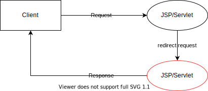

<h1 id="top">目錄</h1>

- [1. 重導請求 (Redirecting a Request)](#s1)
- [2. 使用 res.setStatus() 與 res.setHeader() 重導](#s2)
- [3. 使用 res.sendRedirect() 重導](#s3)

---

# <a id='s1' class='md-title' href='#top'>1. 重導請求 (Redirecting a Request)</a>

- **<span style='color:blue;'>目的:</span>** 將客戶端之請求，重導(Redirect)至指定的地點
- **<span style='color:blue;'>模式說明:</span>**

<p></p>

- 實作方法:
  - **<span style='color:red;'>res</span>.<span style='color:blue;'>sendRedirect(</span><span style='color:#d23200;'>String location</span><span style='color:blue;'>)</span>**
    - 可用相對或完整絕對 URL(relative or absolute URLs)
  - 上述方法等於下列 2 個方法將相加的結果
    - **<span style='color:red;'>res</span>.<span style='color:blue;'>setStatus(</span>HttpServletResponse.SC_FOUND<span style='color:blue;'>)</span>**
    - **<span style='color:red;'>res</span>.<span style='color:blue;'>setHeader(</span>"Location", <span style='color:#d23200;'>String location</span><span style='color:blue;'>)</span>**
      - 必須用完整絕對 URL (absolute URLs)

# <a id='s2' class='md-title' href='#top'>2. 使用 res.setStatus() 與 res.setHeader() 重導</a>

- 範例: SiteSelector.java (隨機重導)
  - 可另開此連結 [參考此檔](./doc/WebApp_ch05.war)

```java
package servlet_examples;

import java.io.*;
import java.util.*;
import javax.servlet.*;
import javax.servlet.http.*;

public class SiteSelector extends HttpServlet {
  private static final long serialVersionUID = 1L;

  Vector<String> sites = new Vector<String>();
  Random random = new Random();

  public void doGet(HttpServletRequest req, HttpServletResponse res)
                          throws ServletException, IOException {
    res.setContentType("text/html");
    PrintWriter out = res.getWriter();

    // 設定亂數
    int siteIndex = Math.abs(random.nextInt()) % sites.size();
    // 亂數取得重導頁面
    String site = sites.get(siteIndex);

    // 回傳狀態碼 302
    res.setStatus(HttpServletResponse.SC_FOUND);
    // 頁面重導
    res.setHeader("Location", site);
  }

  public void init() throws ServletException {
    sites.add("https://tw.yahoo.com");
    sites.add("https://www.google.com.tw");
    sites.add("http://www.oracle.com");
    sites.add("http://www.amazon.com/");
  }
}
```

# <a id='s3' class='md-title' href='#top'>3. 使用 res.sendRedirect() 重導</a>

```java
package servlet_examples;

import java.io.*;
import java.util.*;
import javax.servlet.*;
import javax.servlet.http.*;

public class SiteSelector extends HttpServlet {
  private static final long serialVersionUID = 1L;

  Vector<String> sites = new Vector<String>();
  Random random = new Random();

  public void doGet(HttpServletRequest req, HttpServletResponse res)
                          throws ServletException, IOException {
    res.setContentType("text/html");
    PrintWriter out = res.getWriter();

    int siteIndex = Math.abs(random.nextInt()) % sites.size();
    String site = sites.get(siteIndex);

    // 一行解決重導問題，如不需攜帶參數到頁面中的話可使用
    // 參數可在網址列上攜帶 parameter 值，但要注意此跳轉算get請求，跳轉列網址不能太長
    res.sendRedirect(site);
  }

  public void init() throws ServletException {
    sites.add("https://tw.yahoo.com");
    sites.add("https://www.google.com.tw");
    sites.add("http://www.oracle.com");
    sites.add("http://www.amazon.com/");
  }
}
```
