<h1 id="top">目錄</h1>

- [1. Connection pool (連線池) - 基本觀念](#s1)
- [2. Connection pool (連線池) - 實作](#s2)
- [3. server.xml 設定](#s3)
- [4. web.xml 設定](#s4)
- [5. 使用 JNDI](#s5)

---

# <a id='s1' class='md-title' href='#top'>1. Connection pool (連線池) - 基本觀念</a>

- 對於複雜的 Servlet ， 最理想的做法是實作一個 Connection pool (連線池)
- Connection pool 是一種對資料庫連線 (Connection 物件) 的管理機制，它可 **<span style='color:red;'>預先</span>** 建立起「若干個資料庫連線」，並執掌分配這些連線需要的 Servlet
- Servlet 可以從 Connection pool 中取出資料庫連線，用完即歸還給 Connection pool

<p></p>

# <a id='s2' class='md-title' href='#top'>2. Connection pool (連線池) - 實作</a>

- **實作方案 1:** 未使用 **javax.sql.<span style='color:blue;'>DataSurce</span>** (資料來源介面)
  - <u>準備好 ConnectionPool.java 類別 (連線池類別-支援類別)</u>
    - **Servlet 內:** **<span style='color:blue;'>宣告上述 pool 物件為實體變數 (instance variable)</span>** 並由 **<span style='color:red;'>init()</span>** 負責該 **<span style='color:blue;'>pool</span>** 實體搭建
    - **Servlet 內 <span style='color:red;'>doGet()</span> 或 <span style='color:red;'>doPost()</span> 負責如下**
      - 步驟 1: **<span style='color:blue;'>宣告 Connection</span> con <span style='color:blue;'>物件為區域變數(local variable)</span>**
      - 步驟 2: **<span style='color:blue;'>從 pool 取得連線 【如</span> con <span style='color:blue;'>= pool.getConnection();】</span>**
      - 步驟 3: **<span style='color:blue;'>歸還連線給 pool【如 pool.returnConnection(</span>con<span style='color:blue;'>);】</span>**
  - 說明: 此方法效能好但實作太複雜，如果連線池都由伺服器提供就會更為簡便 (此方法也為傳統作法)
- **實作方案 2:** 使用 **javax.sql.<span style='color:blue;'>DataSurce</span>** (資料來源介面)

  - <u>使用 **javax.sql.<span style='color:blue;'>DataSurce</span>** (資料來源介面) 這是設計觀念上最為複雜的一種方式，但卻也是實務操作時最方便的一種</u>
  - 一個 DataSource 物件就代表一個資料庫。應用程式一定要透過這介面才能取得資料庫連線 Cnnection 物件
  - 使用簡述
    - 步驟 1: <span style='color:red;'>需配合</span> server.xml <span style='color:red;'>之設定</span>
    - 步驟 2: <span style='color:red;'>需配合</span> web.xml <span style='color:red;'>之設定</span>
    - 步驟 3: <span style='color:red;'>程式中使用</span> JNDI <span style='color:red;'>去尋找以及存取</span> <span style='color:blue;'>DataSource</span>

# <a id='s3' class='md-title' href='#top'>3. server.xml 設定</a>

- **<span style='color:red;'>server.xml 或 context.xml 方法則一使用</span>**
- **連線池 - server.xml 設定 (Tomcat 5.x 以下設定)**

  - **<span style='color:red;'>需配合</span> server.xml <span style='color:red;'>之設定</span>** (以 Tomcat5.5 為例，但這樣設定不方便，每個專案都需要單獨設定一次)
    - 好處是使專案開發時的資料庫跟上線時的可以不同，降低相依性
    - 註: Tomcat 6.x 7.x 8.x 皆可另由 context.xml 檔設定 (見 <u>01.Servlet 基礎篇/03.環境準備/01.設定 Tomcat.html/3. 設定 Tomcat 組態檔</u>)

```xml
<Context path="/myWebApp" docBase="myWebApp" debug="5" reladable="true" crossContext="true">
  <Resurce name="jdbc/XxxDB" auth="Container"
    type="javax.sql.DataSource"
    maxActive="100" maxIdle="30" maxWait="10000"
    username="root" password="123456"
    driverClassName="com.mysql.jdbc.Driver"
    url="jdbc:mysql://localhost:3306/db01">
</Context>
```

- **連線池 - 組態檔設定 (Tomcat 8.x 設定)**

  - **context.xml:** <u>C:\apache-tomcat-8.0.xx\conf\\**<span style='color:red;'>context.xml</span>**</u>
    - The contents of this file will be loaded <span style='color:blue;'>for each web application</span>
    - 但需改變設定如下
      - **reloabled="true"** 自動 Servlet Reloading for 所有的 WebApp
      - **driverClassName="com.mysql.jdbc.Driver"** JNDI for 所有的 WebApp

```xml
<Context antiResourceLocking="false" privileged="true" reloabled="true" crossContext="true">
  <Resource name="jdbc/TestDB" auth="Container"
  type="javax.sql.DataSource" driverClassName="com.mysql.jdbc.Driver"
  url="jdbc:mysql://localhost:3306/DBxx"
  username="xxx" password="yyy" maxActive="20" maxIdle="10"
  maxWait="-1"/>
</Context>
```

# <a id='s4' class='md-title' href='#top'>4. web.xml 設定</a>

- **<span style='color:red;'>需配合</span> web.xml <span style='color:red;'>之設定</span>**
- 參考: http://localhost:8080/index.jsp 首頁之 Tomcat Documentation 的 **<span style='color:red;'>JNDI DataSource HOW-TO</span>** 說明
- 注意: 前頁之 **server.xml** 隨 servlet container 版本寫法會不同

```xml
<resource-ref>
  <description>DB Connection</description>
  <res-ref-name>jdbc/XxxDB</res-ref-name>
  <res-type>javax.sql.DataSource</res-type>
  <res-auth>Container</res-auth>
</resource-ref>
```

# <a id='s5' class='md-title' href='#top'>5. 使用 JNDI</a>

- **<span style='color:red;'>程式中使用</span> JNDI <span style='color:red;'>去尋找以及存取</span> <span style='color:blue;'>DataSource</span>**
  - **JNDI** (**J**ava **N**aming & **D**irectory **I**nterface, Java 命名及目錄介面)

```java
...
Context ctx = new javax.naming.InitialContext();
DataSource ds = (DataSource) ctx.lokup("java:comp/env/jdbc/XxxDB");
Connection conn = ds.getConnection();
...
```

- 範例
  - **DBEmpLookup4\_<span style='color:red;'>JNDI</span>.java** (具備 JNDI 能力的 Servlet)
