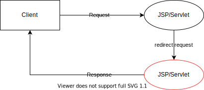

<h1 id="top">目錄</h1>

- [1. Servlet 協同運作](#s1)
- [2. 資訊共享](#s2)
- [3. ServletContext (Servlet 環境) 之屬性 (Attribute) method](#s3)
- [4. HttpSession 介面之屬性 (Attribute) method](#s4)
- [5. Request 介面之屬性 (Attribute) method](#s5)
- [6. 控制權共用](#s6)
- [7. Forward 實作](#s7)
- [8. Include 實作](#s8)
- [9. forward(轉送) 與 sendRedirect(重導)](#s9)
- [10. 重導請求 (Redirecting a Request)](#s10)

---

# <a id='s1' class='md-title' href='#top'>1. Servlet 協同運作</a>

- **Servlet 協同運作 (HttpServletRequest, RequestDispatcher 介面)**
  - 資訊共享
  - 控制權共用

# <a id='s2' class='md-title' href='#top'>2. 資訊共享</a>

- **為了讓在同一伺服器內的 Servlet 能彼此間互相溝通，一般來說是已下列兩種合作模式達成溝通的目的**

  - **資訊共享**
  - **控制權共用**

- **資訊共享**

  - 前面的 **<span style='color:red;'>ServletContext</span>** (<u>02.深入 Servlet/01.取得 Server 的資訊</u>) 及 **<span style='color:red;'>HttpSession</span>** (<u>14.使用 SessionTrackingAPI</u>) 都是讓 Servlet 彼此間共享資訊的方式

- **<span style='color:red;'>控制權共用</span>**

  - 共用 HttpServletRequest 物件(本單元-Servlet 協同運作)

# <a id='s3' class='md-title' href='#top'>3. ServletContext (Servlet 環境) 之屬性 (Attribute) method</a>

- **void <span style='color:red;'>context.</span><span style='color:blue;'>setAttribute(String name, Object value)</span>**
  - 將指定的物件存入 ServletContext 中
- **Object <span style='color:red;'>context.</span><span style='color:blue;'>getAttribute(String name)</span>**
  - 從 ServletContext 中取出物件
- **void <span style='color:red;'>context.</span><span style='color:blue;'>removeAttribute(String name)</span>**
  - 從 ServletContext 中移除物件
- **Enumeration <span style='color:red;'>context.</span><span style='color:blue;'>getAttributeNames()</span>**
  - 將目前 ServletContext 中的所有屬性名稱以 Enumeration 型態傳回

> 註: <span style='color:#d23200;'>javax.servlet.context.tempdir</span> 是伺服器被強制規定一定要有的屬性(Attribute)名稱

# <a id='s4' class='md-title' href='#top'>4. HttpSession 介面之屬性 (Attribute) method</a>

- **void <span style='color:red;'>session</span>.<span style='color:blue;'>setAttribute(String name, Object value)</span>**
  - 將指定的物件存入 session 中
- **Object <span style='color:red;'>session</span>.<span style='color:blue;'>getAttribute(String name)</span>**
  - 從 session 中取出物件
- **void <span style='color:red;'>session</span>.<span style='color:blue;'>removeAttribute(String name)</span>**
  - 從 session 中移除物件
- **Enumeration <span style='color:red;'>session</span>.<span style='color:blue;'>getAttributeNames()</span>**
  - 將目前 session 中的所有屬性名稱以 Enumeration 型態傳回

> <span style='color:red;'>特別注意:</span> request，<span style='color:red;'>session</span>，ServetContext (即 JSP 之 application) 等物皆有和屬性 (Attribute) 有關的如上 4 個 methods，應分辨其間之不同處！

# <a id='s5' class='md-title' href='#top'>5. Request 介面之屬性 (Attribute) method</a>

- **void <span style='color:red;'>req</span>.<span style='color:blue;'>setAttribute(String name, Object value)</span>**
  - 將指定的物件存入 Request 中
- **Object <span style='color:red;'>req</span>.<span style='color:blue;'>getAttribute(String name)</span>**
  - 從 Request 中取出物件
- **void <span style='color:red;'>req</span>.<span style='color:blue;'>removeAttribute(String name)</span>**
  - 從 Request 中移除物件
- **Enumeration <span style='color:red;'>req</span>.<span style='color:blue;'>getAttributeNames()</span>**
  - 將目前 Request 中的所有屬性名稱以 Enumeration 型態傳回

# <a id='s6' class='md-title' href='#top'>6. 控制權共用</a>

- **控制權共用模式可讓兩個或多個 Servlet，共享同一個 <span style='color:red;'>request</span> 的控制權**

  - **<span style='color:blue;'>轉送(forward)</span>**
    - Servlet 可以轉送 (forward) 整個 request 給其他 Servlet，然後由後者進行必要的處理
    - **<span style='color:red;'>request</span> 的控制權轉交後者**
  - **<span style='color:blue;'>包含(include)</span>**
    - Servlet 可以在自己的 response 內包含 (include) 其他元件所產生的內容
    - **前者仍保留 <span style='color:red;'>request</span> 的控制權**

- **概念上，如果將往業的執行結果當成是一個『畫面 screen』則**

  - **<span style='color:blue;'>轉送(forward)</span>** 可視為: 『**<span style='color:blue;'>交給另一個 Servlet 全權處理整個畫面</span>**』
    - 拜訪 A 畫面看見的是 B
  - **<span style='color:blue;'>包含(include)</span>** 則為: 『**<span style='color:blue;'>在原畫面的某區域注入其他元件所產生的畫面</span>**』
    - 拜訪 A 畫面裡面包含 B

- **JSP 相關概念**

  - **JSP 於控制權<span style='color:blue;'>轉送(forward)、包含(incude)</span>，是以標籤(Tag)的方式執行之**
    - **<span style='color:red;'>&lt;jsp:</span><span style='color:blue;'>forward</span> <span style='color:red;'>page="</span>被 forward 的 Servlet/JSP<span style='color:red;'>"/&gt;</span>**
    - **<span style='color:red;'>&lt;jsp:</span><span style='color:blue;'>include</span> <span style='color:red;'>page="</span>被 include 的 Servlet/JSP<span style='color:red;'>"</span><span style='color:blue;'>flush="true"</span><span style='color:red;'>/&gt;</span>**
  - **對 JSP Model2 之 MVC 價購(Model-View-Controller)而言，此控制權觀念極為重要**
  - **<span style='color:red;'>注意 1:</span> 被 forward 和 被 include 的網頁，可以接收到前面任何一層網業曾經送出的任何請求參數的值**
  - **<span style='color:red;'>注意 2:</span> 被 include 的網頁不能有錯誤，否則被 include 時會因看不到畫面而無法除錯**

- **<span style='color:red;'>Request</span> 之 <span style='color:blue;'>serAttribute(); getAttribute() ...</span> 等 method 才有作用**

# <a id='s7' class='md-title' href='#top'>7. Forward 實作</a>

- **實作目的:** <u>"轉送(forward) 可視為『交給另一個 Servlet 全權處理整個畫面』"</u>
  - <small>可另開此連結 [參考此檔](./doc/WebApp_ch08.war)，下載後進行 war 匯入</small>

```cs
"/WebApp_ch08/src/Forward.java"
```

```java
import java.io.*;
import javax.servlet.*;
import javax.servlet.http.*;

public class Forward extends HttpServlet {
  private static final long serialVersionUID = 1L;

  public void doGet(HttpServletRequest req, HttpServletResponse res)
      throws ServletException, IOException {

    res.setContentType("text/html; charset=UTF-8");
    PrintWriter out = res.getWriter();

    out.println("<HTML>");
    out.println("<HEAD><TITLE>Hello World</TITLE></HEAD>");
    out.println("<BODY bgcolor='lightblue'>");
//		============================================================================================================
    out.println("1-有執行 , 但看不到 , 因buffer被清掉");
    req.setAttribute("name1", "peter1"); // 有執行
    out.println("2-有執行 , 但看不到 , 因buffer被清掉");

    RequestDispatcher dispatcher = req.getRequestDispatcher("/Forwarded");
    dispatcher.forward(req, res);

    out.println("3-未執行");
    req.setAttribute("name2", "peter2"); // 未執行
    out.println("4-未執行");
//		============================================================================================================
    out.println("</BODY></HTML>");
  }
}
```

```cs
"/WebApp_ch08/WebContent/forwarded.jsp"
```

```java
import java.io.*;
import javax.servlet.*;
import javax.servlet.http.*;

public class Forwarded extends HttpServlet {
  private static final long serialVersionUID = 1L;

  public void doGet(HttpServletRequest req, HttpServletResponse res)
      throws ServletException, IOException {

    res.setContentType("text/html; charset=UTF-8");
    PrintWriter out = res.getWriter();

    out.println("<HTML>");
    out.println("<HEAD><TITLE>Hello World</TITLE></HEAD>");
    out.println("<BODY bgcolor='orange'>");
//		============================================================================================================
    out.println("<hr color=red>");

    out.println("我是 Forwarded<br>");
    out.println("name1= "+req.getAttribute("name1"));
    out.println("<br>");
    out.println("name2= "+req.getAttribute("name2"));
    out.println("<br>");

    out.println("<hr color=red>");
//		============================================================================================================
    out.println("</BODY></HTML>");
  }
}
```

- **範例測試步驟**
  - 先執行 **Forward.java**
  - 執行後顯示內容 (即 **forwarded.java** 頁面資料)

<p></p>

# <a id='s8' class='md-title' href='#top'>8. Include 實作</a>

- **實作目的:** <u>"包含(include) 為『在原畫面的某區域注入其他元件所產生的畫面』"</u>
  - <small>可另開此連結 [參考此檔](./doc/WebApp_ch08.war)，下載後進行 war 匯入</small>

```cs
"/WebApp_ch08/src/Include.java"
```

```java
import java.io.*;
import javax.servlet.*;
import javax.servlet.http.*;

public class Include extends HttpServlet {
  private static final long serialVersionUID = 1L;

  public void doGet(HttpServletRequest req, HttpServletResponse res)
      throws ServletException, IOException {

    res.setContentType("text/html; charset=UTF-8");
    PrintWriter out = res.getWriter();

    out.println("<HTML>");
    out.println("<HEAD><TITLE>Hello World</TITLE></HEAD>");
    out.println("<BODY bgcolor='lightblue'>");
//		============================================================================================================
    out.println("1-有執行, 有看到<br>");
    req.setAttribute("name1", "peter1"); // 有執行
    out.println("2-有執行, 有看到<br>");
    req.setAttribute("name2", "peter2"); // 有執行

    RequestDispatcher dispatcher = req.getRequestDispatcher("/Included");
    dispatcher.include(req, res);

    out.println("3-有執行, 有看到<br>");
    out.println("4-有執行, 有看到<br>");
//		============================================================================================================
    out.println("</BODY></HTML>");
  }
}
```

```cs
"/WebApp_ch08/src/Included.java"
```

```java
import java.io.*;
import javax.servlet.*;
import javax.servlet.http.*;

public class Included extends HttpServlet {
  private static final long serialVersionUID = 1L;

  public void doGet(HttpServletRequest req, HttpServletResponse res)
      throws ServletException, IOException {

    res.setContentType("text/html; charset=UTF-8");
    PrintWriter out = res.getWriter();

    out.println("<HTML>");
    out.println("<HEAD><TITLE>Hello World</TITLE></HEAD>");
    out.println("<BODY bgcolor='orange'>");
//		============================================================================================================
    out.println("<hr color=red>");

    out.println("我是 Included<br>");
    out.println("name1= "+req.getAttribute("name1"));
    out.println("<br>");
    out.println("name2= "+req.getAttribute("name2"));
    out.println("<br>");

    out.println("<hr color=red>");
//		============================================================================================================
    out.println("</BODY></HTML>");
  }
}
```

- **範例測試步驟**
  - 先執行 **Include.java**
  - 執行後顯示內容 (即 **Included.java** 頁面資料)

<p></p>

# <a id='s10' class='md-title' href='#top'>10. 重導請求 (Redirecting a Request)</a>

- **forward(轉送) 與 sendRedirect(重導)**

  - **<span style='color:blue;'>說明:</span>** 這是非常容易混淆的兩個方法。雖然各有其用途，但有時卻也是可以彼此替代的
  - **<span style='color:#d23200;'>比較 1</span>**
    - **<span style='color:blue;'>forward(</span>String localURL<span style='color:blue;'>)</span>**
      - **動作全在伺服器內完成，<span style='color:red;'>執行速度較快</span>**
      - **可分想存在於 request 內屬性(Attribute)的值**
    - **<span style='color:red;'>res</span><span style='color:blue;'>.sendRedirect(</span>String location<span style='color:blue;'>)</span>**
      - **則是<span style='color:red;'>透過 Http 協定的 Header</span>**
      - **因此無法分享存在於 request 內屬性(Attribute)的值(通常改採用 sessin 或請求參數之方式)**
  - **<span style='color:#d23200;'>比較 2</span>**

    - **<span style='color:red;'>res</span><span style='color:blue;'>.sendRedirect(</span>String location<span style='color:blue;'>)</span>**
      - location 可以是「完整絕對 URL，如以 http://...開頭」**<span style='color:red;'>或</span>** 是無「/」和有「/」的相對路徑
    - **<span style='color:blue;'>forward(</span>String localURL<span style='color:blue;'>)</span>**
      - **<span style='color:red;'>必須</span>** 是無「/」和有「/」的相對路徑，並需注意 forward 以「/」開頭時，<u>「/」代表 Servlet Context 環境目錄路徑</u>

  - **<span style='color:#d23200;'>注意事項</span>**
    - 當某網頁可能 **<span style='color:#d23200;'>被 forward</span>** 的網頁時，此網頁內的所有 html 連結，如果採用無 **<span style='color:#d23200;'>「/」</span>** 的相對路徑寫法時，會被加上原先 **<span style='color:#d23200;'>forward 者</span>** 的路徑，要特別注意。這是 forward() 使用上的一個 **<span style='color:#d23200;'>致命傷</span>**

# 重導請求 (Redirecting a Request)

- **<span style='color:blue;'>目的:</span>** 將客戶端之請求，重導(Redirect)至指定的地點
- **<span style='color:blue;'>模式說明:</span>**

<p></p>

- 實作方法:
  - **<span style='color:red;'>res</span>.<span style='color:blue;'>sendRedirect(</span><span style='color:#d23200;'>String location</span><span style='color:blue;'>)</span>**
    - 可用相對或完整絕對 URL(relative or absolute URLs)
  - 上述方法等於下列 2 個方法將相加的結果
    - **<span style='color:red;'>res</span>.<span style='color:blue;'>setStatus(</span>HttpServletResponse.SC_FOUND<span style='color:blue;'>)</span>**
    - **<span style='color:red;'>res</span>.<span style='color:blue;'>setHeader(</span>"Location", <span style='color:#d23200;'>String location</span><span style='color:blue;'>)</span>**
      - 必須用完整絕對 URL (absolute URLs)
