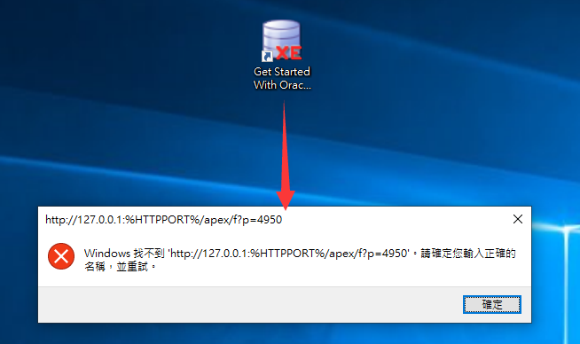
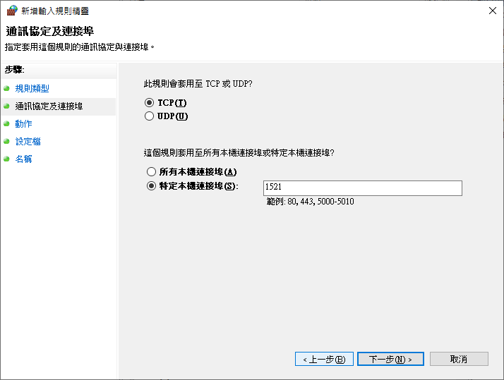
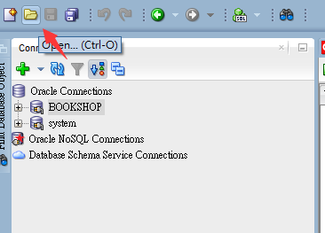

<h1 id="top">目錄</h1>

- [1. Oracle 安裝](#s1)
- [2. 刪除雲資料庫快捷](#s2)
- [3. 開啟/停用 Database](#s3)
- [4. cmd 指令測試是否安裝成功](#s4)
- [5. 啟用 Oracle SQL Developer](#s5)
- [6. Oracle 修改語系](#s6)
- [7. Oracle 建立本機連線](#s7)
- [8. Oracle 建立外部連線](#s8)
- [9. Oracle 修改編碼格式 UTF-8](#s9)
- [10. Oracle 修改可還原次數](#s10)
- [11. Oracle 建立使用者](#s11)
- [12. Oracle 刪除使用者](#s12)
- [13. Oracle 自訂快捷](#s13)
- [14. Oracle 匯入檔案](#s14)
- [15. Oracle 修改預設字體大小](#s15)
- [16. Oracle 修改預設字體](#s16)
- [17. Oracle 顯示行號](#s17)
- [18. Oracle 顯示行號](#s18)

---

# <a id="s1" class="md-title" href="#top">1. Oracle 安裝</a>

- 下載 OracleXE 版，並解壓

  <div style="text-align:center">
    
  </div>

- 點擊 setup.exe 安裝

  <div style="text-align:center">
    
  </div>

- 進入安裝步驟

  <div style="text-align:center">
    
  </div>

- 選擇安裝目錄

  <div style="text-align:center">
    
  </div>

- 輸入帳號密碼 (此為系統帳號，且帳密區分大小寫)

  - 若後續帳號丟失則須重新安裝資料庫

  <div style="text-align:center">
    
  </div>

- 安裝完成

  - 進行安裝時可能會在進度 99%時卡很久，只要等待即可

  <div style="text-align:center">
    
  </div>

# <a id="s2" class="md-title" href="#top">2. 刪除雲資料庫快捷</a>

- 因為連結是錯誤的，所以直接刪除此快捷就好

  <div style="text-align:center">
    
  </div>

# <a id="s3" class="md-title" href="#top">3. 開啟/停用 Database</a>

- Start Database 開啟
- Stop Database 停用

  <div style="text-align:center">
    
  </div>

# <a id="s4" class="md-title" href="#top">4. cmd 指令測試是否安裝成功</a>

- 輸入指令 `sqlplus / as sysdba`

  <div style="text-align:center">
    
  </div>

# <a id="s5" class="md-title" href="#top">5. 啟用 Oracle SQL Developer</a>

- 下載 `sqldeveloper-19.2.1.247.2212-no-jre.zip` 並解壓縮

  - 此版本有解決 1.7 版的輸入中文即會造成編輯器崩潰的情形<br><br>

  <div style="text-align:center">
    
  </div>

- 選擇 jdk 安裝目錄

  <div style="text-align:center">
    
  </div>

- 開始安裝

  <div style="text-align:center">
    
  </div>

- 安裝完成

  <div style="text-align:center">
    
  </div>

- 後續開啟位置

  <div style="text-align:center">
    
  </div>

# <a id="s6" class="md-title" href="#top">6. Oracle 修改語系</a>

- 修改 `sqldeveloper.conf`

  ```cs
  D:\sqldeveloper\sqldeveloper\bin\sqldeveloper.conf
  ```

  <div style="text-align:center">
    
  </div>

- 添加 `AddVMOption -Duser.language=en`

  <div style="text-align:center">
    
  </div>

- 重新運行後介面即是英文版

# <a id="s7" class="md-title" href="#top">7. Oracle 建立本機連線</a>

- `Connections` > `New Connections...`

  <div style="text-align:center">
    
  </div>

- 設定新連線名稱 `Name:system` > 輸入帳號密碼 > `save` > `Connect`

  <div style="text-align:center">
    
  </div>

- 連線成功

  <div style="text-align:center">
    
  </div>

- 連線成功後完整畫面

  <div style="text-align:center">
    
  </div>

# <a id="s8" class="md-title" href="#top">8. Oracle 建立外部連線</a>

- 設定防火牆

  <div style="text-align:center">
    
  </div>

- 右鍵輸入規則 > 新增規則 > 連接埠

  <div style="text-align:center">
    
  </div>

- 特定本機連接埠為 `1521`

  <div style="text-align:center">
    
  </div>

- 下一步

  <div style="text-align:center">
    
  </div>

- 下一步

  <div style="text-align:center">
    
  </div>

- 自訂名稱 > 完成

  <div style="text-align:center">
    
  </div>

# <a id="s9" class="md-title" href="#top">9. Oracle 修改編碼格式 UTF-8</a>

- `Tools` > `Preferences...`

  <div style="text-align:center">
    
  </div>

- 選擇 `UTF-8`

  <div style="text-align:center">
    
  </div>

# <a id="s10" class="md-title" href="#top">10. Oracle 修改可還原次數</a>

- `Tools` > `Preferences...` > `Code Editor` > `Undo Behavior`

  - 可將文字編輯器還原次數調高<br><br>

  <div style="text-align:center">
    
  </div>

# <a id="s11" class="md-title" href="#top">11. Oracle 建立使用者</a>

- `system` > `Other Users`

  <div style="text-align:center">
    
  </div>

- 右鍵 `Other Users` > `Create User`

  <div style="text-align:center">
    
  </div>

- `User` > 設定 `User Name...`

  <div style="text-align:center">
    
  </div>

- `Granted Roles` > 勾選 `CONNECT`、`DBA`、`RESOURCE`

  <div style="text-align:center">
    
  </div>

- 設定完成 (建立好帳號**並不會同時關聯資料庫**，若須建立連線請參照: [建立本機連線](#s7)

  <div style="text-align:center">
    
  </div>

# <a id="s12" class="md-title" href="#top">12. Oracle 刪除使用者</a>

  <div style="text-align:center">
    
  </div>

# <a id="s13" class="md-title" href="#top">13. Oracle 自訂快捷</a>

- `Tools` > `Preferences...` > `Shortcut Keys`

# <a id="s14" class="md-title" href="#top">14. Oracle 匯入檔案</a>

- `Open...`

  <div style="text-align:center">
    
  </div>

- 選擇檔案 > `open`

  <div style="text-align:center">
    
  </div>

# <a id="s15" class="md-title" href="#top">15. Oracle 修改預設字體大小</a>

- `Tools` > `Preferences...` > `Code Editor` > `Fonts` > `Font Size`

  <div style="text-align:center">
    
  </div>

# <a id="s16" class="md-title" href="#top">16. Oracle 修改預設字體</a>

- `Tools` > `Preferences...` > `Code Editor` > `Fonts` > `Font Name`

# <a id="s17" class="md-title" href="#top">17. Oracle 顯示行號</a>

- `Tools` > `Preferences...` > `Code Editor` > `Line Gutter` > 勾選 `Show Line Numbers`

# <a id="s18" class="md-title" href="#top">18. Oracle KEY_XE.reg 錯誤</a>

- `windows 開始` > 搜尋 `regedit` > `HKEY_CLASSES_ROOT` > `Installer` > `Products` > `266B7A503A089BE4EAD1986A429434C1` > `SourceList` > `Media` > 修改 `1` 的 `資料` > 貼上 oracle 錯誤題式碼 `C:\Users\Li\AppData\Local\Temp\{2E8B34C8-54AC-4AD0-968F-6475D67302E4}}\KEY_XE.reg`
- `C:\Users\{填寫自己電腦的User名稱}\`
- **錯誤提示碼每次重灌就會給新值**
- 改好後**繼續安裝**即可
- 可參考此 [youtube 影片](https://www.youtube.com/watch?v=gNS1BF9MSlc) 教學

  <div style="text-align:center">
    
  </div>
