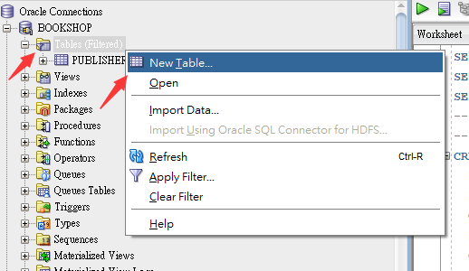
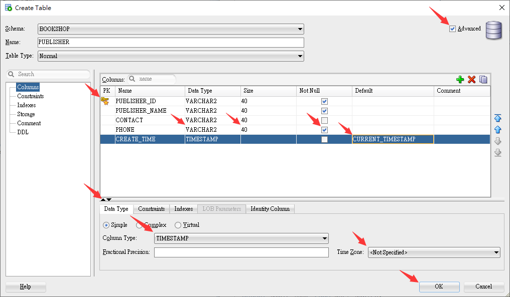
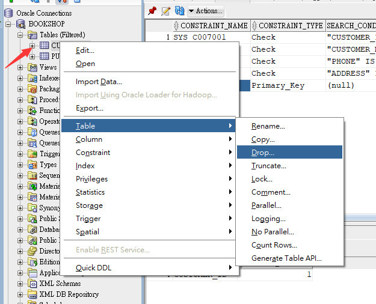
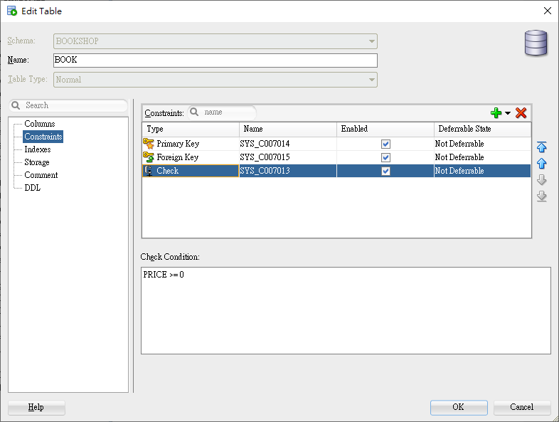
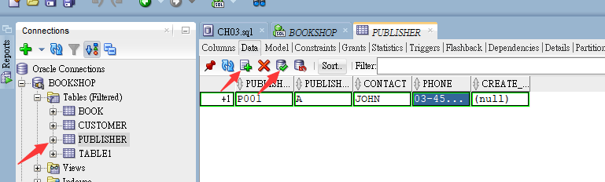

<h1 id="top">目錄</h1>

- [1. 建立表格](#s1)
- [2. 刪除表格](#s2)
- [3. 介面化創建檢查效果](#s3)
- [4. 新增表單值](#s4)

---

# <a id="s1" class="md-title" href="#top">1. 建立表格</a>

- `Tables` 右鍵 > `New Table`

  

    
  

- 添加欄位等細項

  - NUMBER

    - 自訂精準數 NUMBER(總位數,小數位數)

  - CHAR

  - VARCHAR2

    - 不確定字元長度就選這個

  - DATE

    - 儲存日期

  - TIMESTAMP

    - 自動創建當日時間: `Default` > `CURRENT_TIMESTAMP`   

  

    
  

# <a id="s2" class="md-title" href="#top">2. 刪除表格</a>

- `表格右鍵` > `Table` > `Drop...`

  

    
  

# <a id="s3" class="md-title" href="#top">3. 介面化創建檢查效果</a>

- `Constrains` > `Check` > `Check Condition` > 寫入條件

  

    
  

# <a id="s4" class="md-title" href="#top">4. 新增表單值</a>

- `打開表單` > `Data` > `+` > `新增數據` > `√`

  

    
  

