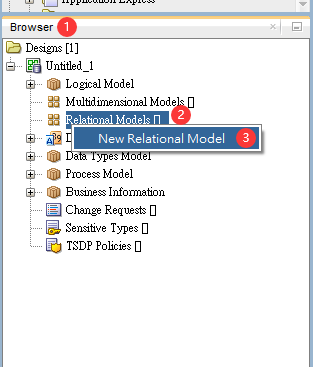
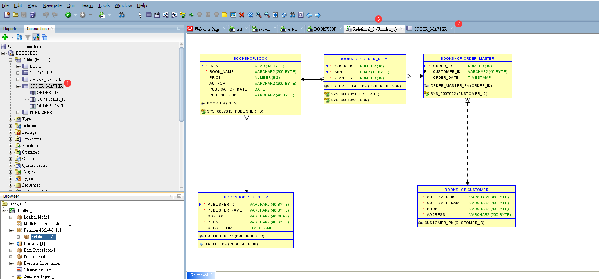

<h1 id="top">目錄</h1>

- [1. 開啟 Browser](#s1)

---

# <a id="s1" class="md-title" href="#top">1. 開啟 Browser</a>

- `view` > `Data Modeler` > `Browser`

- `Browser` 頁籤 > `Relational Models` 右鍵 > `New Relational Model`

  

    
  

- `Relational_1(Untitled_1)` > 將 table 表格點著並拖拉至圖表中(多拉幾次)<a href="#fn1" id="fnref1">[1]</a>

  

    
  

---

<section class="footnotes">
<ol class="footnotes-list">
<li id="fn1" class="footnote-item">

Relational Model 中<strong>虛線箭頭</strong>指向的是<strong>爸爸</strong>，一定要先建立資料。<strong>實線</strong>是<strong>兒子</strong>後來在建立<a href="#fnref1" class="footnote-backref">↩︎</a></li>

</ol>
</section>
