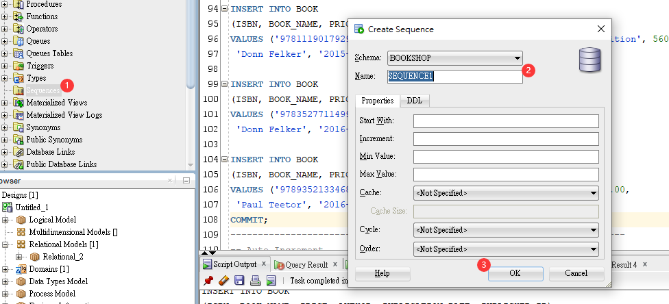
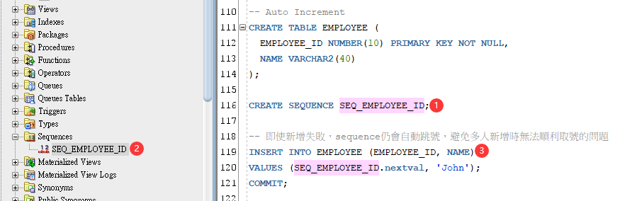
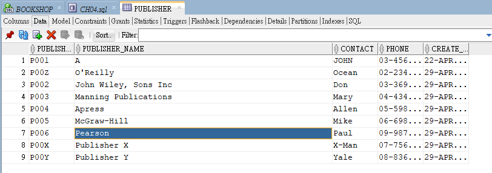

<h1 id="top">目錄</h1>

- [1. 插入資料(無日期)](#s1)
- [2. 插入資料(含日期格式)](#s2)
- [3. 設定統一日期格式](#s3)
- [4. 自動編號](#s4)
- [5. COMMIT 與 ROLLBACK](#s5)
- [6. 自動序號格式](#s6)
- [7. 資料鎖定](#s7)

---

# <a id="s1" class="md-title" href="#top">1. 插入資料(無日期)</a>

- 插入資料 `INSERT INTO [TableName]([TableCol],[TableCol],...)`

  - 值若是 `'O''Reilly'` 則建立後變成 `O'Reilly`<br><br>

```sql
-- INSERT INTO PUBLISHER
INSERT INTO PUBLISHER (PUBLISHER_ID, PUBLISHER_NAME, CONTACT, PHONE)
VALUES ('P001', 'O''Reilly', 'Ocean' , '02-23456789');

INSERT INTO PUBLISHER (PUBLISHER_ID, PUBLISHER_NAME, CONTACT, PHONE)
VALUES ('P002', 'John Wiley, Sons Inc', 'Don' , '03-36962869');

INSERT INTO PUBLISHER (PUBLISHER_ID, PUBLISHER_NAME, CONTACT, PHONE)
VALUES ('P003', 'Manning Publications', 'Mary' , '04-43456789');

INSERT INTO PUBLISHER (PUBLISHER_ID, PUBLISHER_NAME, CONTACT, PHONE)
VALUES ('P004', 'Apress', 'Allen' , '05-59876543');

INSERT INTO PUBLISHER (PUBLISHER_ID, PUBLISHER_NAME, CONTACT, PHONE)
VALUES ('P005', 'McGraw-Hill', 'Mike' , '06-69876543');

INSERT INTO PUBLISHER (PUBLISHER_ID, PUBLISHER_NAME, CONTACT, PHONE)
VALUES ('P006', 'Pearson', 'Paul' , '09-98767867');

INSERT INTO PUBLISHER (PUBLISHER_ID, PUBLISHER_NAME, CONTACT, PHONE)
VALUES ('P00X', 'Publisher X', 'X-Man' , '07-75698765');

INSERT INTO PUBLISHER (PUBLISHER_ID, PUBLISHER_NAME, CONTACT, PHONE)
VALUES ('P00Y', 'Publisher Y', 'Yale' , '08-83698765');
```

---

<table>
<thead>
<tr>
<th>PUBLISHER_ID</th>
<th>PUBLISHER_NAME</th>
<th>CONTACT</th>
<th>PHONE</th>
</tr>
</thead>
<tbody>
<tr>
<td>P001</td>
<td>O'Reilly</td>
<td>Ocean</td>
<td>02-23456789</td>
</tr>
<tr>
<td>P002</td>
<td>John Wiley, Sons Inc</td>
<td>Sons Inc</td>
<td>Don</td>
</tr>
<tr>
<td>P003</td>
<td>Manning Publications</td>
<td>Mary</td>
<td>04-43456789</td>
</tr>
<tr>
<td>P004</td>
<td>Apress</td>
<td>Allen</td>
<td>05-59876543</td>
</tr>
<tr>
<td>P005</td>
<td>McGraw-Hill</td>
<td>Mike</td>
<td>06-69876543</td>
</tr>
<tr>
<td>P006</td>
<td>Pearson</td>
<td>Paul</td>
<td>09-98767867</td>
</tr>
<tr>
<td>P00X</td>
<td>Publisher X</td>
<td>X-Man</td>
<td>07-75698765</td>
</tr>
<tr>
<td>P00Y</td>
<td>Publisher Y</td>
<td>Yale</td>
<td>08-83698765</td>
</tr>
</tbody>
</table>

# <a id="s2" class="md-title" href="#top">2. 插入資料(含日期格式)</a>

- 填日期時需用 to_date() 做日期轉換，例: `to_date('2005-02-19 21:02:44', 'yyyy-mm-dd hh24:mi:ss')`<sup class="footnote-ref"><a href="#fn1" id="fnref1">[1]</a></sup>

  - `yyyy-mm-dd` 表示**年-月-日**轉換

  - `hh24:mi:ss` 表示**時:分:秒**轉換

```sql
-- INSERT INTO BOOK
-- to_date(): 將指定格式日期/時間字串轉成DATE格式
-- DATE：to_date('2005-02-19', 'yyyy-mm-dd')
-- TIMESTAMP：to_date('2005-02-19 21:02:44', 'yyyy-mm-dd hh24:mi:ss')
INSERT INTO BOOK
(ISBN, BOOK_NAME, PRICE, AUTHOR, PUBLICATION_DATE, PUBLISHER_ID)
VALUES('9780596009205', 'Head First Java', 1186 ,
'Kathy Sierra and Bert Bates', to_date('2005-02-19', 'yyyy-mm-dd'), 'P001');
```

# <a id="s3" class="md-title" href="#top">3. 設定統一日期格式</a>

- 設定後連線期間(SESSION)就不用單獨套用格式，用法: `ALTER SESSION SET` (以下格式則一套用)

```sql
-- 更改NLS_DATE_FORMATNLS_DATE_FORMAT, NLS_TIMESTAMP_FORMAT格式有2個好處
-- 1. 在資料庫連線期間新增時無需使用to_date()轉換
-- 2. 查詢結果顯示的日期/時間格式也同時確定
```

---

```sql
ALTER SESSION SET NLS_DATE_FORMAT = 'yyyy-mm-dd';
```

```sql
ALTER SESSION SET NLS_TIMESTAMP_FORMAT = 'yyyy-mm-dd hh24:mi:ss';
```

# <a id="s4" class="md-title" href="#top">4. 自動編號</a>

- 常用在 PK<sup class="footnote-ref"><a href="#fn2" id="fnref2">[2]</a></sup> 上，多用在訂單編號

- 建立**序號格式**

```sql
CREATE SEQUENCE SEQ_EMPLOYEE_ID;
```

<table>
<thead>
<tr>
<th style="text-align:center">Name</th>
<th style="text-align:center">Value</th>
</tr>
</thead>
<tbody>
<tr>
<td style="text-align:center">CREATED</td>
<td style="text-align:center">2020-04-29</td>
</tr>
<tr>
<td style="text-align:center">LAST_DDL_TIME</td>
<td style="text-align:center">2020-04-29</td>
</tr>
<tr>
<td style="text-align:center">SEQUENCE_OWNER</td>
<td style="text-align:center">BOOKSHOP</td>
</tr>
<tr>
<td style="text-align:center">SEQUENCE_NAME</td>
<td style="text-align:center">SEQ_EMPLOYEE_ID</td>
</tr>
<tr>
<td style="text-align:center">MIN_VALUE</td>
<td style="text-align:center">1</td>
</tr>
<tr>
<td style="text-align:center">MAX_VALUE</td>
<td style="text-align:center">9999999999999999999999999999</td>
</tr>
<tr>
<td style="text-align:center">INCREMENT_BY</td>
<td style="text-align:center">1</td>
</tr>
<tr>
<td style="text-align:center">CYCLE_FLAG</td>
<td style="text-align:center">N</td>
</tr>
<tr>
<td style="text-align:center">ORDER_FLAG</td>
<td style="text-align:center">N</td>
</tr>
<tr>
<td style="text-align:center">CACHE_SIZE</td>
<td style="text-align:center">20</td>
</tr>
<tr>
<td style="text-align:center">LAST_NUMBER</td>
<td style="text-align:center">21</td>
</tr>
</tbody>
</table>

- 套用**序號格式**並新增資料

```sql
-- 即使新增失敗，sequence仍會自動跳號，避免多人新增時無法順利取號的問題
-- 新增失敗的話照樣會新增失敗，直到新的執行可以執行成功就會將資料加入
INSERT INTO EMPLOYEE (EMPLOYEE_ID, NAME)
VALUES (SEQ_EMPLOYEE_ID.nextval, 'John');
```

- 查詢目前編到的號碼

```sql
-- 查詢目前自動編號(sequence)的值
-- SEQ_EMPLOYEE_ID 的值替換成需查詢編號的 sequence 名
SELECT SEQ_EMPLOYEE_ID.currval FROM dual;
```

# <a id="s6" class="md-title" href="#top">6. COMMIT 與 ROLLBACK</a>

- COMMIT<sup class="footnote-ref"><a href="#fn3" id="fnref3">[3]</a></sup>

  - 在 Oracle 提交此次修改信息，沒下 commit 則指令後的效果沒有真正被保存(相當於 excel 編輯後沒有 `ctrl + s` 檔案)[^commitdata]，這時就可以使用 ROLLBACK 回退資料

  - 使用方法 `COMMIT;`

- ROLLBACK<sup class="footnote-ref"><a href="#fn5" id="fnref5">[5]</a></sup>

  - 撤回未提交(保存)的資料

  - 使用方法 `ROLLBACK;`

# <a id="s7" class="md-title" href="#top">7. 自動序號格式</a>

- 介面化建立

<div style="text-align:center">
  
</div>

- 指令自動建立

<div style="text-align:center">
  
</div>

# <a id="s8" class="md-title" href="#top">8. 資料鎖定</a>

- 資料表在**有人編輯**時**此筆資料會被鎖定**<sup class="footnote-ref"><a href="#fn6" id="fnref6">[6]</a></sup>，此時其他人員不可修改(但此表的其他資料仍可被修改)

<div style="text-align:center">
  
</div>

---

<section class="footnotes">
<ol class="footnotes-list">
<li id="fn1" class="footnote-item"><p>to_date('2005-02-19', 'yyyy-mm-dd')中的 <code>2005-02-19</code> 指的就是值 <a href="#fnref1" class="footnote-backref">↩︎</a></p>
</li>
<li id="fn2" class="footnote-item"><p>Primary Key(主鍵) <a href="#fnref2" class="footnote-backref">↩︎</a></p>
</li>
<li id="fn3" class="footnote-item"><p><a href="https://www.w3cschool.cn/oraclejc/oraclejc-grjn2r0x.html">使用 COMMIT 语句在 Oracle 中发出提交</a> <a href="#fnref3" class="footnote-backref">↩︎</a></p>
</li>
<li id="fn4" class="footnote-item"><p>資料 commit 後才能準確地保存此次修改，並讓其他共用資料庫的人一同使用 <a href="#fnref4" class="footnote-backref">↩︎</a></p>
</li>
<li id="fn5" class="footnote-item"><p><a href="https://tomkuo139.blogspot.com/2009/10/oracle-plsql-savepoint-rollback.html">Oracle PL/SQL 中, Savepoint 與 Rollback 的用法</a> <a href="#fnref5" class="footnote-backref">↩︎</a></p>
</li>
<li id="fn6" class="footnote-item"><p>即應用到 <strong>ACID</strong> 中的<strong>隔離性</strong>(<code>I</code>，<code>Isolation</code>)規則 <a href="#fnref6" class="footnote-backref">↩︎</a></p>
</li>
</ol>
</section>
