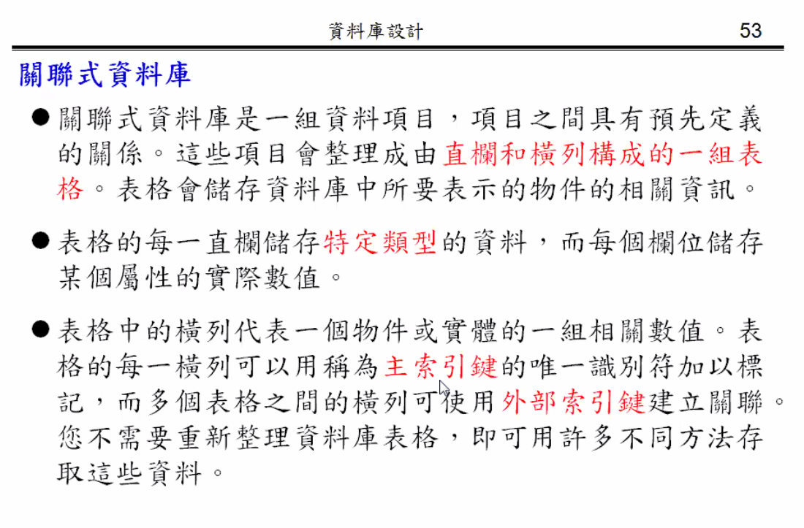
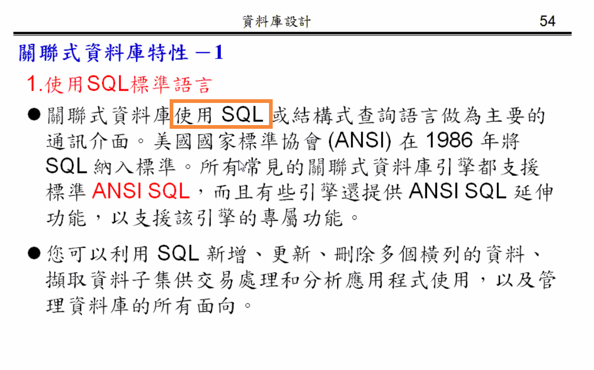
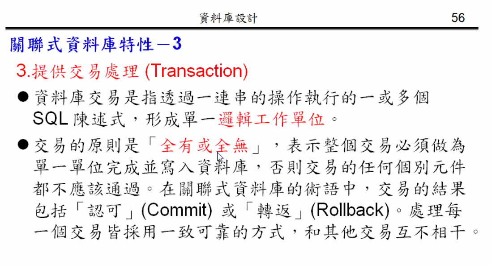
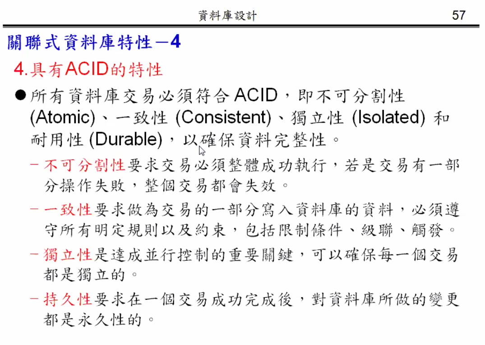
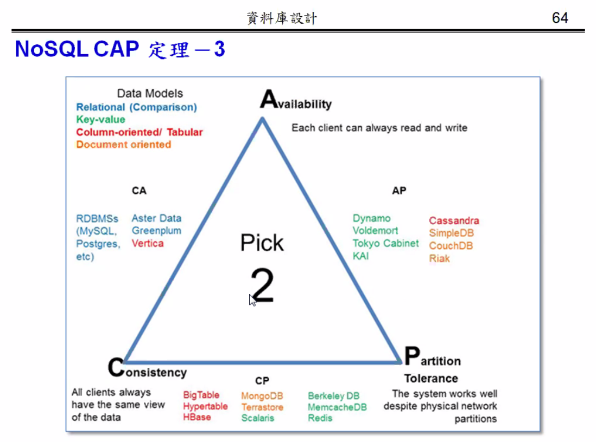
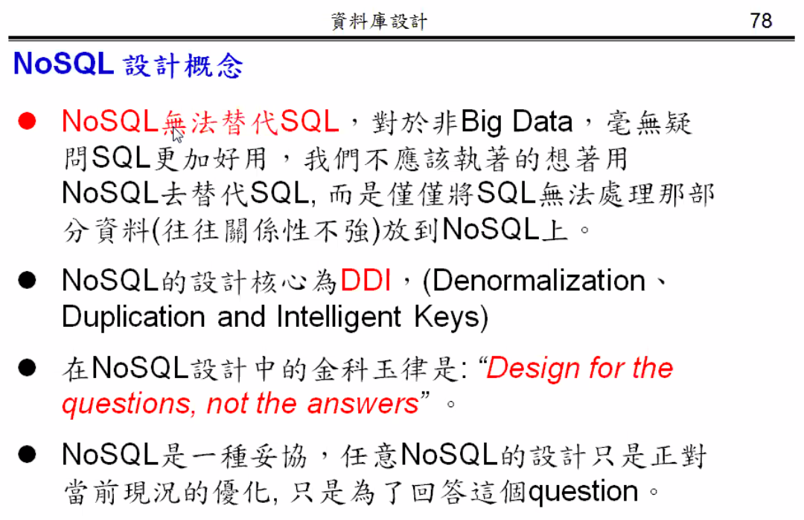
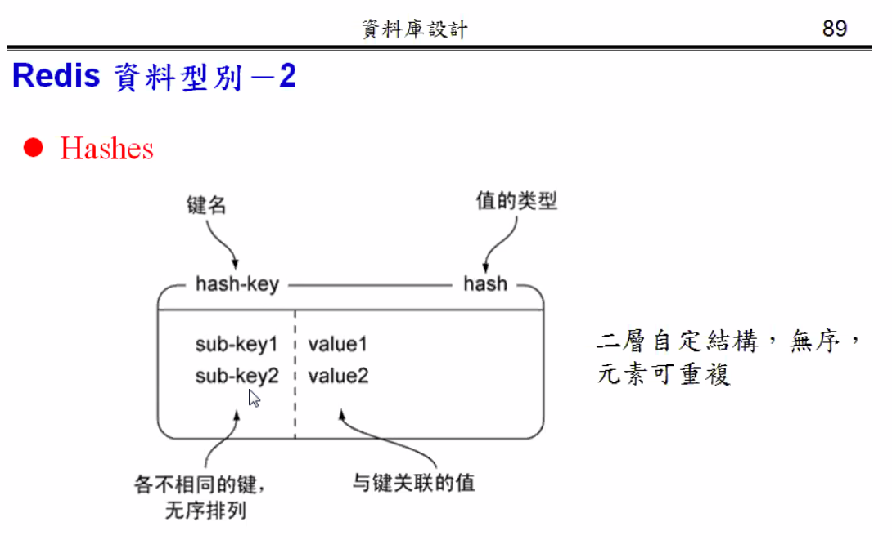
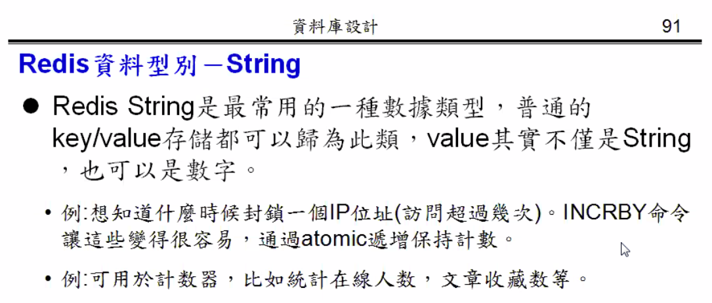

# 作業答案

# 資料庫種類

- Redis 常用

# 關聯式資料庫

# 關聯式資料庫特性(!)

## 1. 使用 SQL

- 使用 SQL，可增刪改查

## 2. 資料完整性

- 給你彈性，後果自己負責

## 3. 提供交易處理

## 4. 具 ACID 特性

### 1. 不可分割性

### 2. 一致性

### 3. 獨立性

- 將可能會出問題的動作 lock
- 但可能會出現兩隻程式交錯鎖定對方的需求，變成 DeadLock
- 但通常資料庫都會處理這些問題，所以不會造成 Staration (餓死) 的情形

### 4. 持久性

- `備份`跟`log`

# 關聯式資料庫面臨的挑戰

## 1. 大數據時代 3V

### 1. 數據量

### 2. 多變性

### 3. 時效性

- 平行處裡，多台電腦運算

## 其他問題

### 1. 阻抗不匹配

- 硬體阻抗不匹配範例

- no SQL 會讓程式與資料庫存取更方便

### 2. 叢集需求

- Scaling up 向上擴充，往上擴充容量(會有極限)

- Scaling out 向外擴充，用多個小的機器取代大的機器(一般的解法)

- 關聯式資料庫用`單一節點`考量，所以無法在 Scaling out 中使用的很好

- 其他解法:
  - Google: BigTable
  - Amazon: Dynamo

# NoSQL

- `SQL`: 關聯式
- `NoSQL` 不只只有資料庫: `Not Only SQL`

## 1. NoSQL 特性

- 沒有關聯式特性
- 在叢集上運行良好
- Open-Source
- 2000 年後產生
- Schema(綱要)less，沒有綱要(`欄位不用事先宣告`)
- 多種(Polyglot)行駛的資料庫

## 2. NoSQL 總結

- 即一種典範的移轉

# NoSQL CAP 定理

- 沒驗證前稱作`布魯爾猜想`，而後一兩年此猜想就被證實

## 1. 一致性

## 2. 可用性

- 有限時間內得到答案

## 3. 分隔容忍

- 因為分散儲存，所以不會因為單一節點無法連通(毀損)而無法運作

## 4. 總結

- 關聯式資料庫: C A

- NoSQL: P

  - 所有 NoSQL 都選 P

# NoSQL BASE 理論

- 名稱由來: ACID(酸)的相反，(鹼)理論 (NoSQL CAP 別名)

- 定義:

  - 基本可用，`有可能效能很差`

  - 軟狀態，`資料還在讀`

  - 最終一致性，`有可能不一致`

# NoSQL 種類

# 常用資料庫排名

# 資料庫比較

# NoSQL 類型資料庫

## 1. 鍵值資料庫(Key-Value Database)

## 2. 列導向資料庫

- 欄位(Column)可以動態增加，不用事先宣告
- Row Key、Column Family 需事先宣告

## 3. 文檔資料庫

- 資料儲存 json 格式，容易產生、處裡

## 4. 圖形資料庫

- 資料庫結構以圖形呈現

# 混合持久性資料庫

- 給予儲存方案更多的選擇

# NoSQL 設計概念

# NoSQL 資料塑模

# DDI 原則

- Denormalization

  - 反第一正規化
  - 寫入是針對行，不允許寫入出錯、不允許寫入時其他人編輯...

- Duplication

- Intelligent Keys

# NoSQL 資料庫設計步驟

- 第一點與第四點跟關聯式資料庫有很大差別
- ER-Model 是為了找出資料的本質

# MongoDB 設計範例

# Redis 資料庫

- 可以將`陣列`存入資料庫當中
- 可以將`集合`存入資料庫當中
- 可以將`結構`存入資料庫當中
- 可以多存幾台資料，以利於資料毀損時的啟用/保護

# Redis 架構

- 3、4 ， 安全備分 (會影響效能)
- 5 ， 做備份用的

# Redius 架構之原件

- 虛擬記憶體

# Redis 資料型別

  

  

  

  

# 推薦學習站台

- Include libyary 後 用 api 修改 noSql 資料庫

  

# 專題開發步驟

1. 選資料結構
2. 選 Key
3. 內容
