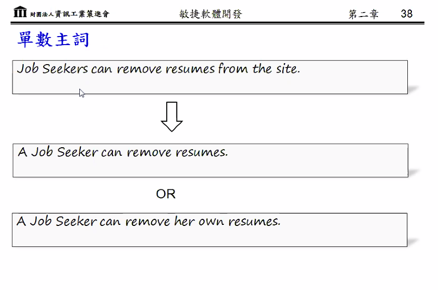

- 這頁不會要求要寫

- 需求
  - 功能性
    - use case Dgrm
  - 非功能性
    - 品質
- MTBF
  - Mcan Time Between Failwres
- SQA 品質保證
  - Testing

- 都是主動語態的簡單句
- 使用案例敘述

- 串接主要流程與例外流程
- 使用案例情節

- 使用主視角
  - 有什麼功能
  - 做事的方法步驟
  - 效能是如何
  - 是什麼畫面

- User Story: 用一句話形容
- Product > Release(Version) > Use Case(Feature) > Usrt Story
- Product Backlog > 順序由高到低
- Gold Planting 鍍金理論(過度完成功能)
- 需使用此頁方法畫驗收測試

- 不能畫流程圖

- `一定要做`的用 include
  - include 正常
- `不一定要做`的用 extend
  - extend 相反
- include 與 extend 箭頭方向相反

- 考試會考 (3C)
  - Card
  - Conversation
  - Confirmation 確認驗收標準

- 經常修整代辦清單內容，回應變化

