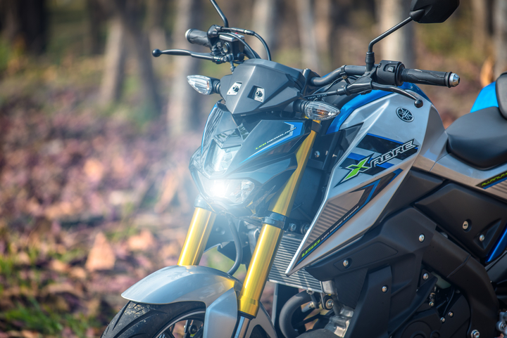
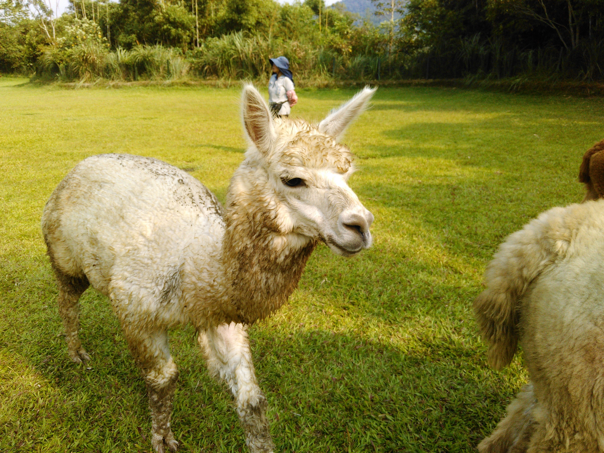

# 題目

- 現在的頁面排版方式有單欄排版、雙欄排版、多欄排版、混和排版等等。
  我們將利用 div+css 來熟悉相關作法

  1. 設計 id 代號為 all 的 div 標籤寬度為 800px 高度自動 且水平置中 這就是常見的單欄式排版
  2. 接著我們要做左右雙欄的排版效果
     請將 id 代號為 left 的 div 標籤寬度為 300px 浮動靠左
     請將 id 代號為 right 的 div 標籤寬度為 500px 浮動靠左
     這就是常見的雙欄式浮動排版
  3. 請將 id 代號為 left 的 div 標籤內的影像設計適合的寬度與高度
  4. 請將 id 代號為 right 的 div 標籤內的影像設計適合的寬度與高度

- **善用外層 DIV 來決定寬高度與位置 可以讓其他區塊的排版更容易!!**

# 作法

```html
<!DOCTYPE html>
<html lang="en">
  <head>
    <meta charset="UTF-8" />
    <title>版面排版-基本認識</title>
    <style>
      #all {
        width: 47.6%; /* 800/1600 = 0.47619047 = 47.6% */
        height: auto;
        margin: 50px auto;
      }
      #left {
        width: 37.5%;
        float: left;
      }
      #left img {
        width: 26.6%;
        height: 100px;
        margin: 5px;
      }
      #right {
        width: 31.25%;
        float: left;
        overflow: auto;
      }
    </style>
  </head>
  <body>
    <div id="all">
      <div id="left">
        
        
        
        
        
        
        
        
        
      </div>
      <div id="right">
        
      </div>
    </div>
  </body>
</html>
```
