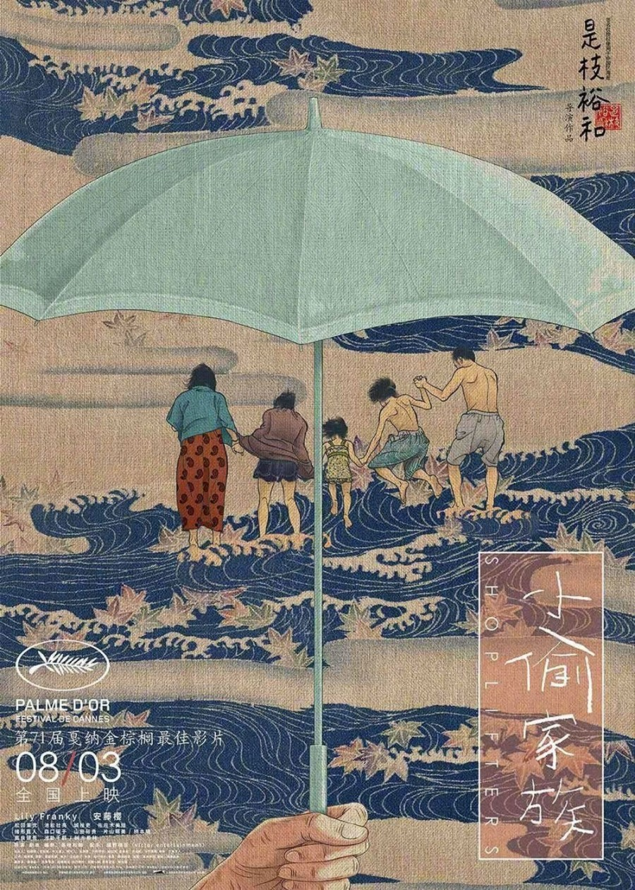
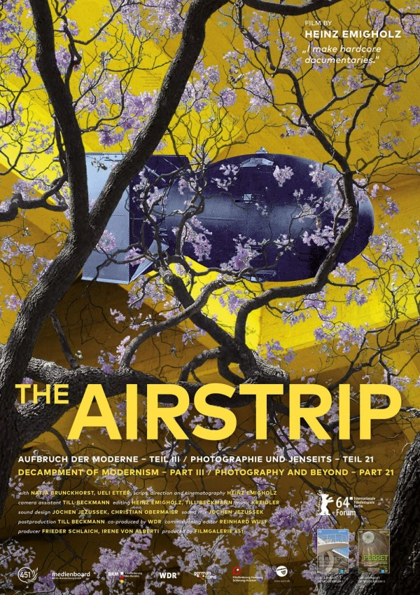
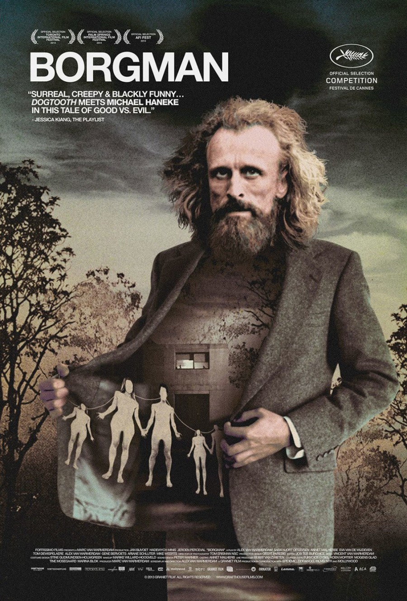
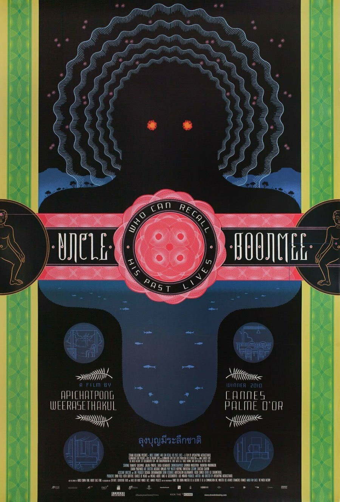

# 題目

- CSS 指定練習一

# 作法

```html
<!DOCTYPE html PUBLIC "-//W3C//DTD XHTML 1.0 Transitional//EN" "http://www.w3.org/TR/xhtml1/DTD/xhtml1-transitional.dtd">
<html xmlns="http://www.w3.org/1999/xhtml">
  <head>
    <meta http-equiv="Content-Type" content="text/html; charset=utf-8" />
    <title>CSS指定練習一</title>
    <style>
      body {
        background-color: brown;
        width: 920px;
        margin: 10px auto;
      }
      div {
        width: 90%;
        margin: 50px auto;
      }
      div img {
        width: 150px;
        height: 250px;
        margin-right: 30px;
      }
      div p {
        text-align: justify;
        letter-spacing: 1px;
        line-height: 26px;
        display: inline-block;
        vertical-align: top;
        width: 600px;
        color: #fff;
      }
    </style>
  </head>

  <body>
    <div>
      
      <p>
        《小偷家族》藉由故事探討親情與緣，設計師黃海選擇了電影中全家人溫馨共度海邊時光的這一幕，作為海報主視覺。據說那支撐著的傘是取自「散」的諧音，隱隱預告了電影的走向。
      </p>
    </div>

    <div>
      
      <p>
        《The Airstrip》是德國紀錄片導演 Heinz Emigholz 的作品，設計師 Stefan
        Kanter 曾多次為他的電影製作海報。合作過程中，通常導演 Emigholz
        對海報已有非常清楚的想法，他會挑幾張紀錄片裡有趣的影像，再和設計師
        Kanter 討論。
      </p>
    </div>

    <div>
      
      <p>
        男子拉開西裝，裡面露出一棟建築和一群牽著手的人們，《該死的中產階級》集懸疑、喜劇、恐怖、荒誕於一身，海報如同電影本身，著實令人摸不著頭緒卻又為之吸引。左上角以白色
        Helvetica 字體呈現的電影名稱 Borgman ，則流露出一股與之對照的清新。
      </p>
    </div>

    <div>
      
      <p>
        設計師 Chris Ware 以講求格線和對幾何圖形的熱愛而聞名，但 2011
        年為泰國電影《波米叔叔的前世今生》設計的海報，大大突破了他先前的風格。Chris
        Ware
        在對稱的整體畫面中心放了卡通化的曼陀羅，加上波米叔叔的長毛兒子，一起訴說這個怪誕的故事。
      </p>
    </div>
  </body>
</html>
```

<!DOCTYPE html PUBLIC "-//W3C//DTD XHTML 1.0 Transitional//EN" "http://www.w3.org/TR/xhtml1/DTD/xhtml1-transitional.dtd">
<html xmlns="http://www.w3.org/1999/xhtml">
  <head>
    <meta http-equiv="Content-Type" content="text/html; charset=utf-8" />
    <title>CSS指定練習一</title>
    <style>
      .app {
        background-color: brown;
        width: 920px;
        margin: 10px auto;
        padding-top: 10px;
        padding-bottom: 10px;
      }
      .app div {
        width: 90%;
        margin: 50px auto;
      }
      .app div img {
        width: 150px;
        height: 250px;
        margin-right: 30px;
      }
      .app div p {
        text-align: justify;
        letter-spacing: 1px;
        line-height: 26px;
        display: inline-block;
        vertical-align: top;
        width: 600px;
        color: #fff;
      }
    </style>
  </head>

  <body>
    <div class="app">
      <div>
        
        <p>
          《小偷家族》藉由故事探討親情與緣，設計師黃海選擇了電影中全家人溫馨共度海邊時光的這一幕，作為海報主視覺。據說那支撐著的傘是取自「散」的諧音，隱隱預告了電影的走向。
        </p>
      </div>
      <div>
        
        <p>
          《The Airstrip》是德國紀錄片導演 Heinz Emigholz 的作品，設計師 Stefan
          Kanter 曾多次為他的電影製作海報。合作過程中，通常導演 Emigholz
          對海報已有非常清楚的想法，他會挑幾張紀錄片裡有趣的影像，再和設計師
          Kanter 討論。
        </p>
      </div>
      <div>
        
        <p>
          男子拉開西裝，裡面露出一棟建築和一群牽著手的人們，《該死的中產階級》集懸疑、喜劇、恐怖、荒誕於一身，海報如同電影本身，著實令人摸不著頭緒卻又為之吸引。左上角以白色
          Helvetica 字體呈現的電影名稱 Borgman ，則流露出一股與之對照的清新。
        </p>
      </div>
      <div>
        
        <p>
          設計師 Chris Ware 以講求格線和對幾何圖形的熱愛而聞名，但 2011
          年為泰國電影《波米叔叔的前世今生》設計的海報，大大突破了他先前的風格。Chris
          Ware
          在對稱的整體畫面中心放了卡通化的曼陀羅，加上波米叔叔的長毛兒子，一起訴說這個怪誕的故事。
        </p>
      </div>
    </div>
  </body>
</html>
