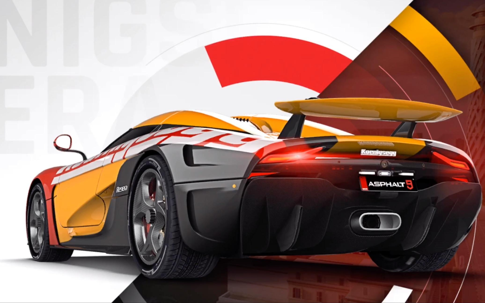

# 題目

- 版面綜合練習五

# 作法

```html
<!DOCTYPE html PUBLIC "-//W3C//DTD XHTML 1.0 Transitional//EN" "http://www.w3.org/TR/xhtml1/DTD/xhtml1-transitional.dtd">
<html xmlns="http://www.w3.org/1999/xhtml">
  <head>
    <meta http-equiv="Content-Type" content="text/html; charset=utf-8" />
    <title>版面綜合練習五</title>
    <style>
      body {
        width: 750px;
        margin-left: auto;
        margin-right: auto;
        font-family: Microsoft JhengHei;
        letter-spacing: 1px;
        text-align: justify;
      }
      body > div {
        margin-top: 15px;
      }
      video {
        width: 100%;
      }
      img {
        display: block;
        width: 200px;
        height: 100%;
        flex-flow: column;
        float: left;
        margin: 0 15px 15px 0;
        clear: both;
      }
    </style>
  </head>

  <body>
    <h1>GAME SHOW</h1>
    <video src="images/film.mp4" loop autoplay muted></video>

    <div>
      
      <p>
        《狂野飆車9：競速傳奇》（英語：Asphalt 9:
        Legends）是一款在iOS、Android以及Windows
        10平台上發行的競速遊戲。遊戲由Gameloft開發並發行，是狂野飆車系列的最新一部遊戲作品。也是繼2013年推出的《狂野飆車8：極速凌雲》之後相隔5年再次推出的狂野飆車系列正傳作品。
      </p>
      <p>
        Asphalt 9: Legends" (English: Asphalt 9: Legends) is a racing game
        released on iOS, Android and Windows 10 platforms. The game is developed
        and released by Gameloft and is the latest game in the wild drag racing
        series. It is also the official work of the wild drag racing series that
        was launched again 5 years after "Wild Drag 8: Extreme Speed ​​Cloud"
        launched in 2013.
      </p>
    </div>

    <div>
      
      <p>
        遊戲提供了48種車輛供玩家駕駛，並且可以使用新推出的Touchdrive操控方式來降低上手難度。遊戲在2018年7月26日於全球地區（中國大陸除外）正式推出。
      </p>
      <p>
        The game provides 48 kinds of vehicles for players to drive, and can use
        the newly introduced Touchdrive control mode to reduce the difficulty of
        getting started. The game was officially launched on July 26, 2018 in
        all regions of the world (except Mainland China).
      </p>
    </div>

    <div>
      
      <p>
        《狂野飆車9：競速傳奇》設計了一系列多人比賽，玩家可以隨時在其中與朋友競速，或是與整個遊戲社群對決。多人遊戲模式可以集結
        8 名玩家進行排名系列賽，激勵玩家去提升聯賽級別（總共分為 5
        大聯賽）和排行榜名次。
      </p>
      <p>
        "Wild Racing 9: Racing Legend" has designed a series of multiplayer
        competitions, where players can compete with friends at any time, or
        compete with the entire game community. The multiplayer game mode can
        gather 8 players for a ranking series, incentivizing players to upgrade
        the league level (a total of 5 major leagues) and leaderboard rankings.
      </p>
    </div>

    <hr />
    <h4>DHS.2020</h4>
  </body>
</html>
```

<!DOCTYPE html PUBLIC "-//W3C//DTD XHTML 1.0 Transitional//EN" "http://www.w3.org/TR/xhtml1/DTD/xhtml1-transitional.dtd">
<html xmlns="http://www.w3.org/1999/xhtml">
  <head>
    <meta http-equiv="Content-Type" content="text/html; charset=utf-8" />
    <title>版面綜合練習五</title>
    <style>
      .app {
        width: 750px;
        margin-left: auto;
        margin-right: auto;
        font-family: Microsoft JhengHei;
        letter-spacing: 1px;
        text-align: justify;
      }
      .app > div {
        margin-top: 15px;
      }
      .app video {
        width: 100%;
        background-color: #333;
      }
      .app img {
        display: block;
        width: 200px;
        height: 100%;
        flex-flow: column;
        float: left;
        margin: 0 15px 15px 0;
        clear: both;
      }
    </style>
  </head>
  <body>
    <div class="app">
      <h1>GAME SHOW</h1>
      <video src="images/film.mp4" loop autoplay muted></video>
      <div>
        
        <p>
          《狂野飆車9：競速傳奇》（英語：Asphalt 9:
          Legends）是一款在iOS、Android以及Windows
          10平台上發行的競速遊戲。遊戲由Gameloft開發並發行，是狂野飆車系列的最新一部遊戲作品。也是繼2013年推出的《狂野飆車8：極速凌雲》之後相隔5年再次推出的狂野飆車系列正傳作品。
        </p>
        <p>
          Asphalt 9: Legends" (English: Asphalt 9: Legends) is a racing game
          released on iOS, Android and Windows 10 platforms. The game is developed
          and released by Gameloft and is the latest game in the wild drag racing
          series. It is also the official work of the wild drag racing series that
          was launched again 5 years after "Wild Drag 8: Extreme Speed ​​Cloud"
          launched in 2013.
        </p>
      </div>
      <div>
        
        <p>
          遊戲提供了48種車輛供玩家駕駛，並且可以使用新推出的Touchdrive操控方式來降低上手難度。遊戲在2018年7月26日於全球地區（中國大陸除外）正式推出。
        </p>
        <p>
          The game provides 48 kinds of vehicles for players to drive, and can use
          the newly introduced Touchdrive control mode to reduce the difficulty of
          getting started. The game was officially launched on July 26, 2018 in
          all regions of the world (except Mainland China).
        </p>
      </div>
      <div>
        
        <p>
          《狂野飆車9：競速傳奇》設計了一系列多人比賽，玩家可以隨時在其中與朋友競速，或是與整個遊戲社群對決。多人遊戲模式可以集結
          8 名玩家進行排名系列賽，激勵玩家去提升聯賽級別（總共分為 5
          大聯賽）和排行榜名次。
        </p>
        <p>
          "Wild Racing 9: Racing Legend" has designed a series of multiplayer
          competitions, where players can compete with friends at any time, or
          compete with the entire game community. The multiplayer game mode can
          gather 8 players for a ranking series, incentivizing players to upgrade
          the league level (a total of 5 major leagues) and leaderboard rankings.
        </p>
      </div>
      <hr />
      <h4>DHS.2020</h4>
    </div>
  </body>
</html>
