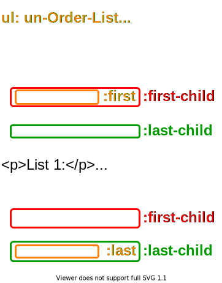

# jQuery 安裝

1. [從官網下載](https://code.jquery.com/)

2. 使用 `<script src="https://code.jquery.com/jquery-3.5.1.min.js"></script>` 方式引入

3. jQuery 1.x 支持 IE

# 頁面加載好後執行 js

```js
$(document).ready(function () {
  ...
});
```

# 第一個 jQuery

```html
<!DOCTYPE html>
<html lang="en">
  <head>
    <meta charset="UTF-8" />
    <meta name="viewport" content="width=device-width, initial-scale=1.0" />
    <title>Document</title>
    <script src="http://code.jquery.com/jquery-3.5.1.min.js"></script>
    <script>
      $(document).ready(function () {
        let isActive = false;
        $('button').click(function () {
          if (!isActive) {
            isActive = true;
            $('p').hide();
          } else {
            isActive = false;
            $('p').show();
          }
        });
      });
    </script>
  </head>
  <body>
    <h2>This is a heading</h2>
    <p>This is a paragraph.</p>
    <p>This is another paragraph.</p>
    <button>Click me</button>
  </body>
</html>
```

# jQuery 語法結構

- 語法結構

```js
$('CSS 選擇器').動作();
```

- 舉例

```js
$('div').hide(); // 隱藏 div
$('div').show(); // 顯示 div
```

# basic 選擇器用法

- 用法 `$('Selector')`

|          Selector           |                         Mean                          |
| :-------------------------: | :---------------------------------------------------: |
|             \*              |                       所有元素                        |
|             #id             |                        指定 ID                        |
|           element           |                         標籤                          |
|           .class            |                         class                         |
|      element.className      |                      標籤.class                       |
|        el1, el2, el3        |                     多個標籤同時                      |
|        element:first        |                      第一個元素                       |
|        element:last         |                     最後一個元素                      |
|        element:even         |                偶數，`index 從 0 開始`                |
|         element:odd         |                奇數，`index 從 0 開始`                |
|     element:first-child     |                所有父元素的第一個孩子                 |
|     element:last-child      |               所有父元素的最後一個孩子                |
|    element:first-of-type    |            所有父元素的第一個 element 孩子            |
|    element:last-of-type     |           所有父元素的最後一個 element 孩子           |
|    element:nth-child(2)     |           所有 element 是父元素的第二個孩子           |
|  element:nth-last-child(2)  |         所有 element 是父元素的到數第二個孩子         |
|   element:nth-of-type(2)    |           所有 element 是父元素的第二個孩子           |
| element:nth-last-of-type(2) |         所有 element 是父元素的到數第二個孩子         |
|     element:only-child      |          所有 element 是父元素的唯一一個孩子          |
|    element:only-of-type     |     所有 element 是父元素的唯一一個 element 孩子      |
|     element1 > element2     |          element1 元素下第一代 element2 元素          |
|      element1 element2      |           element1 元素下所有 element2 元素           |
|     element1 + element2     |        element1 元素下一個相鄰的 element2 元素        |
|     element1 ~ element2     |      element1 元素後同一層級的所有 element2 元素      |
|        element:eq(3)        |        第 3 個 element 元素，`index 從 0 開始`        |
|        element:gt(3)        |  第 3 個元素後的所有 element 元素，`index 從 0 開始`  |
|        element:lt(3)        | 小於第 3 個元素的所有 element 元素，`index 從 0 開始` |

- css 練的好，抓位置沒煩惱

# 考題(完全相同?)

- `$("#div1 > p")` 5, 10
- `$("#div1 p")` 5, 7, 8, 10
- `$("#div1 + p")` 12
- `$("#div1 ~ p")` 12 13

```cs
1.  <body>
2.    <p>...</p>
3.    <div id="div1">
4.      <a>...</a>
5.      <p>...</p>
6.      <div>
7.        <p>...</p>
8.        <p>...</p>
9.      </div>
10.      <p>...</p>
11.   </div>
12.   <p>...</p>
13.   <p>...</p>
14. </body>
```

# 選擇器實踐

- `p:even`: 1, 4, 6, 8, 18
- `p:odd`: 3, 5, 7, 12, 19
- `li:first`: 9
- `li:last`: 沒數字的 li
- `li:first-child`: 9, 13
- `li:last-child`: 11, 沒數字的 li
- `p:first-of-type`: 1, 3, 4, 18
- `p:last-of-type`: 5, 6, 12, 19
- `p:nth-child(2)`: 3, 5, 18
- `p:nth-last-child(2)`: 4, 18
- `p:nth-of-type(2)`: 5, 6, 7, 19
- `p:nth-last-of-type(2)`: 3, 4, 8, 18
- `span:only-child`: 16
- `a:only-of-type`: 2, 17
- `p:eq(3)`: 5
- `p:gt(3)`: 6, 7, 8, 12, 18, 19
- `p:lt(3)`: 1, 3, 4
- `:empty`: 沒數字的 li
- `li:not(:empty)`: 9, 10, 11, 13, 14, 15
- `div ~ p`: 6, 7, 8, 12

```html
<body>
  <p>1</p>
  <div id="div1">
    <a>2</a>
    <p>3</p>
    <div>
      <p>4</p>
      <p>5</p>
    </div>
    <p>6</p>
  </div>
  <p>7</p>
  <p>8</p>
  <ul>
    <li>9</li>
    <li>10</li>
    <li>11</li>
  </ul>
  <p>12</p>
  <ul>
    <li>13</li>
    <li>14</li>
    <li>15</li>
    <li></li>
  </ul>
  <div><span>16</span></div>
  <div>
    <a>17</a>
    <p>18</p>
    <p>19</p>
  </div>
</body>
```

# :first、:last、:first-child、:last-child 範例

- `li:first`: 9
- `li:last`: 沒數字的 li
- `li:first-child`: 9, 13
- `li:last-child`: 11, 沒數字的 li

<p></p>

# :even, :odd 範例

```js
$(document).ready(function () {
  $('p:even').css('color', 'pink');
  $('p:odd').css('color', '#8BC34A');
});
```

```html
<h2>This is a heading</h2>
<p>This is a paragraph.</p>
<p>This is another paragraph.</p>
<p>Lorem ipsum dolor sit amet.</p>
<button>Click me</button>
```

<p></p>

# Content 選擇器

|        Selector         |                Mean                |
| :---------------------: | :--------------------------------: |
|         :header         |           `<h1>`~`<h6>`            |
|        :animated        |     選擇當前`正在做動畫`的元素     |
|         :focus          |      取得獲得`焦點`的某個元素      |
| element1:contains(text) |  所有內文有 text 的 element1 元素  |
| element1:has(element2)  | 所有包含 element2 的 element1 元素 |
|         :empty          |     所有空的標籤元素，含 input     |
|         :parent         |             所有父元素             |
|     element1:hidden     |      所有隱藏的 element1 元素      |
|    element1:visible     |      所有顯示的 element1 元素      |
|          :root          |      文件的`根`(`<html>`)元素      |

- :focus 較常用

---

- `:empty` 範例
  - :empty 是抓取空值，但 input 也算，因為此屬性主要是抓兩標籤中沒值的標籤

```cs
1. <td></td>
2. <input/>
3. 
4. ...
```

<p></p>

---

- `li:visible` 範例 (所有`顯示`的)

<p></p>

# Attribute 選擇器

<table>				
<tr>	<th>Selector</th>	<th>Mean</th>		</tr>
<tr>	<td>[attribute]</td>	<td>$("[href]")，所有 href 屬性的元素</td>		</tr>
<tr>	<td>[attribute=value]</td>	<td>$("[src='a.jpg']")，所有 src 屬性<code>等於</code> a.jpg</td>		</tr>
<tr>	<td>[attribute!=value]</td>	<td>$("[src!='a.jpg']")，所有 src 屬性<code>不等於</code> a.jpg (不是 [src!='a.jpg'] 的都是)</td>		</tr>
<tr>	<td>[attribute$=value]</td>	<td>$("[src$='.jpg']")，所有 src 屬性<code>尾端</code>是 .jpg</td>		</tr>
<tr>	<td>[attribute|=value]</td>	<td>$([value|='en'])，所有 value 屬性<code>是 en 這個字</code> (例如: value="en") 或<code>開頭是 en- </code> (例如: value="en- example")</td>		</tr>
<tr>	<td>[attribute^=value]</td>	<td>$([value^='en'])，所有 value 屬性<code>開頭</code>是 en (開頭包含 en 的都是， value="en.jpg a a-jpg" 是，value="b en-jpg" 就不是)</td>		</tr>
<tr>	<td>[attribute~=value]</td>	<td>$([value~='en'])，所有 value 屬性<code>包含 en 這一個字</code> (需要是一個完整的字 value="a.jpg en a-jpg" 中有 en 就是)</td>		</tr>
<tr>	<td>[attribute*=value]</td>	<td>$([value~='en'])，所有 value 屬性包含 en 這一個<code>字串</code> (value="a.jpg en a-jpg" 與 value="en-jpg" 情形都算)</td>		</tr>
</table>

- [attribute] 、 [attribute=value] 較常用

# Form 選擇器

| Selector  | Mean                                                 |
| :-------: | ---------------------------------------------------- |
|  :input   | 所有`<input>`                                        |
|   :text   | 所有`type="text"`的`<input>`                         |
| :password | 所有`type="password"`的`<input>`                     |
|  :radio   | 所有`type="radio"`的`<input>`                        |
| :checkbox | 所有`type="checkbox"`的`<input>`                     |
|  :submit  | 所有`type="submit"`的`<input>`                       |
|  :reset   | 所有`type="reset"`的`<input>`                        |
|  :button  | 所有`type="button"`的`<input>`，和`<button>`         |
|  :image   | 所有`type="image"`的`<input>`(`圖形按鈕`)，和`` |
|   :file   | 所有`type="file"`的`<input>`                         |
|  :button  | 所有`type="button"`的`<input>`，和`<button>`         |
| :enabled  | 所有 enabled 的`<input>`                             |
| :disabled | 所有 disabled 的`<input>`                            |
| :selected | 所有 selected 的`<input>` 選擇                       |
| :checked  | 所有 checked 的`<input>`勾選                         |

- :selected 與 :checked 比較常用

---

- checkbox 或 radio 可搭配 prop() 或 attr() 賦予**勾選**的屬性

```js
$(':checkbox').prop('checked', true); // 勾選
$(':checkbox').prop('checked', false); // 取消勾選

$(':radio').prop('checked', true); // 勾選
$(':radio').prop('checked', false); // 取消勾選
```

---

- :image 只有這種情形會選中，`不` 包含 `` 標籤

```html
<input type="image" name="image" src="srcLink" alt="image input" />
```

# 結論

1. css 練的好，抓位置沒煩惱
2. [attribute] 、 [attribute=value]、:selected 、 :checked 常用
3. basic 選擇器的 2~6 種要練好
4. 有特別舉例出來的一定會考

---

參考鏈接:

- [jQuery 参考手册 - 选择器](https://www.w3school.com.cn/jquery/jquery_ref_selectors.asp)
