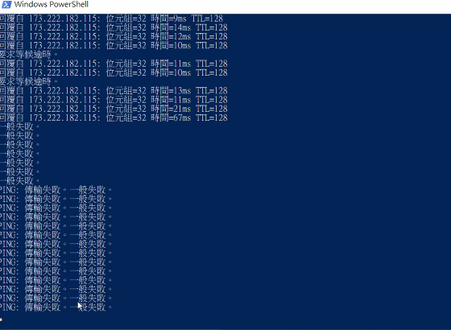

- 虛擬硬碟無法打開的話
  - 電腦重開機，delete > f7 > 進階 > Intel 虛擬化技術(Intel Vertor......) > F10
- 開啟虛擬機後滑鼠不見
  - ctrl+Alt
- 安裝 Win10 時記得
  - 離線帳戶 > 有限的經驗
- 192.154 簡單來說就是區網

- Install VM tool
- 連續 ping 指定網址
  - ping www.yahoo.com.tw -t
- ctrl+c 中斷 powershell 連線，或 ctrl+break
- 母機器關閉的狀態才可複製，第一台建議不動

