# 軟體開發通常會進行的步驟

<p></p>

# 軟體測試 (Software Testing) 是什麼?

- 軟體測試是評估待測試的程式，用以
  - 發現程式的錯誤(bug)
    - 測試和除錯(debugging)不同
  - 評估程式的品質(quality)
    - 與需求或規格一致(conformance to requirements)
    - 符合使用的目的(fitnessfor purpose)
    - 效能、安全性、使用者經驗
  - 建立程式符合使用者需求的信心

# 歷史上知名的軟體錯誤

- 歷史上因軟體錯誤造成的災難或問題的案例很多
  - 2007 年高鐵上路時，最受旅客抱怨的是購票系統的品質(電腦主機與自動售票機頻當機)(2007-01)
    - [臺灣高鐵將增加伺服器解決當機](http://www.ithome.com.tw/node/41718)
  - 遠通電收系統國道計程收費上路狀況不斷，民眾投訴 eTag 車輛遭雙向扣款、重複扣款、幽靈扣款等狀況(2014-01)
    - [一場臺灣國道計程收費革命，遠通電收 IT 用高正確率釋疑](https://www.ithome.com.tw/people/116441)
  - 新戶政系統頻出包，引爆民怨，行政院科技會報辦公室調查報告直指內政部涉四大疏失.包括要求測試水準偏低(2014-02)
    - [戶政系統頻出包 司長謝愛齡轉調參事](https://m.ltn.com.tw/news/politics/breakingnews/951128)
- 實際上軟體錯誤造成的影響遠比已知案例多
  - 許多公司並不願意主動公開承認其軟體存在有重大錯誤或漏洞，以免危害其公司信譽與利益

# 討論：軟體測試的目的？

- Q:您認為軟體測試的目的是什麼？(多選)
  - A1: 找出軟體裡面的錯誤
  - A2: 建立對軟體品質的信心程度
  - A3: 驗證軟體符合系規格
  - A4: 確認軟體滿足顧客的需求
- ANS: 全選

# 不同角色的測試

- 開發人員
  - 測試是證明明程式是對的
  - 以交付軟體驅動測試的進行 (delivery-driven)
  - 主要負責單元測試、整合測試
- 測試人員
  - 測試是證明程式是錯的
  - 以驗證程式品質驅動測試的進行 (qimlity-driven)
  - 主要負責系統測試
- 系統使用者
  - 以驗證程式是否合乎需求驅動測試的進行 (requirement-driven)
  - 決定程式是否滿足驗收準則 (acceptance criteria)
  - 主要負責驗收測試
- **<u> 測試用例</u> 撰寫範例**

<p>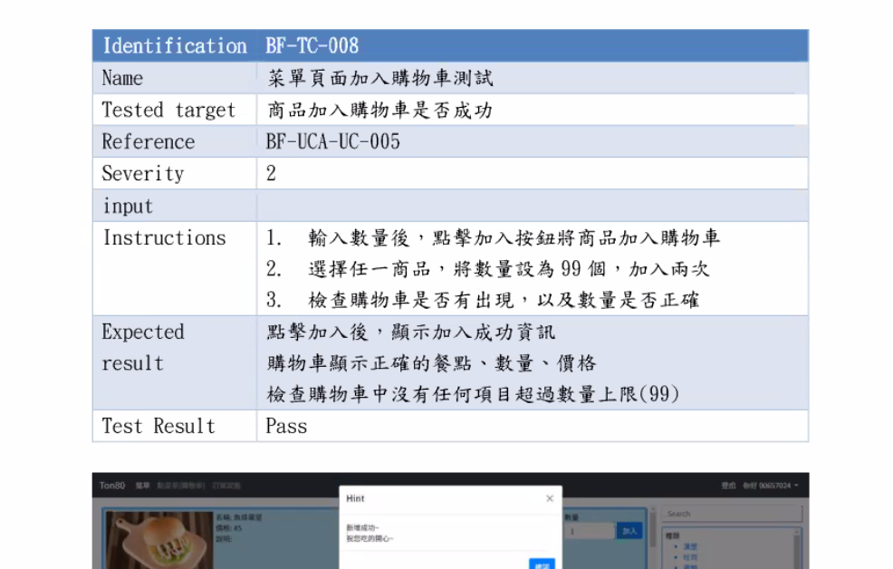</p>

# 動態測試

- 程式撰寫完成後才能進行動態測試，執行軟體程式碼。
- 動態測試計畫需規劃<u> **測試案例(Test Case)** </u>的設計，測試的
  執行以及結果資料的收集和評估。
- —般使用<u> **黑箱(Black Box)測試** </u>與<u> **白箱(White Box)測試** </u>這
  兩種技術來設計測試案例。
- 軟體開發過程中，透過單元測試(Unit Testing)、整合測試
  (Integration Testing)、系統測試(System Testing)與
  驗收測試(Acceptance Testing)等各種軟體測試階段，
  來檢查軟體介面、功能、與非功能需求，以及選擇性地確保軟體內部
  程式敘述執行路徑與條件判斷的正確性。

# 軟體動態測試的問題 1

```cs
int scale(int m, int n, int p){
  double j=0.0;
  for(i=0;i<n;i++){
    if(m>n){
      j = j - 1; // 正確應為 j=j+1
      j = j / p;
    }
  }
  return j;
}
```

- 如何針對上述程式碼片段進行完整的軟體動態測試?

# 軟體動態測試的問題 2

- 在電腦中 int 為 32 bit(4bytes)，若要完全測試所有 m, n, p 的輸入組合，必須測試 2^32 x 2^32 x 2^32 (約 10^29 次)
  - 假如執行 1 組測試數據需耗費 10^-5 秒，1 年共有 3.1536 x 10^7 秒，則測試所有輸入組合需花費 10^16 年的時間

# 窮舉性測試 (Exhaustive Testing)

- 窮舉性測試 (Exhaustive Testing)
  - 測試所有的輸入組合與路徑
  - 實務上不可行(impractical)
- 選擇性測試 (Selectivw Testing)
  - 選擇測試一些輸入組合與路徑，有效地偵測出程式的錯誤
  - 如何選擇，以及選擇多少測試案例才足夠？
  - 可藉由測試方法、測試覆蓋率和經驗的協助
  - 隨意或盲目的選擇，有可能耗費寶貴的測試資源(時間和成本)卻無法達到測試目的

# 軟體動態測試的主要目的

- 為了能夠<u>在有限的時間內，以最有效率的方式發現最多的軟體錯誤</u>，而發現 1 個或多個尚未發現的錯誤，都可算是一次成功的測試結果
- 測試案例設計的好壞決定整個動態測試程序的成效
  - <u>越早發現錯誤(缺失)，修正的成本越低</u>
    - **Code Review**: 開發時段，將 code 提交並合併入 master 前的 code 查看(提早解決問題)
- 測試中止發現少量的錯誤，其可能表示的意義:
  - 表示此軟體系統的品質已相當可靠及穩定

# 白箱測試(White-box Testing)

- 了解軟體內部結構後進行測試。
  - 根據程式碼判斷條件或迴圈，定義邏輯路徑，產生測試案例資料。
- 有效測試程式細節，確保程式的穩定性。
  - 對程式結構或資料變數使用的錯誤特別有效。
- 缺點
  - 成本高。
  - 對需求規格錯誤的效果不好。
  - 對介面錯誤的效果不好。

# 測言式覆蓋準則 (Coverage Criteria)

- 敘述覆蓋(Statement Coverage)
  - 測試案例要能使程式每一敘述至少執行一次
- 分支決策覆蓋(Branch Coverage)
  - 測試案例要使程式`每一決策點至少執行一次 (true/false 各一次)`
- 條件覆蓋(Condition Coverage)
  - `所有邏輯判斷情況`都至少執行過一次 (True or False)
- 決策/條件覆蓋(Branch/Condition Coverage)
  - 結合分支決策覆蓋與條件覆蓋
- 多重條件組合覆蓋(Multiple Condition Coverage)
  - `不同組合的判斷情況`都至少被執行一次(同一行條件 true/false 之排列組合)
- 全面路徑覆蓋(All-Paths Coverage)
  - 測試案例要使軟體每一路徑至少執行一次(跨行條件 true/false 之排列組合)

# Statement Coverage (敘述覆蓋)

- 設計測試案例，使每一條執行敘述至少執行一次(`確保程式每一行都有被執行，且沒有發生錯誤`)
  - input 為 (2, 0, 3) 就可覆蓋所有執行指令，結果會得到 3
- 敘述覆蓋測試方法較不嚴僅，例如若把:
  - 行號 20 的 and 改成 or
  - 行號 30 的 x > 1 改成 x > 0
  - 行號 20 後面的 Y = A 改成其他的敘述
- 程式執行結果沒變，所以找不出這種錯誤
- 敘述覆蓋最弱邏輯及涵蓋準則，白箱測試至少要做到此測試

```cs
10 INPUT A, B, X
20 IF (A>1) AND (B=0) THEN Y=A
30 IF (A=2) OR (X>1) THEN Y=X
40 PRINT Y
```

- **請判斷選項中哪些測試案例可對以下這段程式碼達到敘述覆蓋(Statement Coverage)?**

```cs
input length, weight, height
if (length > 1 && weight = 0)
  select = length
if (length = 2 || height > 1)
  select = heights
print select
```

- **選項**
  - **A**: (length, weight, height) = (1,0,6); **F T**
  - **B**: (length, weight, height) = (2,1,3)
  - **C**: (length, weight, height) = (3,1,0)
  - **D**: (length, weight, height) = (3,0,6); **T T**
  - **E**: (length, weight, height) = (9,0,2); **T T**
- **答案**
  - D, E

# Statement Coverage 課堂中練習

- 將寫完符合所有 if、else 的測試點
  - determineTriangleV1: 6 種
  - determineTriangleV2: 4 種

```java
package ch02;
public class Triangle
{
  public static String determineTriangleV1 (int a, int b, int c)
  {
    if ((a <= 0) || (b <= 0) || (c <= 0)){ return "Not a triangle"; }
    else
    {
      if ((a + c <= b) || (a + c <= b) || (b + c <= a)){ return "Not a triangle"; }
      else {
        if ((a == b) && (b == c)){ return "Regular triangle"; }
        if ((a == b) || (b == c) || (c == a)){ return "Isosceles triangle"; }
        if ((a * a + b * b == c * c) || (b * b + c * c == a * a) || (c * c + a * a == b * b))
        { return "Right triangle"; }
      }
    }
    return "Be a triangle";
  }

  public static String determineTriangleV2 (int a, int b, int c)
  {
    String result = "";
    if ((a <= 0) || (b <= 0) || (c <= 0)){ result = "Not a triangle"; }
    else {
      result = "Be a triangle";
      if ((a + b <= c) || (a + c <= b) || (b + c <= a)) { result = "Not a triangle"; }
      else {
        if ((a == b) || (b == c) || (c == a)) { result = "Isosceles triangle"; }
        if ((a == b) && (b == a)) { result = "Regular triangle"; }
        if ((a * a + b * b == c * c) || (b * b + c * c == a * a) || (c * c + a * a == b * b))
        { result = "Right triangle"; }
      }
    }
    return result;
  }
}
```

- **determineTriangleV1 之可能最精簡的 Test Case ， 可達成 100% 的 Statement Coverage**
  - (1, 1, 0)(2, 2, 3)(3, 1, 1)(3, 5, 4)(3, 6, 4)(1, 1, 1)
- **determineTriangleV2 之可能最精簡的 Test Case ， 可達成 100% 的 Statement Coverage**
  - (1, 1, 0)(3, 1, 1)(3, 5, 4)(1, 1, 1)

# Branch Coverage (分支決策覆蓋)

- 分支決策覆蓋(Branch Coverage or Decision Coverage)目標是設計測
  試案例，使程式每個判斷的`真分支和取假分支各至少一次`。
- A,B,X 若為(3,0,3)和(3,1,1)能使得(A>1)AND(B=0)和(A=2)OR(X>1)這兩個布林運算式均能產生真和假的值。
- 若將(A>1)寫 成(A>2)卻是無法測出的錯誤。
- 決策涵蓋測試方法嚴密性比敘述涵蓋高。
- <bikao>★</bikao> 此方法常用

```cs
10 INPUT A, B, X
20 IF (A>1) AND (B=0) THEN Y=A
30 IF (A=2) OR (X>1) THEN Y=X
40 PRINT Y
```

- **請判斷選項中哪些測試案例可對以下這段程式碼達到分支覆蓋(Branch Coverage)?**

```cs
input length, weight, height
if (length > 1 && weight = 0)
  select= length
if (length = 2 11 height > 1)
  select = height
print select
```

- **選項**
  - **A**: (length, weight, height) = {(3, 1, 6),(2, 0, 3)} **F T T T**
  - **B**: (length, weight, height) = {(2, 0, 0),(2, 2, 2)} **T T F T**
  - **C**: (length, weight, height) = {(1, 0, 6),(6, 0, 2)}
  - **D**: (length, weight, height) = {(2, 0, 3),(1, 0, 1)} **T T F F**
  - **E**: (length, weight, height) = {(5, 0, 2),(0, 0, 0)} **T T F F**

# Condition Coverage (條件覆蓋)

- 條件覆蓋和分支覆蓋類似 - 不過條件覆蓋是以某項條件為主，而決策涵蓋
  則以整個布林運算式為主，使程式中每個判斷的每個條件至少執行一次。
- 案例說明：
  - 前述程式具有下列四條件 A>1、B=0、A=2、X>1
  - 欲使這四個條件都能產生真與假的值，測試案例須包含
    - (1) A>1; (2) A<=1
    - (3) B=0; (4) B!=0
    - (5) A=2; (6) A!=2
    - (7) X>1; (8) X<=1
  - (1,0,3) 滿足 2、3、6、7
  - (2,1,1) 滿足 1、4、5、8
  - 但這兩組測試案例並未使運算式 (A>1)AND 和 (A=2)OR(X>1)具有真值
    與假值- 亦即未達成 100% Branch Coverage。

# Branch Coverage and Condition Coverage

- 條件覆蓋(Condition Coverage)嚴密性似乎比分支決策覆蓋(Branch Coverage)高，但並非絕對
  - 如上頁案例極為達成 100%分支決策覆蓋
- 決策/條件覆蓋(Branch/Condition Coverang):
  - 需設計足夠的測試案例，使判斷樹的布林運算是中的每個條件的所有可能直都至少執行一次，同時每個判斷續所有可能判斷結果都至少執行一次
    - 例如: 輸入值 (2, 0, 3) 和 (1, 1, 1) 即可達成此目標

# 黑箱測試

- 了解軟體產品需求功能後進行測試
- `不考慮軟體內部邏輯的結構`
- 測試軟體介面，正確的輸入、輸出

# 黑箱等價劃分簡介

- **說明**
  - 以不同資料類別、劃分規則、切割輸入域，設計測試案例
    - 輸入域的子集合(個輸入資料對程式中的錯誤都是等效的)
    - 同一類測試案例，會發現某類同樣錯誤，如所有字元資料的錯誤處裡
  - 輸入條件設定值的範圍 a 和 b，則取一個有效等價類別 a < x < b 和兩個無效的等價類別 < a ， > b 的值設計測試案例
    - 輸入 x 為，4<=x<=10
  - 輸入條件規定值的個數 N，則取一個有效等價類別 N，和兩個無效等價類別 > N， < N 的值設計測試案例資料
- **總結**
  - 測試判斷: 4<=x<=10
  - 等價劃分域(定義域):
    - 有效等價類別: 4, 10, 7
    - 無效等價類別: 3, 11

# 討論: 什麼是黑箱測試?

- **問題**
  - Q: 黑箱測試會進行哪些工作?
- **選項**
  - A1: 了解軟體產品需求功能後進行測試，測試軟體介面，正確輸入輸出
  - A2: 了解軟體內部結構後進行測試
  - A3: 根據程式碼判斷條件或迴圈
  - A4: 定義邏輯路徑，產生測試案例資料
- **答案**
  - **A1** (其餘都為白箱)

# 單元測試說明

- 目標: 找出單元模組內部功能、邏輯錯誤
- 方法:
  - 靜態分析
  - 動態測試: 可同時對多個模組平行測試
- 執行重點: 注意模組對錯誤的控制能力
- 單元設計原則:
  - 遵循高內聚力設計模組，簡化單元測試
  - 當一個模組僅時現一個功能時，可降低測試案例數量，且容易發現錯誤
- 重構(Refactoring)建立在通過單元測試的前提下

<p>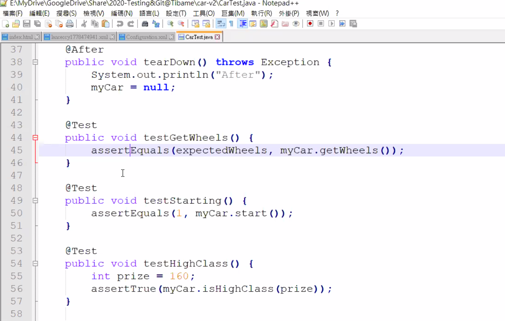</p>

# 單元測試創建

- <u>File</u> > <u>New</u> > <u>JUnit Test Case</u> > 選擇 New JUnit 4 test

<p>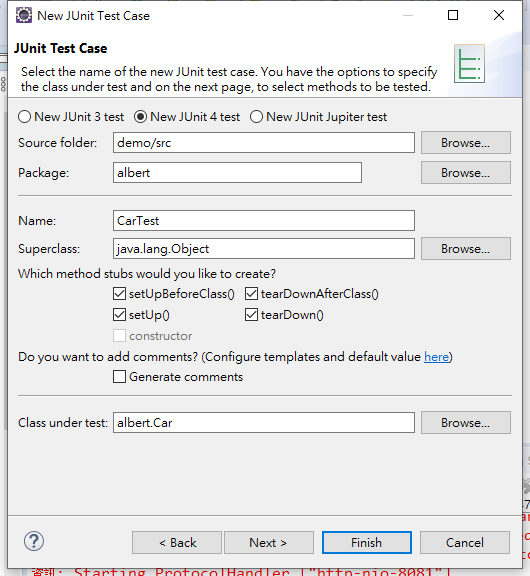</p>

- <u>勾選 method</u> > <u>勾選 Create tasks for generated test methods</u> > <u>Finish</u>

<p>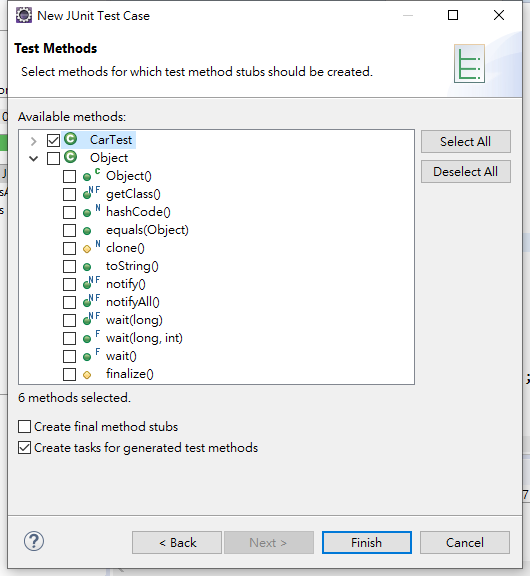</p>

# 單元測試範例

- class

```java
package ch02;

public class Car {
  public int getWheels() {
    return 4;
  }
}
```

- 測試程式

```java
package ch02;

import static org.junit.Assert.*;

import org.junit.After;
import org.junit.AfterClass;
import org.junit.Before;
import org.junit.BeforeClass;
import org.junit.Test;

import ch02.Car;

public class CarTest {

  private int expectedWheels;
  private Car myCar;

  @BeforeClass
  public static void setUpBeforeClass() throws Exception {
    System.out.println("BeforeClass");
  }

  @AfterClass
  public static void tearDownAfterClass() throws Exception {
    System.out.println("AfterClass");
  }

  @Before
  public void setUp() throws Exception {
    System.out.println("Before");
    // 設定測試數據，並 new 一個 Car 實體
    expectedWheels = 4;
    myCar = new Car();
  }

  @After
  public void tearDown() throws Exception {
    System.out.println("After");
    myCar = null;
  }

  @Test
  public void testGetWheels() {
    System.out.println("Test 1");
    assertEquals(expectedWheels, myCar.getWheels());
  }

  @Test
  public void testGetWheelsAgain() {
    System.out.println("Test 2");
    // assertEquals 功能自 org.junit.Assert 來
    // assertEquals 判斷 "測試數據" 與 "myCar.getWheels()" 是否相同
    assertEquals(expectedWheels, myCar.getWheels());
  }

}
```

- 欲改為單元測試的改法

<p>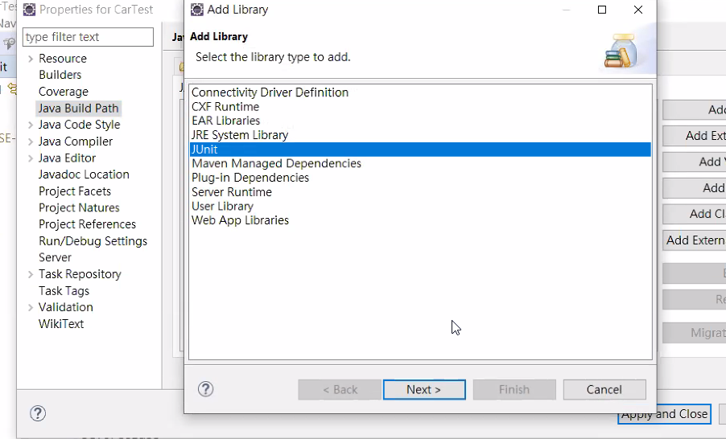</p>

- 想在單元測試階段測試效能如何，可以用 timeout

<p>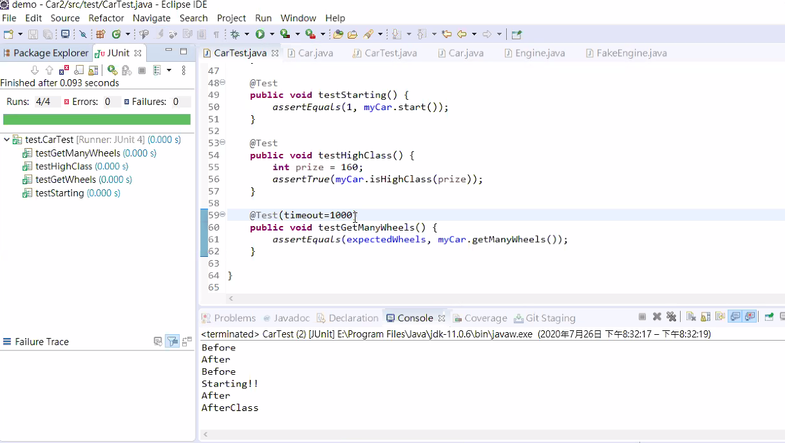</p>

- 涵蓋率測試

<p>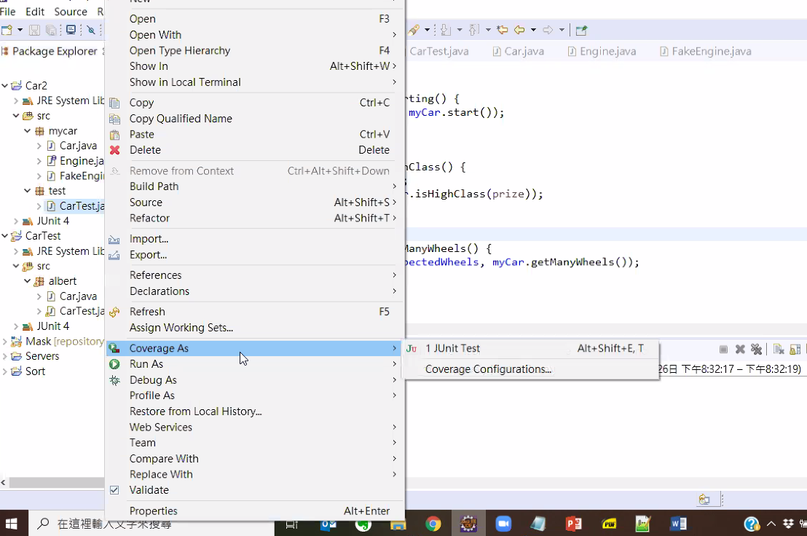</p>

- 涵蓋率測試結果

<p>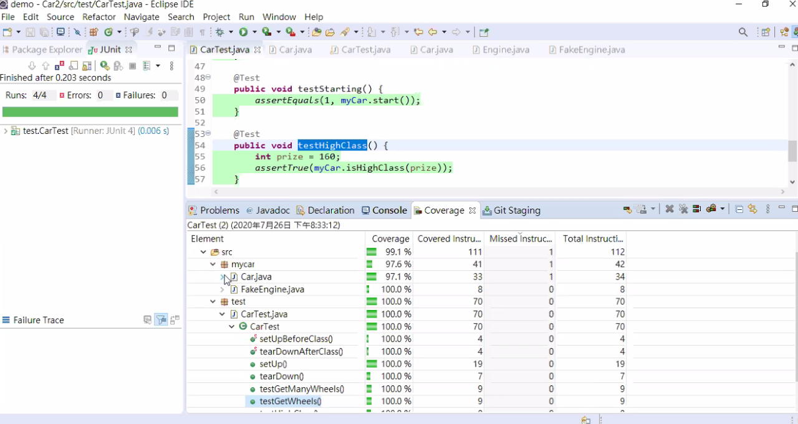</p>

<p>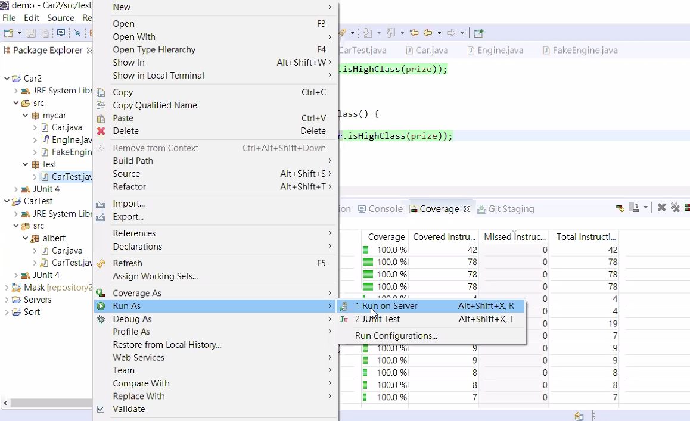</p>

- 單元測試生命周期

<p>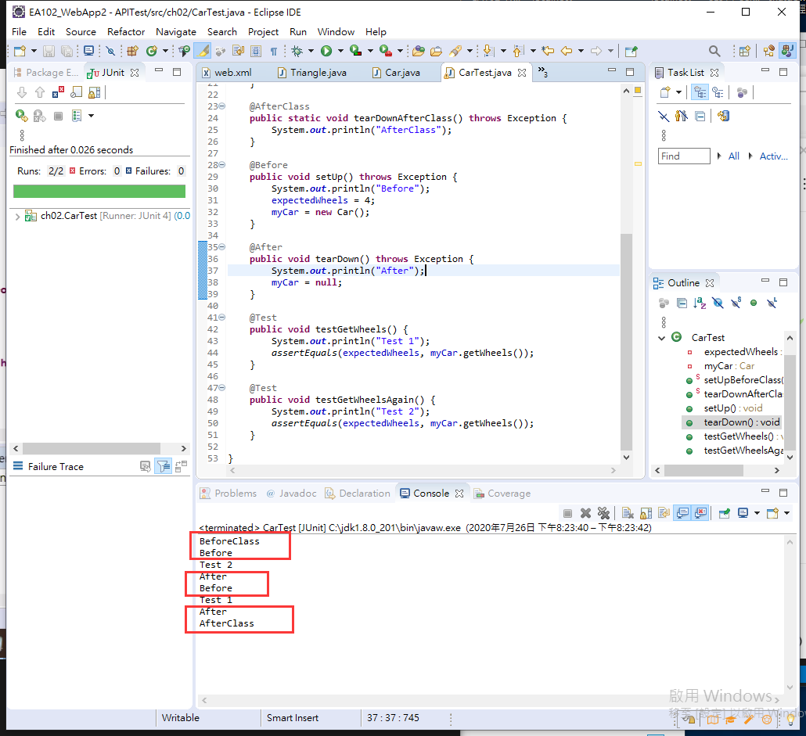</p>

---

參考鏈接:

- [教學資料 Google](https://drive.google.com/drive/u/0/folders/1nIRSViv2Rlvsu9hMfZfz1xYZ8mGm6vg_)
- [語句覆蓋測試 (Statement Testing)](https://kkboxsqa.wordpress.com/2014/01/17/%E8%AA%9E%E5%8F%A5%E8%A6%86%E8%93%8B%E6%B8%AC%E8%A9%A6-statement-testing/)
