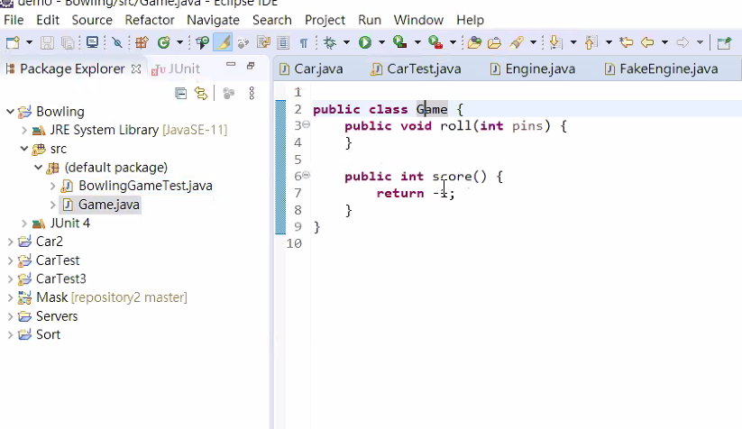
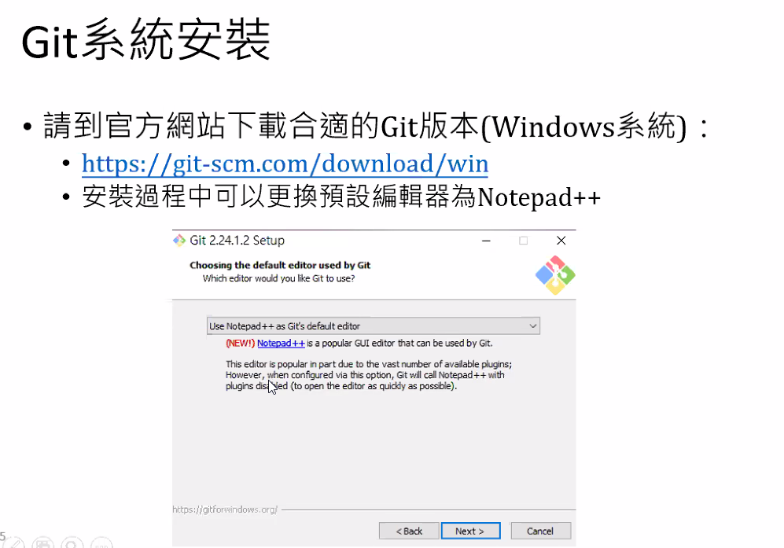
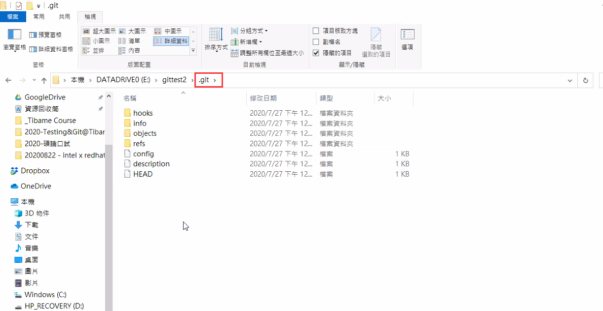

# JUnit 常用 API

- assertEquals 判斷 2 個物件是否相等
- assertNotEquals 判斷 2 個物件是否相等
- assertTure 驗證是否為真
- assertFalse 驗證是否為偽
- assertNull 驗證物件是否為 null
- assertNotNull 驗證物件是否不為 null
- assertArrayEquals 驗證陣列是否相同

# TDD (Test-Driven Development)

- 倡導先寫測試案例，然後再寫實際邏輯程式，以通過測試
- 測試驅動開發是戴兩頂帽子思考的開發方式:
  - 先戴上實現功能的帽子，在測試的輔助下，快速實現其功能
  - 再戴上重構(refactoring)的帽子，在測試的保護下，去除重複的程式碼，提高程式品質

# Red/Green/Refactor Loop

<p></p>

# TDD 範例-1

- 測試程式

<p></p>

- 主程式(測試失敗程式)

<p></p>

- 主程式(測試成功程式)

<p></p>

# TDD 範例-2

<p></p>

- 錯誤邏輯改正

```java
public double[] sort(double[] d) {
  // 測試負數
  for (int i = 0; i < d.length; i++) {
    if(d[i] < 0) {
      return d;
    }
  }
  for (int i = 0; i < d.length - 1; i++) {
    for (int j = 0; j < d.length - i - 1; j++) {
      if (d[j] > d[j + 1]) {
        swap(d, j, j + 1);
      }
    }
  }
  return d;
}
```

# 什麼是 GIT ?

<p></p>

<p></p>

<p></p>

<p></p>

<p></p>

<p></p>

<p></p>

<p></p>

<p></p>

<p></p>

<p></p>
