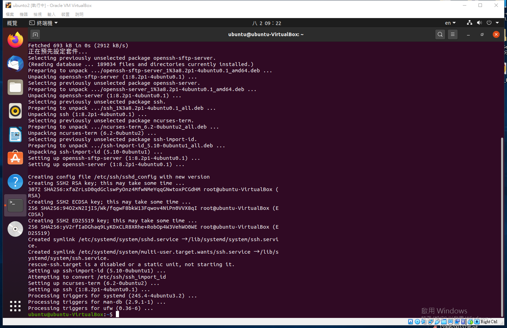
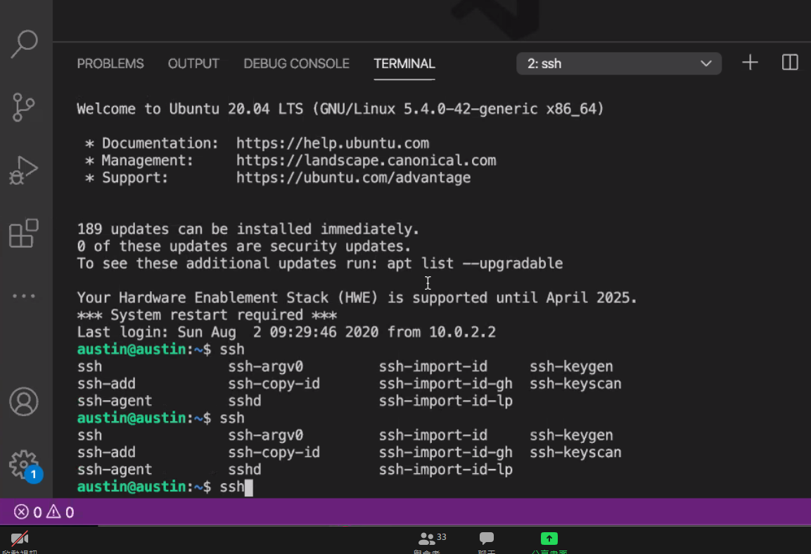
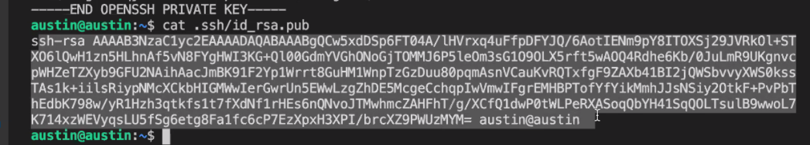
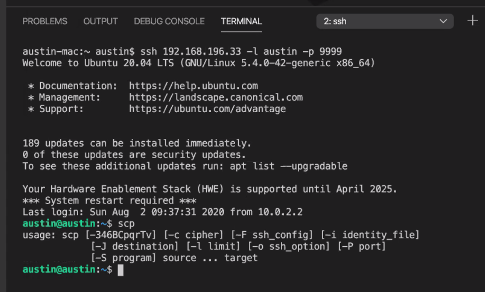

<p></p>

<p></p>

<p></p>

<p></p>

<p></p>

<p></p>

<p></p>

<p></p>

<p></p>

<p></p>

<p></p>

<p></p>

<p></p>

<p></p>

<p></p>

<p></p>

- ssh-keygen
- ssh-copy-id 192.168.196.33 -l austin -p 9999
- scp -P 9999 api.py austin@192.168.196.33:~/
- https://docs.google.com/document/d/1-ZSC0agRZmffqj6YUAsnsCW9g2oVUhPhhqeiCOXqzJ0/edit
- cd /usr/lib
- sudo mkdir jvm
- source ~/.bashrc
- https://austin.itriadv.co/root/demo101
- git clone https://austin.itriadv.co/root/demo101
- javac MyFirst.java

---

- google 分享內容

```cs
"https://docs.google.com/document/d/1-ZSC0agRZmffqj6YUAsnsCW9g2oVUhPhhqeiCOXqzJ0/edit"
```

```cs
wget https://www.dropbox.com/s/butr4i8gfru3xzs/jdk-8u251-linux-x64.tar.gz?dl=0 -O jdk.tar.gz

wget https://www.dropbox.com/s/2f2fx6gfn4w4n6h/jdk-11.0.7_linux-x64_bin.tar.gz?dl=0 -O jdk.tar.gz

wget https://www.dropbox.com/s/71sht0fcxwsoy3u/ojdbc8.jar?dl=0 -O ojdbc8.jar


sudo mkdir -p /usr/lib/jvm
sudo tar axvf jdk.tar.gz -C /usr/lib/jvm
sudo update-alternatives --install /usr/bin/java java /usr/lib/jvm/jdk-11.0.7/bin/java 1
sudo update-alternatives --install /usr/bin/java java /usr/lib/jvm/jdk1.8.0_251/bin/java 2
sudo update-alternatives --config java

// 設定java path 如果你沒有使用上面的設定方式的話
echo export PATH=$PATH:/usr/lib/jvm/jdk-11.0.7/bin >> ~/.bashrc

mvn install:install-file -Dfile=./ojdbc8.jar -DgroupId=com.oracle -DartifactId=ojdbc8 -Dversion=19.6 -Dpackaging=jar

// windows 專用
mvn install:install-file "-Dfile=./ojdbc8.jar" "-DgroupId=com.oracle" "-DartifactId=ojdbc8" "-Dversion=19.6" "-Dpackaging=jar"


// tomcat 手把手安裝
https://www.itcoder.tech/posts/how-to-install-tomcat-9-on-ubuntu-20-04/

// sample war download
wget https://tomcat.apache.org/tomcat-9.0-doc/appdev/sample/sample.war


wget https://www.dropbox.com/s/k0prbtcaxbesorl/env_install-docker.sh?dl=0 -O docker.sh

docker run -p 8080:8080 -v $PWD:/usr/local/tomcat/webapps -d tomcat

wget http://tomcat.apache.org/tomcat-7.0-doc/appdev/sample/sample.war

```
