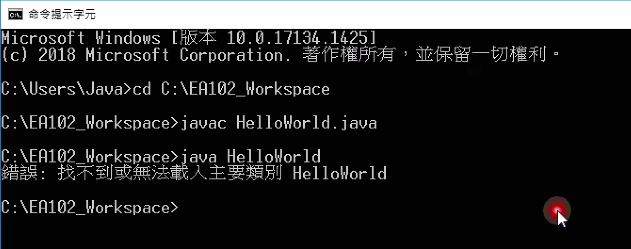
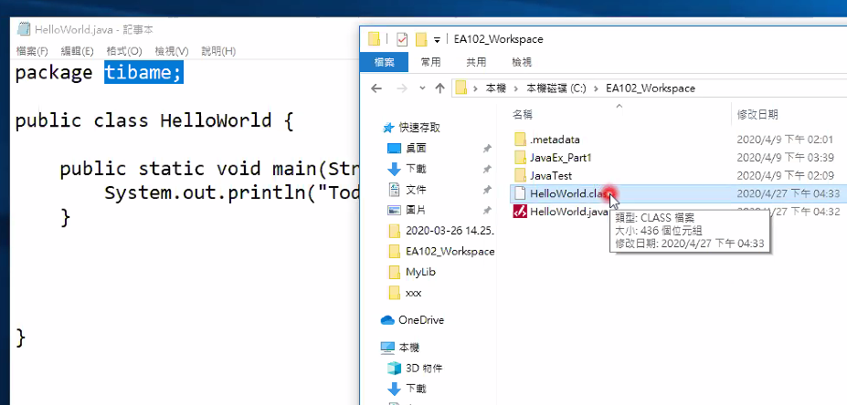
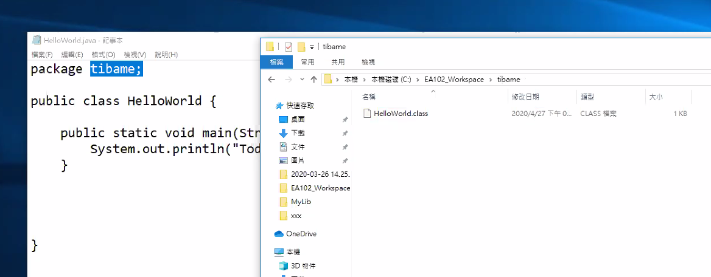
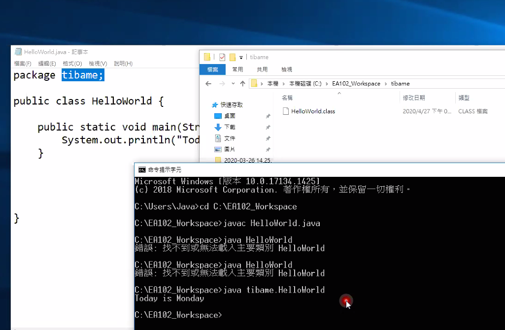

<h1 id="top">目錄</h1>

- [1. 套件編譯與執行(package)](#s1)
- [2. CMD 執行 package 文件](#s2)

---

# <a id="s1" class="md-title" href="#top">1. 套件編譯與執行(package)</a>

- java.util

  - utility(工具)

  - java 目錄下的 util 目錄

  - util 表示 java 的子套件

- <div id="buildAndRunJava">編譯</div>

  - -d(目的地)，`.`表示編譯後的 class 檔至於目前的目錄位置，在文字介面(cmd)下，代表現在的路徑位置

  ```cs
  C:\Workspace> javac -d . HelloWorld.jaja
  ```

- 執行

  - 要在原來的目錄執行

  ```cs
  C:\Workspace> java packageName.HelloWorld
  ```

- 給客戶檔案

  - 一般給 `*.class` 就好，因為就可以執行了

  - 給 `*.java` 就不能讓他們花錢繼續消費(即一次買斷)

# <a id="s2" class="md-title" href="#top">2. CMD 執行 package 文件</a>

- 編譯並執行

  <div style="text-align:center">
    
  </div>

- 錯誤原因

  - 文件中 package 名為 tibame，這樣之前產生的 class 檔必須要在 tibame 目錄中

  <div style="text-align:center">
    
  </div>

- 新增 tibame 目錄，並將執行檔放入其中

  <div style="text-align:center">
    
  </div>

- 執行成功

  <div style="text-align:center">
    
  </div>

- 若下次要直接執行並放入其 package 中，則[照此動作執行](#buildAndRunJava)
