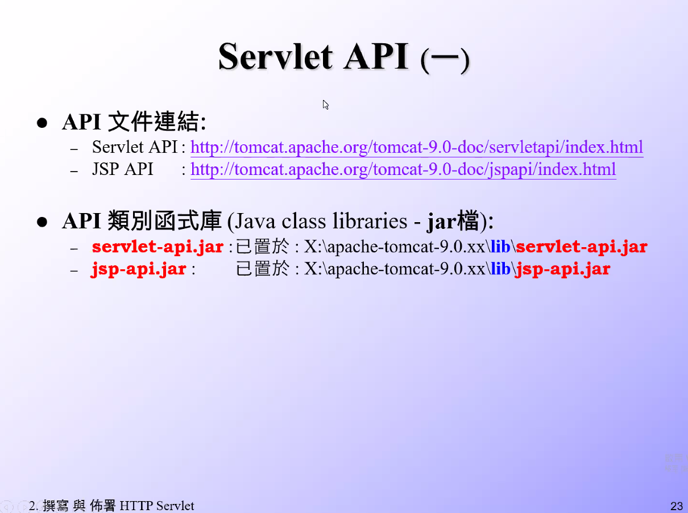
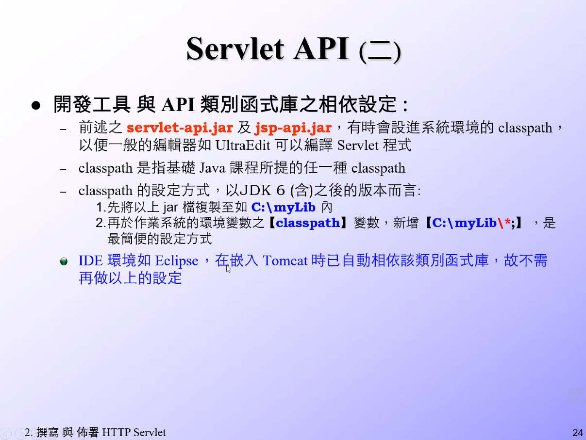
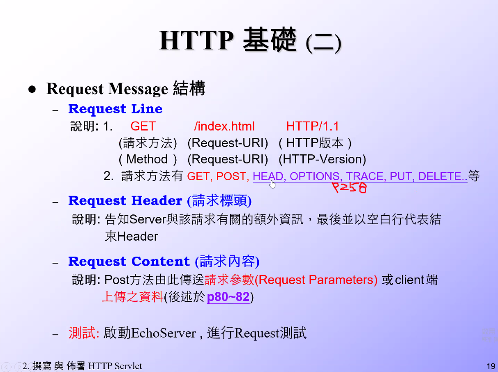
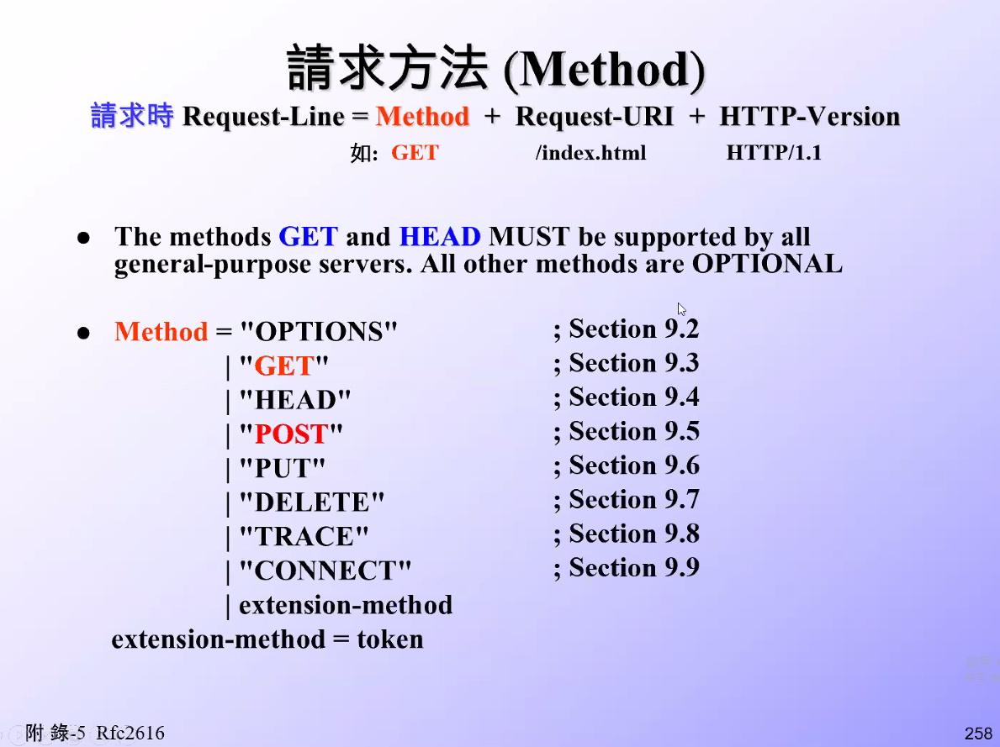
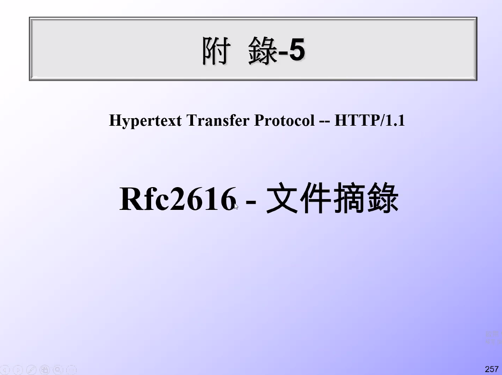
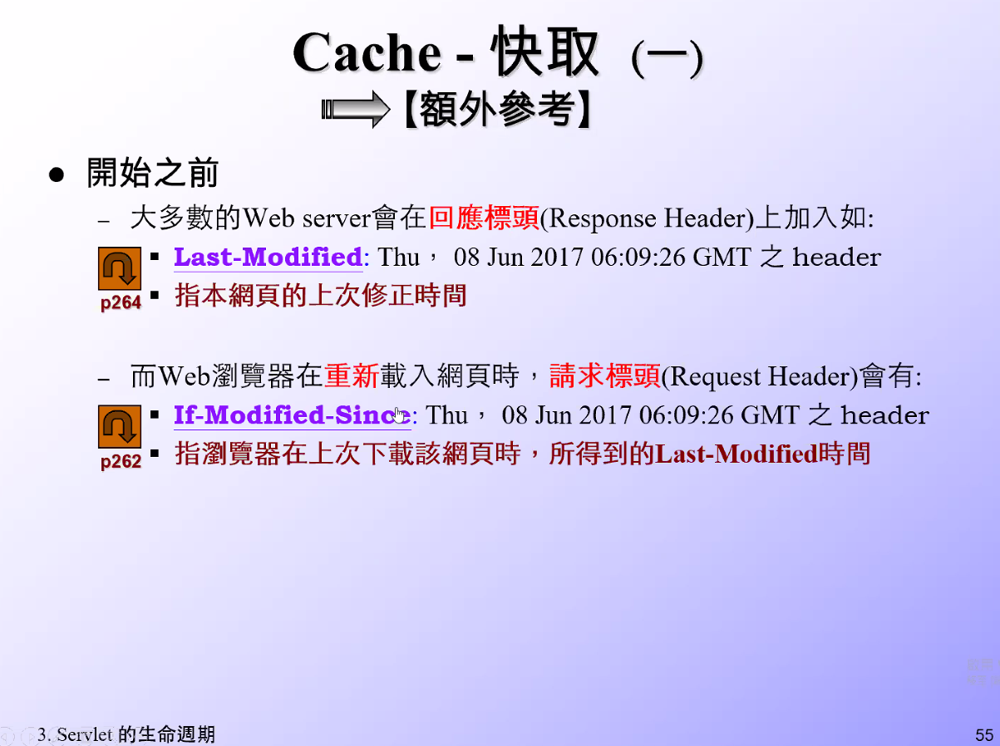
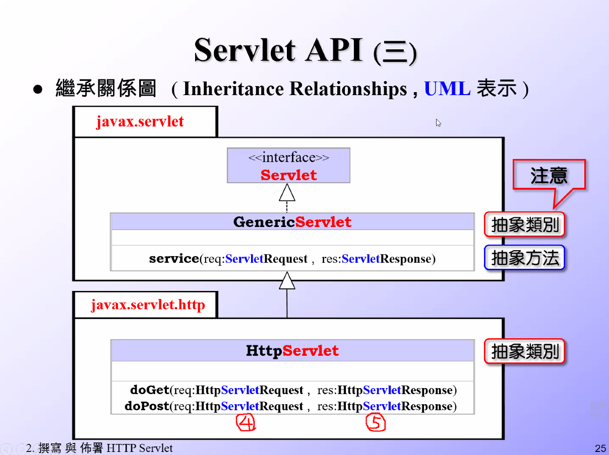

# 撰寫 API 前準備

1. - 將文件設定成書籤(方便日後查找)

```cs
API 1: "G:/%E5%A4%A7%E5%90%B3/SL314_Servlet4%E8%AA%B2%E7%A8%8B%E5%88%86%E4%BA%AB/SL314_%E7%AC%AC%E4%B8%80%E6%AC%A1%E5%88%86%E4%BA%AB/08_Servlet4.0_JSP2.3_API/%E2%97%8Fjavax.servlet-api-4.0-FINAL-javadoc/index.html"

API 2: "G:/%E5%A4%A7%E5%90%B3/SL314_Servlet4%E8%AA%B2%E7%A8%8B%E5%88%86%E4%BA%AB/SL314_%E7%AC%AC%E4%B8%80%E6%AC%A1%E5%88%86%E4%BA%AB/08_Servlet4.0_JSP2.3_API/%E2%97%8Fjavax.servlet.jsp-api-2.3.1-javadoc/index.html"

API 3: "G:/%E5%A4%A7%E5%90%B3/SL275_%E7%AC%AC%E4%B8%80%E6%AC%A1%E5%88%86%E4%BA%AB/JDK%20Resource%E2%97%8F-Java8/docs-Java8u241-API/api/index.html"
```

2. - JAR 檔

   - 在貓(Tomcat)裡面將指定檔案放入 myLib
   - classpath 有 `\*` 才可放入 jar，即添加目錄下的所有 jar

```cs
範例文件: "C:\EA102_WebApp\apache-tomcat-9.0.35\lib\jsp-api.jar"
範例文件: "C:\EA102_WebApp\apache-tomcat-9.0.35\lib\servlet-api.jar"
```





3. - 執行檔案 (因為沒 main 所以可以編譯成功就好)

```cs
範例文件: "C:\EA102_WebApp\apache-tomcat-9.0.35\webapps\IBM_9\WEB-INF\classes\HelloWorld.java"
```



4. - `get` 和 `head` 一定要支援，其他方法可自行選擇是否支援(optional)
   - `method="Head"` ， `doHead()` 僅傳送 header
   - `method="doOptions"`， `doOptions()` 即詢問伺服器支援的請求方法有哪幾個(應用機會 0)
   - method="Put" ， doPut()
   - method="Delete" ， doDelete()
   - method="Delete" ， doTrace() 除錯用



5. - 此文件為學習 tomcat 等開發的人才要用

```cs
檔案連結: "G:\大吳\SL314_Servlet4課程分享\SL314_第一次分享\04_官方文件 _ 規格書"
```






