<p>
  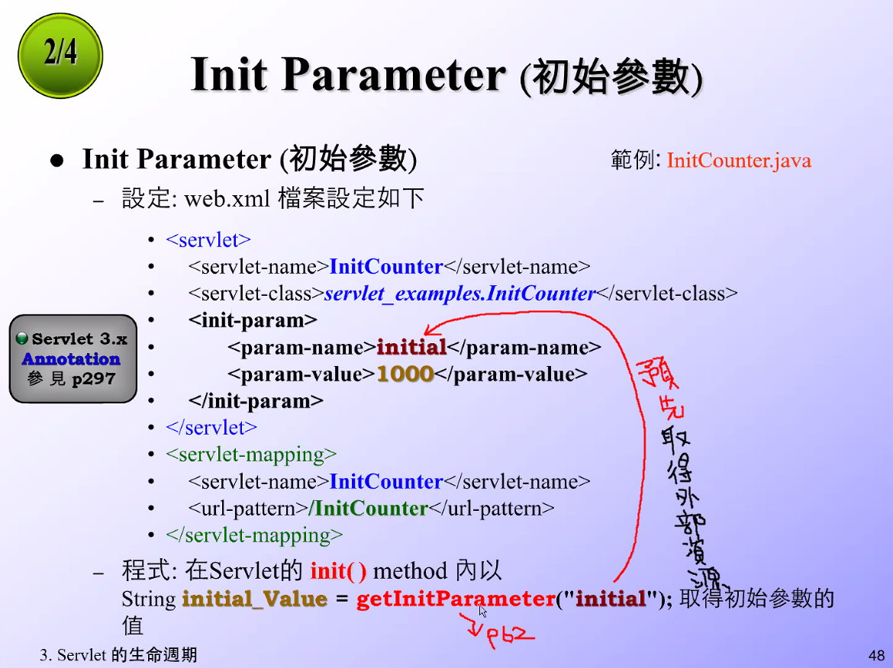
</p>

<p>
  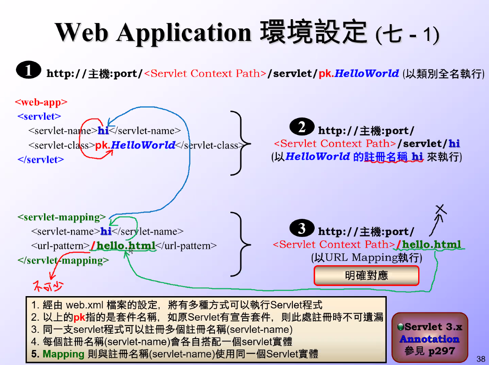
</p>

<p>
  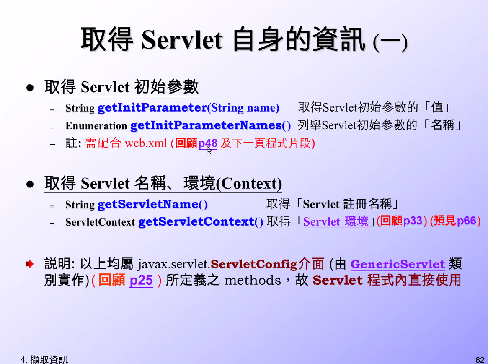
</p>

<p>
  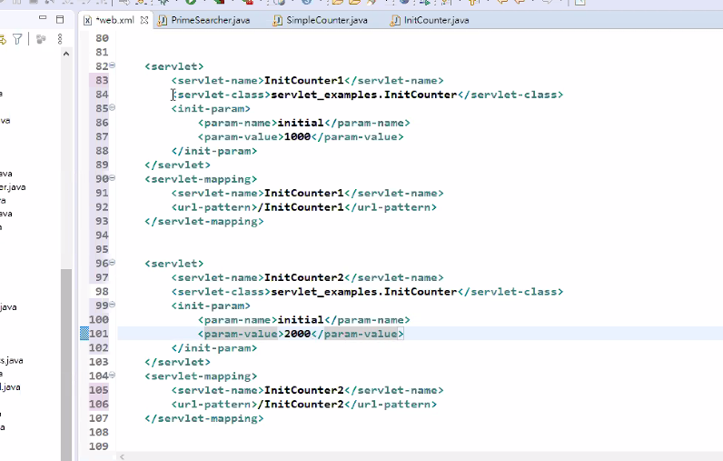
</p>

<p>
  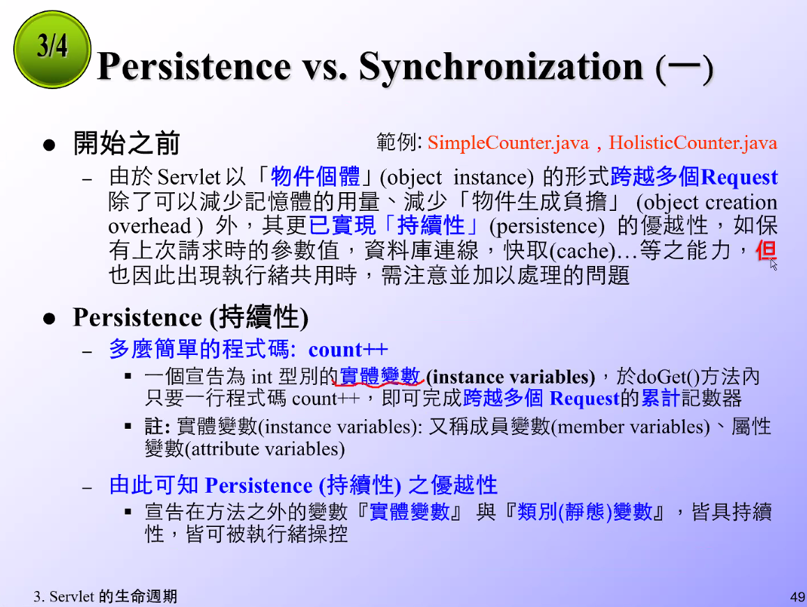
</p>

<p>
  
</p>

<p>
  
</p>

- 第三種作法在 servlet 不能用

<p>
  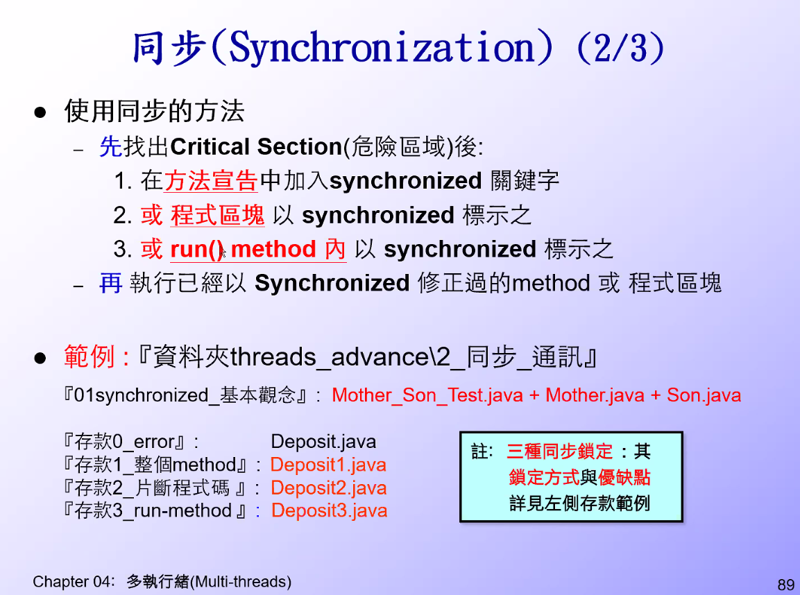
</p>

- 理想方法用`方法3`，實際上使用`方法1`(鎖 method)
- 被抱怨再將成是改成`方法3`
- `方法4`當作沒看到

<p>
  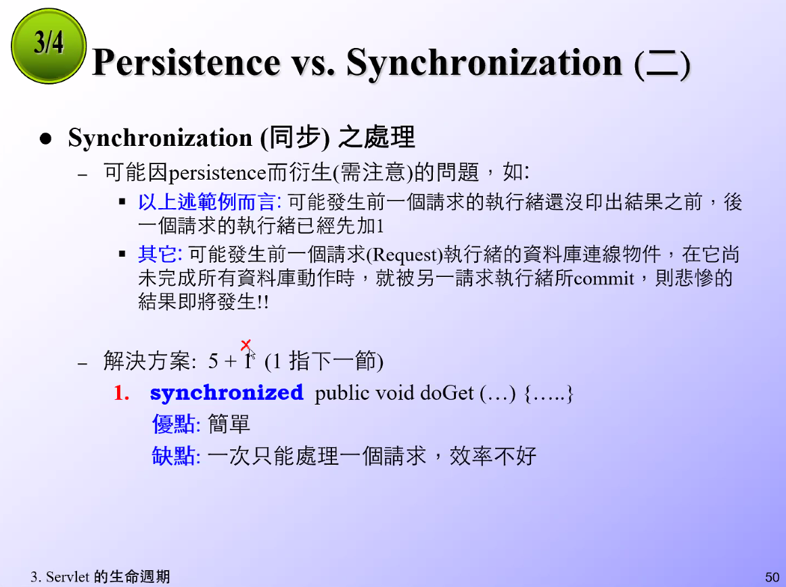
</p>

- 專案開發時區域變數優先

<p>
  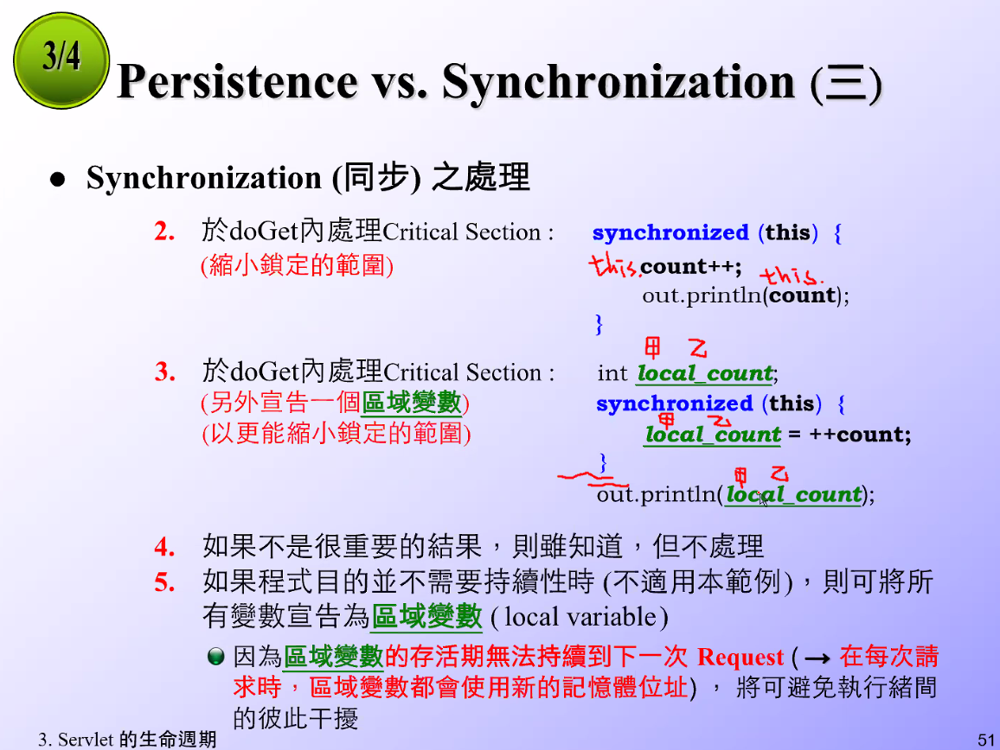
</p>

<p>
  
</p>

- chrome 會讓執行續自動排隊，但 IE 跟火狐不行，所以要自動排隊的話還是要用 yield(); 停下來換對方

<p>
  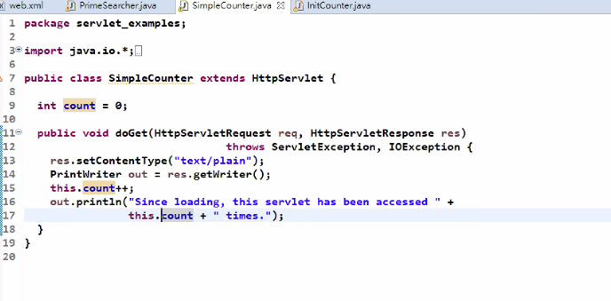
</p>

<p>
  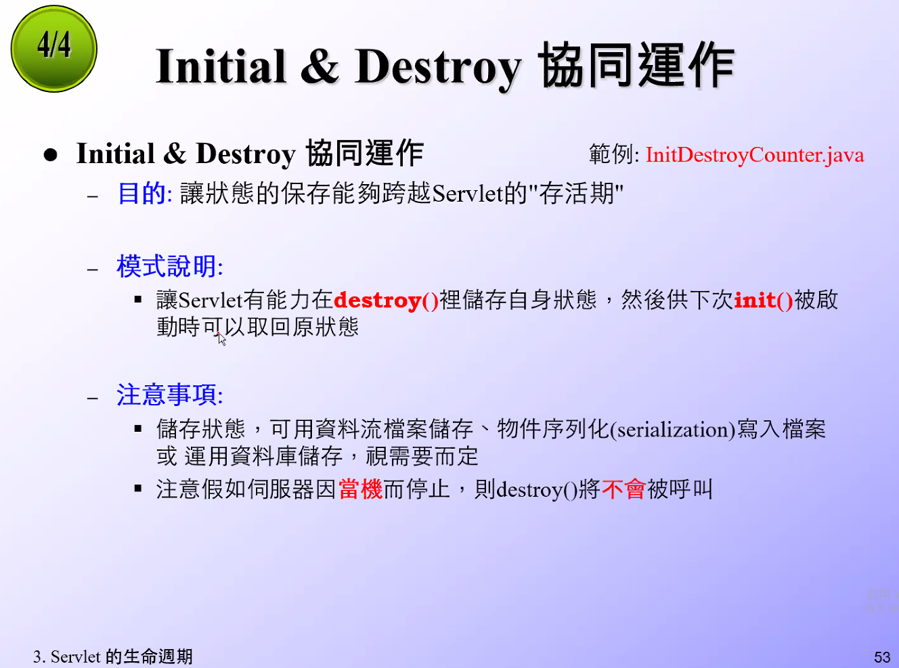
</p>

```cs
範例程式: "/SL314/src/servlet_examples/SimpleCounter.java"
```

```cs
範例程式: "/SL314/src/servlet_examples/InitDestroyCounter.java"
```

```cs
範例程式: "/SL314/src/servlet_examples/PrimeSearcher.java"
```

<p>
  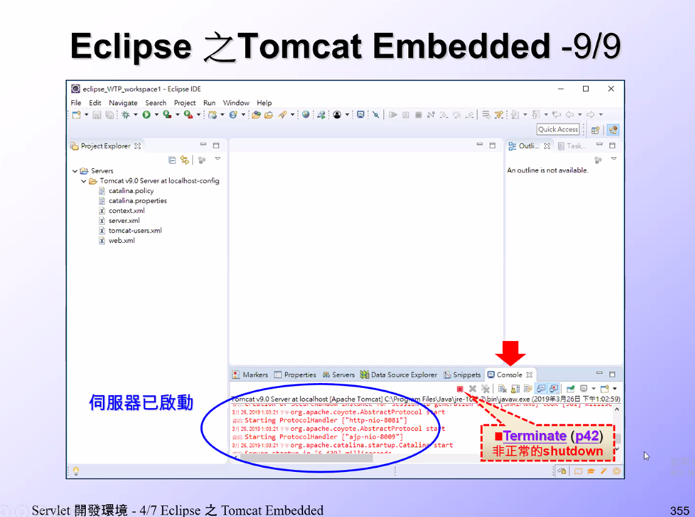
</p>

1. 只要有一隻重載(reloading)，就全部程式一起重載(reloading)
   1. 因為換了一個新的 class loader(類別載入器)
   2. **因為換了新的行政院長**
2. 有 destroy 就要呼叫
   1. 沒有 destroy 就 do nothing
3. 如果有 init() 就要用 destroy 將資源還原回去
   1. 類似背景執行續，有開就要把它給關閉
4. 如果按 Terminate 就不執行 destroy

<p>
  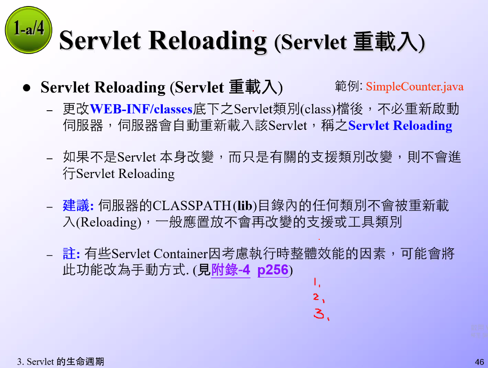
</p>

<p>
  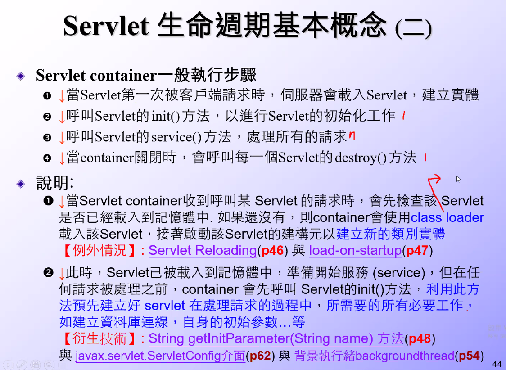
</p>

---

參考鏈接:

- [java 代码中 init method 和 destroy method 的三种使用方式](https://blog.csdn.net/tuzongxun/article/details/53580695)
- [Java Thread destroy()方法](https://www.yiibai.com/java_multithreading/java-thread-destroy-method.html)
