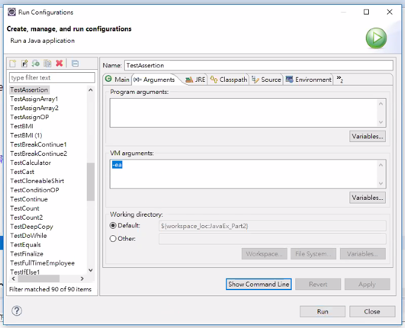

<h1 id="top">目錄</h1>

- [1. Assertions](#s1)
- [2. Eclipse 啟動 Assertions 驗證](#s2)

---

# <a id='s1' class='md-title' href='#top'>1. Assertions</a>

- 什麼是 Assertions (`測試階段的工具`)

  - 用來維護程式使之更堅固(robust)，0 錯誤

  - Assertions 通常用來檢查一些關鍵的值，避免這些值有錯誤時讓程式無法繼續執行

- Assertion 語法

  - `assert <bollean_expression>`

    - 當`bollean_expression`(布林判斷)為 false 時會丟出 `AssertionError` 程式當即中斷

  - `assert <bollean_expression>: <detail_expression>;` (`更常用`，因為後續能添加`運算式`)

    - 當 boolean`expression 為 false 時，會執行後面的運算式，最常用為字串，以說明錯誤的原因
      - 如: assert obj != null : "這物件不得為 null";
      - 如: assert k != 0:"k 值不得為 0";

  - 範例程式: `JavaEx_Part2 > ch01 > TestAssertion.java`

- 執行(`預設 assert 功能是關閉的`) 執行時添加 `-ea`

  ```cs
  java -ea TestAssertion
  ```

- 這樣例外處裡的程式可以`不用刪除`，需要時在啟動就好

# <a id='s2' class='md-title' href='#top'>2. Eclipse 啟動 Assertions 驗證</a>

- `Run` > `Run Configurations...` > `Arguments` > `VM arguments` > `-ea`

  <div style="text-align:center">
    
  </div>
