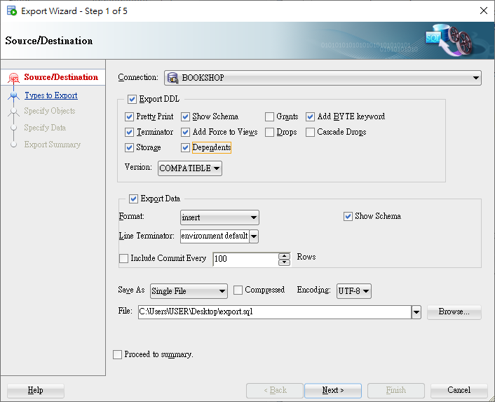

<h1 id="top">目錄</h1>

- [1. 匯出資料](#s1)

---

# <a id="s1" class="md-title" href="#top">1.匯出資料 </a>

- `SQL Developer` > `Tools` > `Database Export` > `Connection` 選好資料庫 > 勾選 `Dependents` (勾選後才會依照關聯建立表格) > `File` 欄位指定匯出檔案路徑

- 可視情況勾選 `Drops` 選項,會生成移除 `Table` 指令 (DROPTABLE)

  - 自動產生的 `Drops` 很可能會有問題，順序不對(不建議)。執行失敗請手動刪除使用者並重新建立(也可手動撰寫 drop 檔案，但容易出錯)

  - 刪除帳號後記得勾選 `CasCade`，才會將舊資料完全清除   

  

    
  

