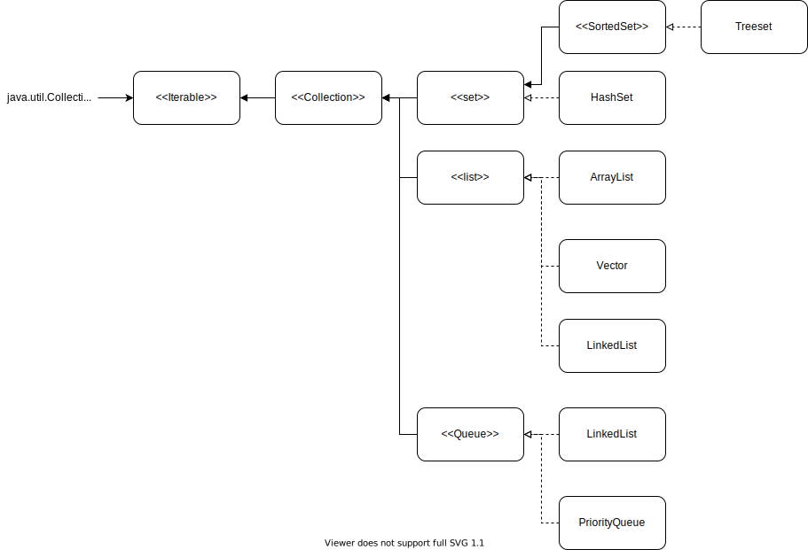

# 例外處理

- 提升程式**穩固性**
- 提升**可讀性**
  - 將**正常**與**錯誤**處理方式分開敘述
- 例外只能**越丟越小**

# 例外處理架構

<p></p>

- ParaseException
  - 時間格式轉化異常錯誤

```java
String str = "2013-09-22";
SimpleDateFormat simpleDateFormat = new SimpleDateFormat("yyyy-MM-dd hh:mm:ss");
// 因須轉換的格式與 simpleDateFormat 不同，故產生 ParaseException 錯誤
simpleDateFormat.parse(str.trim()));
```

- IOException
  - IO 數據讀寫異常

# 例外處理範例

```java
void method() throw Exception {
  try{
    throw Exception();
    正常處裡程序的程式碼...;
  } catch(MyException e){
    錯誤處裡程序的程式碼...;
  } catch(Exception e){
    e.printStackTrace(); // 取得詳細錯誤信息，停止接續的步驟
    錯誤處裡程序的程式碼...;
  } finally {
    一定要執行的程式碼...;
  }
}
```

# File 的各種方法

- File 位於 java.io.File 中

- File 各種方法
  1. exists() 是檔案或目錄
  2. isFile() 是檔案嗎
  3. isDirectory() 是資料夾嗎
  4. list() 檔案與目錄名稱
  5. listFiles() 檔案與目錄所有物件陣列
  6. getAbsolutePath() 回傳檔案或目錄的絕對路徑
  7. getPath() 回傳檔案或目錄的相對路徑 (須在測試一下)
  8. getParent() 取得前置路徑(須在測試一下)
  9. getName() 取得檔案或目錄的名稱
  10. length() 取得檔案大小(Bytes)
  11. canRead() 判斷是否可讀
  12. canWrite() 判斷是否可寫
  13. setReadOnly() 設定只讀
  14. lastModified() 取得最後一次修改時間(時間戳)
  15. delete() 刪除檔案或目錄(從系統刪除)
  16. renameTo() 更改名稱並移動檔案到指定路徑(須在測試一下)
  17. mkdir() 建立資料夾
  18. mkdirs() 建立多層資料夾
  19. createNewFile() 建立檔案

# 資料流類別

- BufferedInputStream 預設緩衝區大小 8k，可自訂
- new FileOutputStream("FileLink", true); 寫入資料時不覆蓋，直接添加後頭
- new FileWriter("FileLink", true); 寫入資料時不覆蓋，直接添加後頭
- BufferedWriter 的 newLine ，是添加換行符號，但不同系統的換行符號不同所以要注意

<p></p>

# Serializable 序列化

- 將大東西拆小

# 物件輸入輸出

1. 要寫出的**物件**需實做 java.io.Serializable(空界面)
1. 寫出: ObjectOutputStream
   1. `writeObject() 寫入 Object`
1. 寫入: ObjectInputStream
   1. `readObject() 讀出 Object`
1. 宣告成 transient 與 static 的不會被加入序列化
1. serialVersionUID 須固定才不會在讀 **被永久儲存的物件檔案** 時因為版本不同的原因無法讀取

- **I/O 奠定將來網路程式設計的基礎**

# 集合與陣列

- **集合**

  1. `不必指定集合大小`
  2. `可存放任何物件`
     (存放的基本類型會自動裝箱成物件)
  3. 元素取出用:
     forEach、Iterator

- **陣列**

  1. 需指定集合大小
  2. 存入的值需符合陣列資料類型
  3. 元素取出用:
     for、forEach

# 集合物件

- 一群相關的資料集合成一個物件
- 物件中的資料稱為元素

<p></p>

# 集合架構

<p></p>

---

參考鏈接:

- [java.util.Scanner.ioException()方法实例](http://gitbook.net/java/util/scanner_ioexception.html)
- [Java 输出文件通过 BufferedWriter.newline() 方法换行的陷阱](https://blog.csdn.net/TroyLemon/article/details/47781817)
- [Map 是不是集合？](https://blog.csdn.net/zimou5581/article/details/52706283)
- [JAVA API 官網版本](https://www.oracle.com/cn/java/technologies/java-se-api-doc.html)
