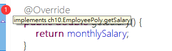

<h1 id="top">目錄</h1>

- [1. 抽象類別 abstract class](#s1)
- [2. 抽象類別使用時機](#s2)
- [3. 成功使用抽象方法的畫面](#s3)
- [4. 一個檔案多個類別注意事項](#s4)

---

# <a id="s1" class="md-title" href="#top">1. 抽象類別 abstract class</a>

- 抽象方法**沒有方法主體**，且必須加上 abstract 修飾子

  - 指的是沒有大括號跟方法內容 `public abstract void myMethod();`，需添加 `abstract`(Java 中 `abstract void myMethod(){}` 就表示有內容，所以直接使用分號結尾)

  - 抽象類別不一定要有抽象方法，但具有抽象方法的類別一定要宣告為抽象類別

    - `public abstract class className{...}`

  - 一個類別只要加上 abstract 修飾子(即使它裡面不含任何 abstract 方法)，他就無法產生實體，只能透過**繼承**來建立延伸類別

  - 一個(子)類別若繼承了抽象父類別，除非他**實作**(implement，跟 Override 完全一樣操作)了抽象父類別當中的所有抽象方法，否則他仍然只是個抽象類別

  - 抽象類別**不能建立物件**，**但可以寫建構子**

# <a id="s2" class="md-title" href="#top">2. 抽象類別使用時機</a>

- 用於在父類別寫個**空方法**，讓後來的人繼續撰寫相應的資料(OOP 概念)(專案合作用)

- 在建立類別時，若有方法尚未決定如何設計內容主體時，就可將此方法加上 abstract 修飾子成為抽象方法，之後在由繼承的子類別來實作

- 一般來說，並**不會**將一個類別同時寫在一個檔案當中

```java
package ch10;

// 抽象(abstract)類別
public abstract class EmployeePoly {
  private int empno;
  private String ename;

  public String getEname() {
    return ename;
  }

  public EmployeePoly(int empno, String ename) {
    this.empno = empno;
    this.ename = ename;
  }
  public EmployeePoly() {
    this(0, "-");
  }

  public void display() {
    System.out.println("empno=" + empno);
    System.out.println("ename=" + ename);
  }

  // 新增getSalary方法 抽象(abstract)方法
  public abstract double getSalary();
}
```

---

```java
package ch10;

public class FullTimeEmployeePoly extends EmployeePoly {
  private double monthlySalary; // 月薪

  public void display() {
    super.display();
    System.out.println("月薪=" + monthlySalary);
  }

  public FullTimeEmployeePoly(int empno, String ename, double monthlySalary) {
    super(empno, ename);
    this.monthlySalary = monthlySalary;
  }

  // 標註也是使用 Override
  @Override
  public double getSalary() {
    return monthlySalary;
  }
}
```

# <a id="s3" class="md-title" href="#top">3. 成功使用抽象方法的畫面</a>

<div style="text-align:center">
  
</div>

# <a id="s4" class="md-title" href="#top">4. 一個檔案多個類別注意事項</a>

- 一個 java 檔可以宣告多個類別，但須注意以下兩點

  - 一個 `*.java` 最多只能有一個公開(public)類別

  - 此公開類別的名子就得跟該 java 檔名**完全相同**

  - [繼承](../9.使用封裝與建構子/9-4.static修飾子.md)的好處由此案例可逐漸展示

```java
package ch11;

// 筆類別(父類別)
// 抽象類別
abstract class Pen {
  protected String brand;
  protected double price;

  // 抽象方法
  public abstract void write();

  public void setdata(String brand, double price) {
    this.brand = brand;
    this.price = price;
  }
}

// 自訂的筆類別(子類別)
class MyPen extends Pen {
  // 定義抽象類別的動作
  public void write() {
    System.out.print("牌子是： " + brand);
    System.out.println("價格為： " + price);
  }
}

// 公開類別(一個file中不可有兩個公開類別，且class名需跟檔名相同)
public class TestAbstract {
  public static void main(String args[]) {
    MyPen myPen = new MyPen();
    myPen.setdata("SKB", 10);
    myPen.write();
  }
}
```
