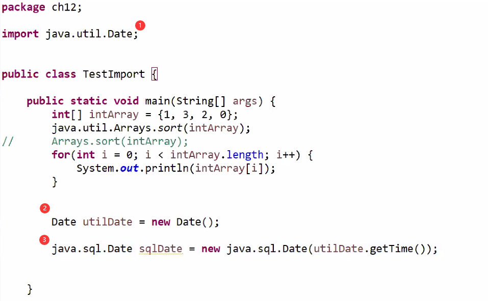

<h1 id="top">目錄</h1>

- [1. import 套件或特定別](#s1)

---

# <a id="s1" class="md-title" href="#top">1. import 套件或特定別</a>

- 引用套件中所有類別 `*`

  - `import java.sql.*;`

  - `*` 代表該套件下的所有類別

- 引用套件中的特定類別

  - `import java.sql.Date;`

- 自動 import

  - java 會自動 import `java.lang.*` 套件

  - 自動引用該套件(package) 下的所有類別

    - 不同套件仍須 import

```java
package ch08; // 套件
import ch08.*; // 該套件下所有類別
import java.lang.*;
```

- `import java.xxx.*;` 不包含其子目錄的類別

  - `import java.xxx.*;` 跟 `import java.xxx.yyy.*;` 是不同套件

- **不使用 import**敘述，則必須用到的地方都使用**類別長名稱**撰寫

```java
package ch12;

public class TestImport {

  public static void main(String[] args) {
    int[] intArray = {1, 3, 2, 0};
    // 正確，不 import 則每行都要這麼寫
    java.util.Arrays.sort(intArray);
    // 錯誤，不使用 import 須嚴格按照上面方法
    Arrays.sort(intArray);
    for(int i = 0; i < intArray.length; i++) {
      System.out.println(intArray[i]);
    }
  }
}
```

- 同名稱套件同時要用

  - 一個可以 import，另個須用長名稱這樣對套件的定義才清晰<br><br>

<div style="text-align:center">
  
</div>
