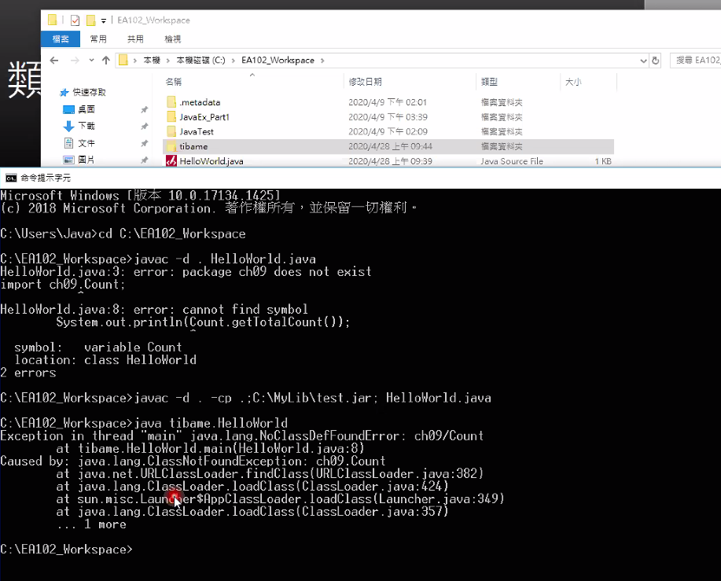

<h1 id="top">目錄</h1>

- [1. 類別路徑(classpath)](#s1)
- [2. 使用 cmd 執行含 import 項目](#s2)

---

# <a id='s1' class='md-title' href='#top'>1. 類別路徑(classpath)</a>

- `*.jar` 不能隨意移動，否則容易損壞

- `*.jar` 是一種程式碼的壓縮包

- classpath 可以讓 Java 應用程式在編輯和執行時可以找到要用的相關類別

- 根據 JDK 文件說明，Java 以下面三類 classpath 順序，依序找尋需的 class

  - Boothstrap classes(Core classes)

    - Java2 Platform 核心類別函式庫

    - 現有，已置於 `%JAVA_HOME%\jre\lib\rt.jar` 檔案

    - JDK 預設會自動載入，不必額外設定

  - Extension classes

    - Java2 Platform 擴充的類別函式庫

    - 指的是 `%JAVA_HOME%\jre\lib\ext` 目錄下的 jar 檔或 zip 檔，third-party(第三方)的類別函式庫可以放在這幕錄下

    - JDK 玉社會自動載入此目錄內的所有 zip 或 jar 檔，不必再做額外設定

  - Users classes<a href="#fn1" id="fnref1">[1]</a>

    - 指使用者自己寫的類別函式庫(third-party 的類別函式庫也可)

    - 使用者必須額外做設定，JDK 才會載入類別

    - 是指我們在環境變數 classpath 設定路徑下的 classes 或 jar 檔

      - [作業系統環境變數](https://leisure0621.github.io/tibame/3.JAVA/01.JAVA%E5%9F%BA%E7%A4%8E%E5%AD%B8%E7%BF%92/02.JAVA%E9%96%8B%E7%99%BC%E7%92%B0%E5%A2%83%E5%BB%BA%E7%AB%8B/2-1.JAVA%E9%96%8B%E7%99%BC%E7%92%B0%E5%A2%83%E5%BB%BA%E7%AB%8B.html)預先新增 classpath 變數可能為 `.;C:\myLib\xxx.jar;C:\myLib\yyy.jar;C:\myClass;`
      - JDK6 `C:\myLib\xxx.jar;C:myLib\yyy.jar;` 可簡化為 `C:\myLib\*`
      - 最好使用時還是要 `.;` 後追加 `C:\myLib\*` 即 `.;C:\myLib\*`

# <a id='s2' class='md-title' href='#top'>2. 使用 cmd 執行含 import 項目</a>

- 有 import 其他項目的 class 需要每次都執行 javac -d . -cp .:....<a href="#fn2" id="fnref2">[2]</a>

  - 若設定了 classpath 則直接執行就好

  

---

<section class="footnotes">
<ol class="footnotes-list">
<li id="fn1" class="footnote-item">
eclipse jar 檔設定參考 p.182 (針對 java project 的說明) <a href="#fnref1" class="footnote-backref">↩︎</a>

</li>
<li id="fn2" class="footnote-item">
很麻煩，現在已經不用了。早期無開發工具時使用 <a href="#fnref2" class="footnote-backref">↩︎</a>

</li>
</ol>
</section>
