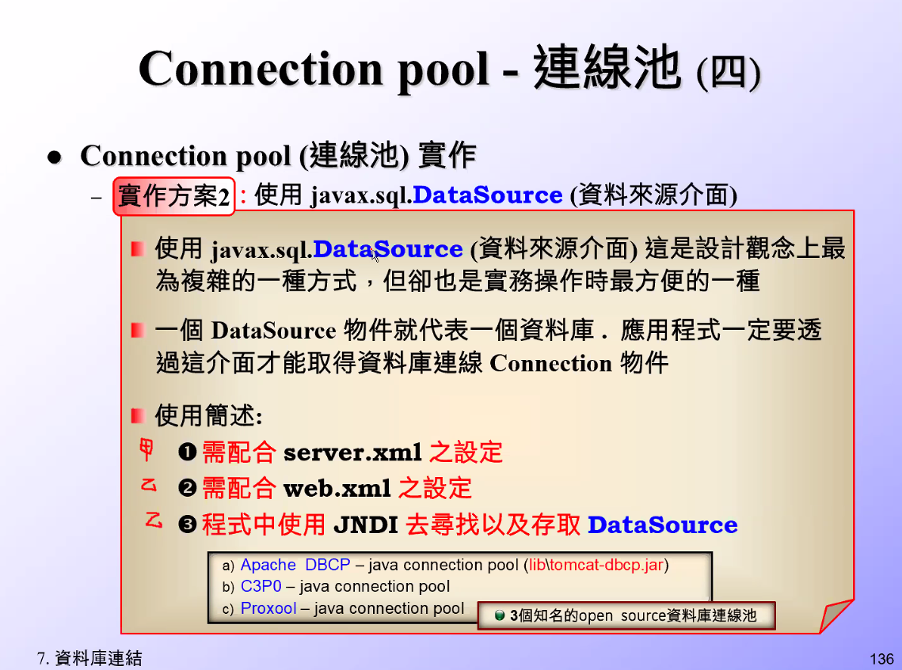
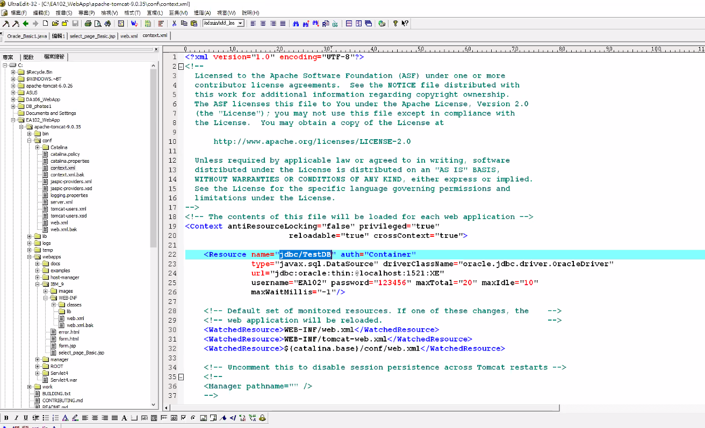
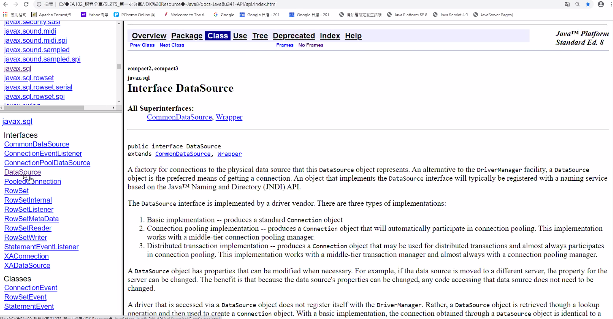
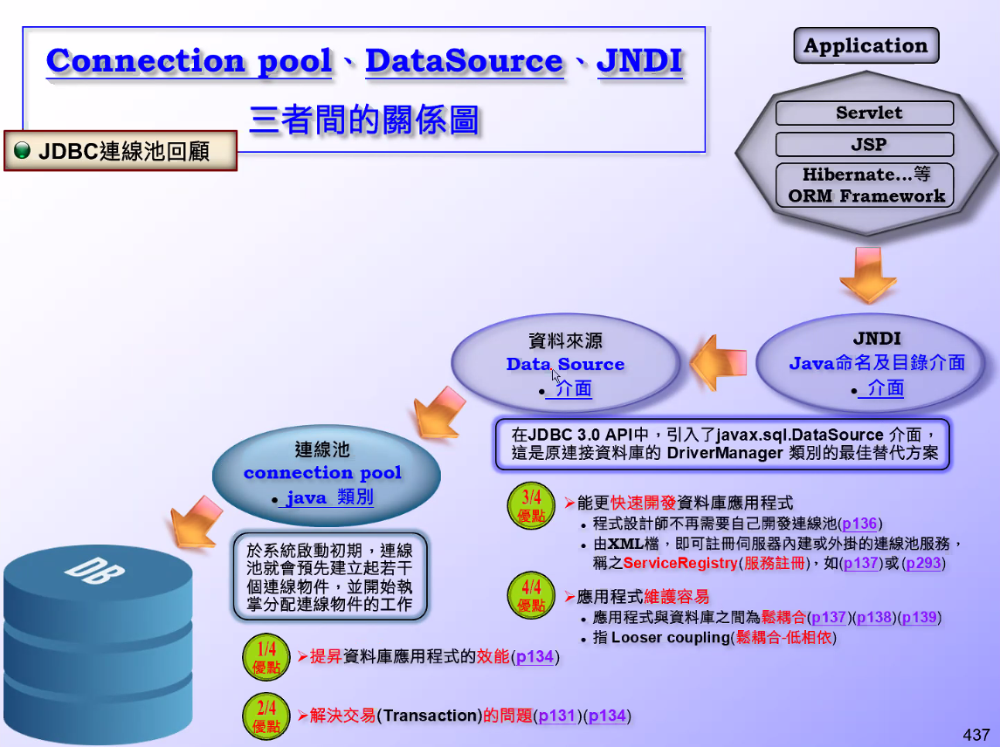
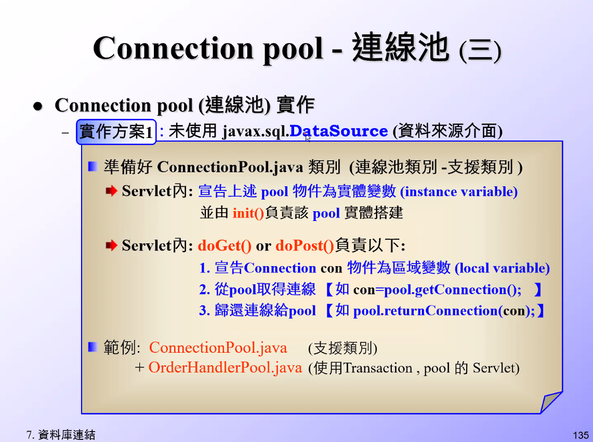
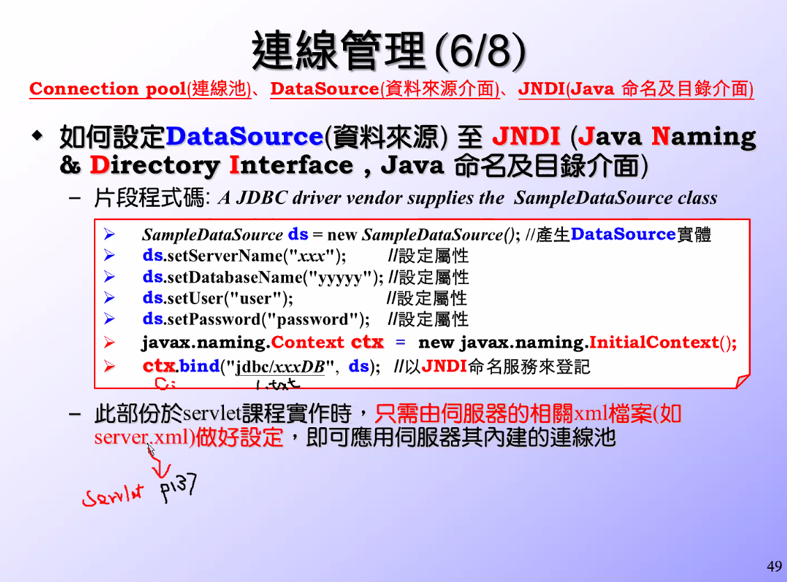
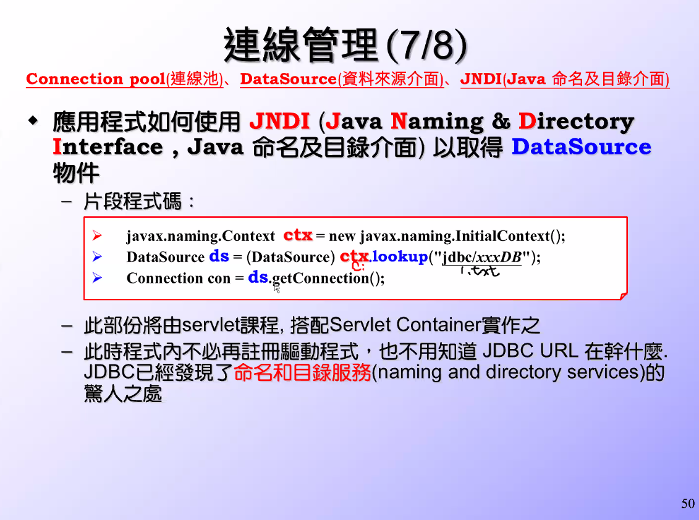
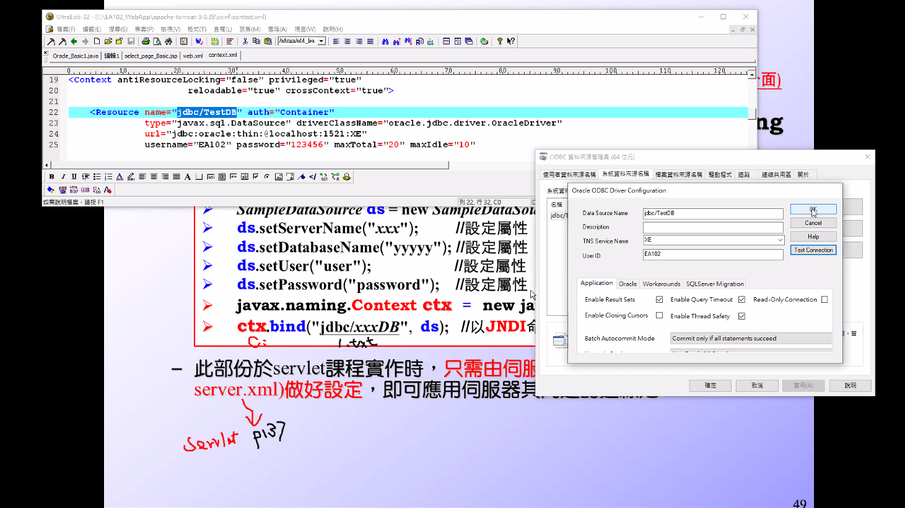

<h1 id="top">目錄</h1>

- [1. DataSouce](#s1)
- [2. JSP 頁面邏輯撰寫](#s2)
- [3. 新連線設定練習](#s3)
- [4. 複製檔案方法](#s4)
- [5. 檔案路徑方法 1](#s5)
- [6. 檔案路徑方法 2](#s6)
- [7. 檔案路徑方法 3](#s7)
- [8. 檔案路徑方法 4](#s8)

---

# <a id='s1' class='md-title' href='#top'>1. DataSouce</a>

1. <span style="color:red">為何</span> 一個 <span style="color:blue">DataSource</span> 代表一個資料庫 <span style="color:red">?</span>

   <span style="color:blue">Data</span>(資料) <span style="color:blue">Source</span>(來源)
   因為微軟做了 odbc 資料來源管理，故 java 也將此方法轉換成 datasource 介面，可以 getConnection

2. 一個 <span style="color:blue">DataSource</span> 物件，定後面一定會伴隨著一個 <span style="color:red">連線池嗎 ?</span>

   不一定，通過 Hooks and anchors design pattern (掛勾跟鉚釘是種設計模式) 的設計模式讓我們在使用 DataSource 時就能取用 PoolConnection

3) <span style="color:red">如何</span> 取得 <span style="color:blue">DataSource</span> 物件，以便透過它取出 <span style="color:red">連線池</span> 中的 <span style="color:red">資料庫連線 ?</span>

   JNDI

<p></p>

<p></p>

<p></p>

<p></p>

<p></p>

<p></p>

<p></p>

<p></p>

<p></p>

<p></p>

<p></p>

<p></p>

<p></p>

<p></p>

- 暴力貓: 乙方註冊錯誤、沒註冊都可以跟資料庫連線成功
- 獨立貓、膽固醇貓、暴力貓

1. 只有 tomcat 可以跳過 web.xml 不註冊或打錯字都能直接跟資料庫連線，因為其他服務器會提供其他轉接器

<p></p>

<p></p>

<p></p>

<p></p>

<p></p>

<p></p>

<p></p>

<p></p>

<p></p>

<p></p>

<p></p>

<p></p>

<p></p>

<p></p>

<p></p>

<p></p>

<p></p>

<p></p>

<p></p>

<p></p>

<p></p>

- 刪除 form1.jsp 以及 其他 jsp，還有 work 資料夾

<p></p>

<p></p>

<p></p>

<p></p>

<p></p>

<p></p>

<p></p>

<p></p>

<p></p>

<p></p>

<p></p>

# <a id='s2' class='md-title' href='#top'>2. JSP 頁面邏輯撰寫</a>

- 撰寫 jsp
  - 執行湯姆貓後，此檔案打開就可用

```html
<%@ page contentType="text/html; charset=Big5" pageEncoding="Big5"%>

<!DOCTYPE html PUBLIC "-//W3C//DTD HTML 4.01 Transitional//EN">
<html>
  <head>
    <meta http-equiv="Content-Type" content="text/html; charset=BIG5" />
    <title>form.jsp</title>
  </head>
  <body>
    <form method="get" action="Hello">
      請輸入您的名字!
      <input type="TEXT" name="name" value="peter1吳永志" />
      <p>
        <input type="SUBMIT" />
      </p>
    </form>

    <table border="1" bordercolor="blue">
      <tr>
        <th>數字</th>
        <th>平方</th>
      </tr>
      <% for(int i = 0; i < 5; i++ ){ %>
      <tr>
        <td><%=i %></td>
        <td><%=i*i %></td>
      </tr>
      <% } %>
    </table>
  </body>
</html>
```

# <a id='s3' class='md-title' href='#top'>3. 新連線設定練習</a>

<p></p>

```cs
"/SL314/src/servlet_examples/DBPhoneLookup.java"
```

```java
package servlet_examples;

import java.io.*;
import java.sql.*;

import javax.naming.Context;
import javax.servlet.*;
import javax.servlet.http.*;
import javax.sql.DataSource;

public class DBPhoneLookup extends HttpServlet {

  public void doGet(HttpServletRequest req, HttpServletResponse res)
                               throws ServletException, IOException {
    Connection con = null;
    Statement stmt = null;
    ResultSet rs = null;

    res.setContentType("text/html; charset=UTF-8");
    PrintWriter out = res.getWriter();

    try {
      Context ctx = new javax.naming.InitialContext();
      DataSource ds = (DataSource) ctx.lookup("java:comp/env/jdbc/TestDB");
      con = ds.getConnection();


      // Display the result set as a list
      out.println("<HTML><HEAD><TITLE>Phonebook</TITLE></HEAD>");
      out.println("<BODY>");
      out.println("<UL>");

      out.println(new HtmlSQLResult("SELECT * FROM emp2", con));

      out.println("</UL>");
      out.println("</BODY></HTML>");
    }
    catch(Exception e) {
      out.println("Exception caught: " + e.getMessage());
    }
    finally {
      // Always close the database connection.
      try {
        if (con != null) con.close();
      }
      catch (SQLException ignored) { }
    }
  }
}
```

# <a id='s4' class='md-title' href='#top'>4. 複製檔案方法</a>

- `開啟檔案` > `File` > `Save As...` > 修改檔名

# <a id='s5' class='md-title' href='#top'>5. 檔案路徑方法 1</a>

<p></p>

<p></p>

<p></p>

- 編輯 DBGifReader

```cs
"/SL314/src/servlet_examples/DBGifReader.java"
```

```java
package servlet_examples;

import java.io.*;
import java.sql.*;
import javax.servlet.*;
import javax.servlet.http.*;

public class DBGifReader extends HttpServlet {

  Connection con;

  public void doGet(HttpServletRequest req, HttpServletResponse res)
      throws ServletException, IOException {

    res.setContentType("image/gif");
    ServletOutputStream out = res.getOutputStream();

    try {
      Statement stmt = con.createStatement();
      ResultSet rs = stmt.executeQuery(
        "SELECT pic FROM club WHERE id = 1");

      if (rs.next()) {
        BufferedInputStream in = new BufferedInputStream(rs.getBinaryStream("pic"));
        byte[] buf = new byte[4 * 1024]; // 4K buffer
        int len;
        while ((len = in.read(buf)) != -1) {
          out.write(buf, 0, len);
        }
        in.close();
      } else {
        res.sendError(HttpServletResponse.SC_NOT_FOUND);
      }
      rs.close();
      stmt.close();
    } catch (Exception e) {
      System.out.println(e);
    }
  }

  public void init() throws ServletException {
    try {
      Class.forName("oracle.jdbc.driver.OracleDriver");
      con = DriverManager.getConnection("jdbc:oracle:thin:@localhost:1521:xe", "david", "123456");
    } catch (ClassNotFoundException e) {
      throw new UnavailableException("Couldn't load JdbcOdbcDriver");
    } catch (SQLException e) {
      throw new UnavailableException("Couldn't get db connection");
    }
  }

  public void destroy() {
    try {
      if (con != null) con.close();
    } catch (SQLException e) {
      System.out.println(e);
    }
  }
}
```

<p></p>

# <a id='s6' class='md-title' href='#top'>6. 檔案路徑方法 2</a>

<p></p>

- 創建新檔案

```cs
原碼自 DBGifReader 複製: "/SL314/src/servlet_examples/DBGifReader2.java"
```

```java
package servlet_examples;

import java.io.*;
import java.sql.*;
import javax.servlet.*;
import javax.servlet.http.*;

public class DBGifReader2 extends HttpServlet {

  Connection con;

  public void doGet(HttpServletRequest req, HttpServletResponse res)
      throws ServletException, IOException {

    res.setContentType("image/gif");
    ServletOutputStream out = res.getOutputStream();

    try {
      Statement stmt = con.createStatement();
      String id = req.getParameter("id");
      ResultSet rs = stmt.executeQuery(
        "SELECT pic FROM club WHERE id =" + id); // 修改此值

      if (rs.next()) {
        BufferedInputStream in = new BufferedInputStream(rs.getBinaryStream("pic"));
        byte[] buf = new byte[4 * 1024]; // 4K buffer
        int len;
        while ((len = in.read(buf)) != -1) {
          out.write(buf, 0, len);
        }
        in.close();
      } else {
        res.sendError(HttpServletResponse.SC_NOT_FOUND);
      }
      rs.close();
      stmt.close();
    } catch (Exception e) {
      System.out.println(e);
    }
  }

  public void init() throws ServletException {
    try {
      Class.forName("oracle.jdbc.driver.OracleDriver");
      con = DriverManager.getConnection("jdbc:oracle:thin:@localhost:1521:xe", "david", "123456");
    } catch (ClassNotFoundException e) {
      throw new UnavailableException("Couldn't load JdbcOdbcDriver");
    } catch (SQLException e) {
      throw new UnavailableException("Couldn't get db connection");
    }
  }

  public void destroy() {
    try {
      if (con != null) con.close();
    } catch (SQLException e) {
      System.out.println(e);
    }
  }
}
```

- 修改 html

```cs
"/SL314/WebContent/form.html"
```

```html
<!DOCTYPE html PUBLIC "-//W3C//DTD HTML 4.01 Transitional//EN">
<html>
  <head>
    <meta http-equiv="Content-Type" content="text/html; charset=BIG5" />
    <title>form.html</title>
  </head>
  <body>
    <form method="get" action="Hello">
      請輸入您的名字!
      <p>
        <input type="checkbox" name="name" value="peter1" />
        <input type="checkbox" name="name" value="peter2" />
        <input type="checkbox" name="name" value="peter3" />
      </p>
      <input type="SUBMIT" />
    </form>

    
    
    
    
    
  </body>
</html>
```

- 佈署描述檔

```cs
"/SL314/WebContent/WEB-INF/web.xml"
```

<p></p>

- 添加新設定入佈署描述檔

```xml
<servlet>
  <servlet-name>DBGifReader2</servlet-name>
  <servlet-class>servlet_examples.DBGifReader2</servlet-class>
</servlet>
<servlet-mapping>
  <servlet-name>DBGifReader2</servlet-name>
  <url-pattern>/DBGifReader2</url-pattern>
</servlet-mapping>
```

# <a id='s7' class='md-title' href='#top'>7. 檔案路徑方法 3</a>

<p></p>

<p></p>

<p></p>

- 創建 DBGifReader3.java

```cs
"/SL314/src/servlet_examples/DBGifReader3.java"
```

```java
package servlet_examples;

import java.io.*;
import java.sql.*;

import javax.naming.Context;
import javax.naming.NamingException;
import javax.servlet.*;
import javax.servlet.http.*;
import javax.sql.DataSource;

public class DBGifReader3 extends HttpServlet {

  Connection con;

  public void doGet(HttpServletRequest req, HttpServletResponse res)
      throws ServletException, IOException {

    res.setContentType("image/gif");
    ServletOutputStream out = res.getOutputStream();

    try {
      Statement stmt = con.createStatement();
      String id = req.getParameter("id");
      ResultSet rs = stmt.executeQuery(
        "SELECT pic FROM club WHERE id =" + id);

      if (rs.next()) {
        BufferedInputStream in = new BufferedInputStream(rs.getBinaryStream("pic"));
        byte[] buf = new byte[4 * 1024]; // 4K buffer
        int len;
        while ((len = in.read(buf)) != -1) {
          out.write(buf, 0, len);
        }
        in.close();
      } else {
        res.sendError(HttpServletResponse.SC_NOT_FOUND);
      }
      rs.close();
      stmt.close();
    } catch (Exception e) {
      System.out.println(e);
    }
  }

  public void init() throws ServletException {
    try {
      Context ctx = new javax.naming.InitialContext();
      DataSource ds = (DataSource) ctx.lookup("java:comp/env/jdbc/David");
      con = ds.getConnection();
    } catch (NamingException e) {
      throw new UnavailableException("Couldn't load JdbcOdbcDriver");
    } catch (SQLException e) {
      throw new UnavailableException("Couldn't get db connection");
    }
  }

  public void destroy() {
    try {
      if (con != null) con.close();
    } catch (SQLException e) {
      System.out.println(e);
    }
  }

}
```

- 設定 context.xml

```cs
"/Servers/Tomcat v9.0 Server at localhost-config/context.xml"
```

```xml
<Resource auth="Container" driverClassName="oracle.jdbc.driver.OracleDriver" maxIdle="10" maxTotal="20" maxWaitMillis="-1" name="jdbc/TestDB" password="123456" type="javax.sql.DataSource" url="jdbc:oracle:thin:@localhost:1521:XE" username="EA102"/>
<!-- 添加此行  name="jdbc/David" 區分大小寫，因為是連線名稱; username 不區分大小寫，因為是連線帳號 -->
<Resource auth="Container" driverClassName="oracle.jdbc.driver.OracleDriver" maxIdle="10" maxTotal="20" maxWaitMillis="-1" name="jdbc/David" password="123456" type="javax.sql.DataSource" url="jdbc:oracle:thin:@localhost:1521:XE" username="David"/>
```

- 設定 web.xml

```cs
"/SL314/WebContent/WEB-INF/web.xml"
```

```xml
<servlet>
  <servlet-name>DBGifReader3</servlet-name>
  <servlet-class>servlet_examples.DBGifReader3</servlet-class>
</servlet>
<servlet-mapping>
  <servlet-name>DBGifReader3</servlet-name>
  <url-pattern>/DBGifReader3</url-pattern>
</servlet-mapping>
```

- 修改 form.html

```html
<!DOCTYPE html PUBLIC "-//W3C//DTD HTML 4.01 Transitional//EN">
<html>
  <head>
    <meta http-equiv="Content-Type" content="text/html; charset=BIG5" />
    <title>form.html</title>
  </head>
  <body>
    <form method="get" action="Hello">
      請輸入您的名字!
      <p>
        <input type="checkbox" name="name" value="peter1" />
        <input type="checkbox" name="name" value="peter2" />
        <input type="checkbox" name="name" value="peter3" />
      </p>
      <input type="SUBMIT" />
    </form>

    
    
    
    
    
    
    
  </body>
</html>
```

# <a id='s8' class='md-title' href='#top'>8. 檔案路徑方法 4</a>

<p></p>

- 設定 web.xml

```cs
"/SL314/WebContent/WEB-INF/web.xml"
```

```xml
<servlet>
  <servlet-name>DBGifReader4</servlet-name>
  <servlet-class>servlet_examples.DBGifReader4</servlet-class>
</servlet>
<servlet-mapping>
  <servlet-name>DBGifReader4</servlet-name>
  <url-pattern>/DBGifReader4</url-pattern>
</servlet-mapping>
```

- 創建 DBGifReader4.java

```cs
"/SL314/src/servlet_examples/DBGifReader4.java"
```

```java
package servlet_examples;

import java.io.*;
import java.sql.*;

import javax.naming.Context;
import javax.naming.NamingException;
import javax.servlet.*;
import javax.servlet.http.*;
import javax.sql.DataSource;

public class DBGifReader4 extends HttpServlet {

  Connection con;

  public void doGet(HttpServletRequest req, HttpServletResponse res)
      throws ServletException, IOException {

    res.setContentType("image/gif");
    ServletOutputStream out = res.getOutputStream();

    try {
      Statement stmt = con.createStatement();
      String id = req.getParameter("id").trim();
      ResultSet rs = stmt.executeQuery(
        "SELECT pic FROM club WHERE id =" + id);

      if (rs.next()) {
        BufferedInputStream in = new BufferedInputStream(rs.getBinaryStream("pic"));
        byte[] buf = new byte[4 * 1024]; // 4K buffer
        int len;
        while ((len = in.read(buf)) != -1) {
          out.write(buf, 0, len);
        }
        in.close();
      } else {
        InputStream in = getServletContext().getResourceAsStream("/NoData/none2.jpg");
        byte[] b = new byte[in.available()];
        in.read(b);
        out.write(b);
        in.close();
      }
      rs.close();
      stmt.close();
    } catch (Exception e) {
      InputStream in = getServletContext().getResourceAsStream("/NoData/null.jpg");
      byte[] b = new byte[in.available()];
      in.read(b);
      out.write(b);
      in.close();
    }
  }

  public void init() throws ServletException {
    try {
      Context ctx = new javax.naming.InitialContext();
      DataSource ds = (DataSource) ctx.lookup("java:comp/env/jdbc/David");
      con = ds.getConnection();
    } catch (NamingException e) {
      throw new UnavailableException("Couldn't load JdbcOdbcDriver");
    } catch (SQLException e) {
      throw new UnavailableException("Couldn't get db connection");
    }
  }

  public void destroy() {
    try {
      if (con != null) con.close();
    } catch (SQLException e) {
      System.out.println(e);
    }
  }

}
```

- 修改 form.html

```html
<!DOCTYPE html PUBLIC "-//W3C//DTD HTML 4.01 Transitional//EN">
<html>
  <head>
    <meta http-equiv="Content-Type" content="text/html; charset=BIG5" />
    <title>form.html</title>
  </head>
  <body>
    <form method="get" action="Hello">
      請輸入您的名字!
      <p>
        <input type="checkbox" name="name" value="peter1" />
        <input type="checkbox" name="name" value="peter2" />
        <input type="checkbox" name="name" value="peter3" />
      </p>
      <input type="SUBMIT" />
    </form>

    
    
    
    
    
    
    

    
    
    
  </body>
</html>
```
